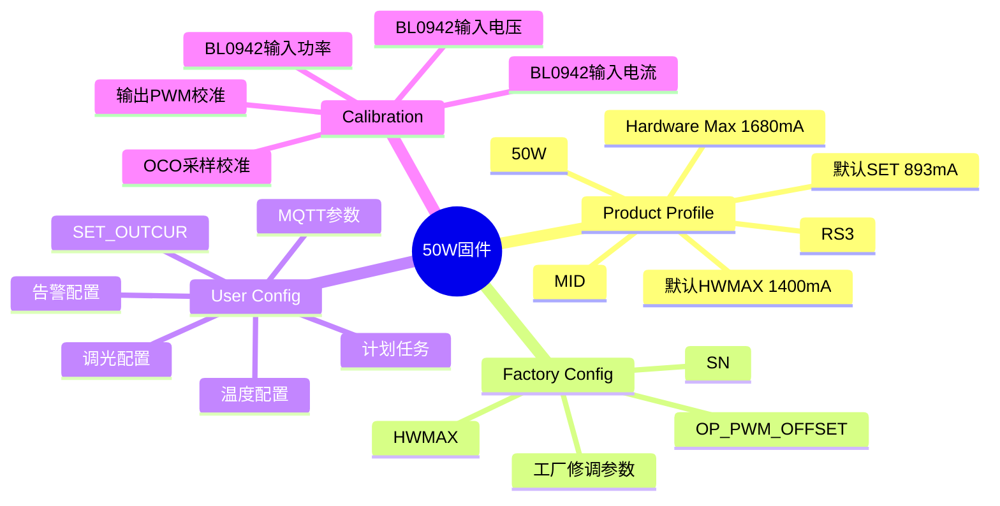
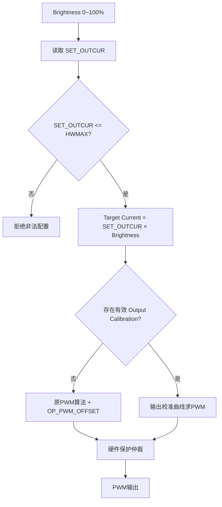
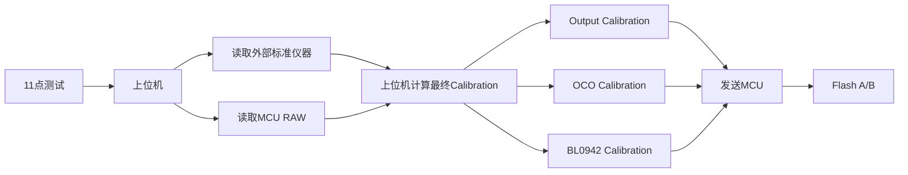
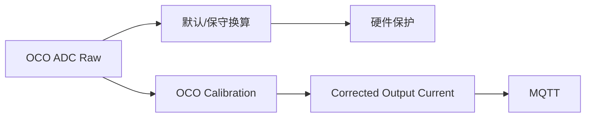
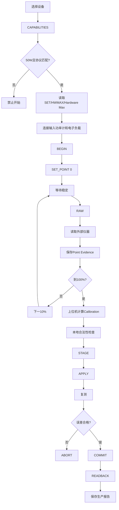

# CAT1 50W 一体化电源——校准固件基线与上位机对接方案

> 项目：CAT1_Keil_Project  
> 基线分支：`done/cat1-product-profile-cal-context-20260817`  
> MCU：HK32F103CCT6A  
> 编译基线：Keil ARMCC5  
> 文档性质：代码修改前架构冻结  
> 当前目标：先完成 50W 可量产校准固件，并同步定义校准上位机实现方式。

---

## 1. 本次修改的最终目标

本轮不是重新开发整个 CAT1 一体化电源固件，而是先完成一套 **50W 可正常运行、可自动校准、可安全保存校准结果、可长期稳定采集电参** 的固件，并让校准上位机与固件形成完整闭环。

本轮核心修改范围：

1. 50W 产品参数基线；
2. SET_OUTCUR / HWMAX / Hardware Max 职责；
3. 无校准输出链；
4. 有校准输出链；
5. 11 点输出校准；
6. OCO 输出电流采样校准；
7. BL0942 输入电压 / 输入电流 / 有功功率校准；
8. BL0942 长期运行停止读取问题；
9. Calibration Flash 安全持久化；
10. 与校准相关的 Config Flash 调整；
11. 校准 MQTT 协议；
12. 校准上位机自动校准流程；
13. 老设备 OTA 兼容。

**禁止因为实现校准而随意重构其他已经工作的业务功能。**

---

## 2. 50W 第一版正式参数

| 参数 | 冻结值 | 参数归属 |
|---|---:|---|
| 额定功率 | 50W | Product Profile |
| Hardware Max | 1680mA | Product Profile |
| 默认 HWMAX | 1400mA | Factory Config 默认值 |
| 默认 SET_OUTCUR | 893mA | User Config 默认值 |
| RS3 | 120mΩ | Product Profile |
| 校准点数量 | 11 点 | Calibration |
| Level | 0、20、40……200 | Calibration |
| 对应输出百分比 | 0%、10%、20%……100% | Calibration |

三个电流参数关系固定：

```text
SET_OUTCUR <= HWMAX <= Hardware Max
```

定义：

- `SET_OUTCUR`：用户当前希望 100% 亮度时输出的目标电流。
- `HWMAX`：工厂允许普通用户调节 `SET_OUTCUR` 的最大范围。
- `Hardware Max`：该功率硬件真正允许的最大输出电流和硬件保护上限。

50W 当前：

```text
Hardware Max = 1680mA
默认 HWMAX   = 1400mA
默认 SET_OUTCUR = 893mA
```

普通用户只能在允许范围内修改 `SET_OUTCUR`。

工厂命令可以修改 `HWMAX`，但固件始终必须检查：

```text
0 < HWMAX <= 1680mA
```

第一版不实现人员身份、密码、Token 或签名鉴权。Factory 命令由开发人员自行掌握，不向普通用户公开，但参数合法性检查仍然必须存在。

---

## 3. 后续其他瓦数固件如何扩展

第一阶段只实现 50W。

架构必须保证：

> **校准框架共用，产品参数独立。**

后续开发 75W、100W、150W、200W、240W 时，不复制整套校准代码，只增加或切换对应 Product Profile。

建议结构：

```text
Product Profile 公共接口
        │
        ├── 50W 产品参数
        ├── 75W 产品参数
        ├── 100W 产品参数
        └── ...
```

一次固件编译只包含一个瓦数。

50W 固件不能继续把其他功率全部 Profile、字符串和参数表一起编译进去。

后续切换瓦数主要修改：

- Profile ID
- MID
- Model Code
- 额定功率
- Hardware Max
- 默认 HWMAX
- 默认 SET_OUTCUR
- RS3
- 该功率独有的硬件保护参数

以下内容原则上不修改：

- 11 点校准流程
- 输出校准算法
- OCO 采样校准算法
- BL0942 校准算法
- Calibration Flash
- Config Flash
- MQTT 校准协议
- 校准上位机状态机

即：**50W 先做成后续其他功率的标准模板。**

---

## 4. 参数分层



### 4.1 Product Profile

表示：**这个功率硬件本身是什么。**

50W 至少包含：

- Profile ID
- MID
- Model Code
- Rated Power = 50W
- Hardware Max = 1680mA
- RS3 = 120mΩ
- 默认 HWMAX = 1400mA
- 默认 SET_OUTCUR = 893mA
- 其他真正和 50W 硬件有关的参数

Hardware Max 不能通过普通远程配置改变。

### 4.2 Factory Config

表示：**这台设备出厂时允许客户使用到什么范围。**

第一版核心包括：

- HWMAX
- OP_PWM_OFFSET
- SN / 生产信息
- 必要的设备个体工厂修调参数

普通用户不能通过正常属性命令修改 HWMAX。

### 4.3 User Config

表示：**客户当前希望设备怎么运行。**

包括：

- SET_OUTCUR
- 用户允许调节的温度保护参数
- 告警配置
- MQTT / 平台配置
- 上报周期
- 调光配置
- 计划任务等

默认 893mA 只用于 Flash 空白情况下初始化。一旦 Flash 中存在有效 SET_OUTCUR，重启、掉电、OTA 后必须继续使用 Flash 值，不能重新被代码默认值覆盖。

---

## 5. 输出电压不再作为配置限制

`BOUND_OUTPUT_VOLTAGE_01V` 不再作为正常业务约束。

固件不规定设备必须工作在 36V、40V、48V 或 56V。

实际输出电压 `Vo` 属于 **实时采样状态量**，不再用于：

- 限制 SET_OUTCUR；
- Calibration 有效性判断；
- PWM 非零输出许可；
- 强制校准工况。

Calibration 可以保存 `referenceVoltage` 作为生产追溯 Metadata，但不能出现：

```text
运行电压 != 校准参考电压
        ↓
Calibration失效 / 禁止输出
```

---

## 6. OP_PWM_OFFSET 的最终定义

`OP_PWM_OFFSET` 中文统一定义为：

> **PWM / 光耦输出偏移补偿。**

历史链路：

```text
MCU PWM
  ↓
光耦
  ↓
模拟控制电路
  ↓
电源输出
```

由于光耦起始阈值、输出死区、传播/导通特性和 PWM 非理想线性，旧代码使用 `OP_PWM_OFFSET` 做补偿。

### 6.1 无 Calibration

必须保持原有成熟链路：

```text
SET_OUTCUR
+
Brightness
 ↓
原默认PWM算法
 ↓
OP_PWM_OFFSET光耦补偿
 ↓
PWM输出
```

目的：保证没有校准的新设备、老设备保持原来的输出特性。

### 6.2 有有效 Output Calibration

改成：

```text
SET_OUTCUR
+
Brightness
 ↓
Target Current
 ↓
11点输出校准曲线
 ↓
最终PWM
```

此时 **不再叠加 OP_PWM_OFFSET**。

原因：11 点实机输出校准本身已经包含 PWM、光耦、模拟控制链和器件个体误差，再额外叠加 OP_PWM_OFFSET 会形成重复补偿。

---

## 7. 正常输出控制逻辑



核心原则：

> **Calibration = Correction，不是 Permission。**

所以：

```text
没有Calibration
≠
不允许输出
```

正确行为：

```text
没有Calibration
 ↓
使用原默认PWM链
 ↓
正常输出
```

---

## 8. Calibration 不能绑定 SET_OUTCUR

例如校准时：

```text
SET_OUTCUR = 893mA
```

校准结束后客户修改：

```text
SET_OUTCUR = 1200mA
```

只要：

```text
1200 <= HWMAX
```

就应该立即生效。

不能要求：

- SET_OUTCUR 必须等于校准时 SET；
- 修改 SET_OUTCUR 后重新校准；
- calibratedMaxCurrent 变成运行授权上限。

Calibration 是传递特性修正，不是 SET_OUTCUR 许可证。

---

## 9. 11 点校准方法保持不变

| Point | Level | 输出比例 |
|---:|---:|---:|
| 0 | 0 | 0% |
| 1 | 20 | 10% |
| 2 | 40 | 20% |
| 3 | 60 | 30% |
| 4 | 80 | 40% |
| 5 | 100 | 50% |
| 6 | 120 | 60% |
| 7 | 140 | 70% |
| 8 | 160 | 80% |
| 9 | 180 | 90% |
| 10 | 200 | 100% |

产线仍然按照：

```text
0% → 10% → 20% → ... → 100%
```

不改变生产操作习惯。

---

## 10. Calibration SET_POINT 的正式基线

正常无校准输出链使用：

```text
原PWM算法 + OP_PWM_OFFSET
```

但校准采点过程中，`SET_POINT` 应输出 **已知的原始逻辑 PWM 档位**。

例如：

```text
Level = 20  -> Logical PWM = 10%
Level = 100 -> Logical PWM = 50%
Level = 200 -> Logical PWM = 100%
```

校准采点过程中：

**不应用 Output Calibration，也不叠加 OP_PWM_OFFSET。**

原因：校准必须测量真实的 `PWM -> 输出电流` 传递关系。如果采点时先经过旧补偿，则最终曲线会把旧算法混入新校准模型。

但 `SET_POINT` 仍必须经过硬件底线保护：

- Hardware Max；
- 实时过流；
- 过温；
- 短路；
- 已有成熟硬件保护。

---

## 11. 当前旧版 11 点 Calibration 格式

当前每点 18 Byte，11 点共：

```text
18 × 11 = 198 Byte
```

当前字段：

- level
- power_factor_percent
- input_voltage_01v
- input_current_ma
- input_power_01w
- instrument_output_current_ma
- instrument_output_power_01w
- device_output_current_ma
- device_output_power_01w
- input_current_ad

旧格式的问题不是“11点”，而是：

> **采集证据和最终运行 Calibration 混在一张表里，同时没有把 BL0942 Raw U/I/P 与外部标准仪器 Reference U/I/P 明确拆开。**

因此 11 点方法继续保留，但固件与上位机职责重新定义。

---

## 12. 新校准职责分工



### 上位机负责

- 仪器控制；
- 电子负载控制；
- 11 点顺序；
- 等待稳定；
- 数据采样；
- 平均 / 过滤；
- 校准算法；
- 误差判断；
- PASS / FAIL；
- 最终 Calibration 数据生成。

### MCU 负责

- 输出指定 PWM 点；
- 提供未校准 RAW；
- 保留硬件保护；
- 接收最终 Calibration；
- 数据结构 / CRC 检查；
- Flash A/B 保存；
- 正常运行时应用 Calibration。

---

## 13. 每个校准点上位机采集的数据

### 13.1 基础状态

- Point Index
- Level
- Actual PWM
- SET_OUTCUR
- HWMAX
- 时间戳
- 输出是否稳定

### 13.2 外部输入仪器

- Reference Input Voltage
- Reference Input Current
- Reference Input Active Power
- Power Factor

### 13.3 外部输出仪器

- Reference Output Current
- Reference Output Power
- 必要时 Reference Output Voltage

### 13.4 MCU 输出侧 RAW

- OCO ADC Raw
- Uncalibrated Output Current
- Output Voltage
- Actual PWM

### 13.5 BL0942 RAW

- BL0942 Voltage Raw / Uncalibrated Voltage
- BL0942 Current Raw / Uncalibrated Current
- BL0942 Power Raw / Uncalibrated Power
- `last_valid_frame_tick`
- `dataAge`
- `fresh / stale`

**RAW 接口绝对不能返回已经经过 Calibration 修正后的值。**

否则上位机会形成二次校准。

---

## 14. Output Calibration 算法

使用：

```text
Actual PWM
↕
Reference Output Current
```

形成 11 点：

```text
PWM0   ↔ I0
PWM10  ↔ I10
PWM20  ↔ I20
...
PWM100 ↔ I100
```

正常运行：

```text
Target Current
 ↓
找到相邻 Reference Current 点
 ↓
分段线性反插值
 ↓
直接得到 u16 PWM
```

PWM 目标范围以硬件逻辑范围为准，例如 0~1000。

禁止：

```text
插值
 ↓
转换成整数百分比
 ↓
再转PWM
```

避免产生 1% 级量化损失。

---

## 15. Calibration 范围外处理

Calibration 只负责已测量覆盖范围。

如果运行 Target Current 超过 Calibration 已覆盖最高有效电流，但仍满足：

```text
Target Current <= HWMAX
```

则 **不能 PWM=0**。

第一版采用：

```text
超出Calibration覆盖范围
        ↓
回退原默认PWM + OP_PWM_OFFSET
        ↓
记录 CAL_OUT_OF_RANGE 诊断
```

不做激进外推。

这样保证 Calibration 永远不会成为正常输出授权条件。

---

## 16. OCO 输出采样 Calibration

推荐使用：

```text
OCO ADC Raw
↕
Reference Output Current
```

建立 11 点采样曲线。

运行时必须拆两条链：



硬件保护永远不能使用可能被 Calibration 钳位或修正后的 MQTT 值。

---

## 17. BL0942 Input Current Calibration

11 点负载变化天然对应输入电流从低到高，因此适合做 11 点校准。

数据：

```text
BL0942 Raw/Uncal Current
↕
Reference Input Current
```

运行：

```text
Raw Current
 ↓
11点分段插值
 ↓
Corrected Input Current
 ↓
MQTT
```

Calibration 不存在或范围外时，回退当前 BL0942 默认换算。

---

## 18. BL0942 Input Power Calibration

数据：

```text
BL0942 Raw/Uncal Active Power
↕
Reference Active Power
```

同样使用 11 点负载范围修正。

无 Calibration 时继续使用原换算。

---

## 19. BL0942 Input Voltage Calibration

输入电压与输入电流/功率不同。

11 个负载点通常仍处在相同市电电压，例如 220V 附近，因此不能把 11 个负载点误认为 11 个不同输入电压量程点。

第一版：

每个 11 点都采集：

```text
BL0942 Uncal Voltage
↕
Reference Voltage
```

由上位机剔除异常数据后，根据多个有效样本计算稳定的 Voltage Gain。

第一版可采用：

```text
Voltage Corrected = Voltage Uncal × Gain
```

未来如果需要全量程输入电压校准，再使用可调交流源设计独立多电压点流程，不影响当前 11 点负载校准。

---

## 20. 最终存入 MCU Flash 的数据

MCU 不需要保存所有生产测试证据，完整证据由上位机保存。

MCU Flash 只保存运行真正需要的 Calibration。

建议概念结构：

```text
Calibration Record V2

Header
├─ Magic
├─ Format Version
├─ Generation
├─ Product Profile ID
├─ Profile Version / Fingerprint
├─ Calibration reference metadata
└─ 各子校准有效位

Output Calibration
└─ 11 × {PWM, Reference Output Current}

OCO Calibration
└─ 11 × {OCO Raw, Reference Output Current}

BL0942 Current Calibration
└─ 11 × {BL0942 Current Raw, Reference Input Current}

BL0942 Power Calibration
└─ 11 × {BL0942 Power Raw, Reference Input Power}

BL0942 Voltage Calibration
└─ Voltage Gain / 参数

Footer
├─ CRC
└─ Commit
```

禁止把以下参数作为 Calibration 有效性绑定条件：

- 当前 SET_OUTCUR；
- 当前运行输出电压 Vo。

---

## 21. 校准 MQTT 协议基线

沿用现有：

```text
SV = cal
```

现有会话思想继续保留：

- CAPABILITIES
- BEGIN
- HEARTBEAT
- SET_POINT
- RAW
- STAGE_CONFIG
- APPLY
- READBACK
- COMMIT
- ABORT（若当前接口不完整则补齐）

由于数据含义与 Calibration Context 都发生不兼容调整，Calibration MQTT Protocol Version 应升级。

当前 Version=2，建议新版：

```text
Protocol Version = 3
```

上位机必须先读取 CAPABILITIES，只有协议版本匹配才允许开始校准。

---

## 22. CAPABILITIES 至少返回

- protocolVersion
- calibrationFormatVersion
- productProfileId
- modelCode
- Hardware Max
- HWMAX
- SET_OUTCUR
- pointCount = 11
- levelStep = 20
- pwmRange
- Output Calibration 支持状态
- OCO Calibration 支持状态
- BL0942 Voltage 支持状态
- BL0942 Current 支持状态
- BL0942 Power 支持状态
- 当前 Calibration Generation
- 当前 Calibration valid 状态

50W 固件只返回 50W 能力。

不要继续返回多功率 Profile Catalog。

---

## 23. BEGIN

上位机发送 BEGIN 后，MCU 进入 ACTIVE 校准会话。

BEGIN 不能要求：

- SET_OUTCUR 必须等于某个校准电流；
- 运行电压必须等于某个固定电压。

上位机决定当前校准工况，固件只保留硬件保护。

---

## 24. SET_POINT

输入：

```text
Level = 0 / 20 / 40 / ... / 200
```

MCU 输出对应原始逻辑 PWM。

校准采点时不应用：

- Output Calibration；
- OP_PWM_OFFSET。

但必须保留硬件底线保护。

---

## 25. RAW

RAW 用于上位机采集未校准证据。

至少返回：

### Output

- level
- pwm
- ocoAdRaw
- outputCurrentUncal
- outputVoltage

### BL0942

- voltageRaw / voltageUncal
- currentRaw / currentUncal
- powerRaw / powerUncal
- fresh
- dataAge
- lastValidFrameTick

### State

- SET_OUTCUR
- HWMAX
- Hardware Max
- hardwareFault

RAW 不能返回 Corrected 数据冒充 Raw。

---

## 26. STAGE

完成 11 点后，上位机计算最终 Calibration Record。

```text
STAGE
 ↓
MCU只写入RAM Stage区
```

此时不能直接破坏 Flash 中旧有效 Calibration。

---

## 27. APPLY

APPLY 用于临时应用新 Calibration。

Flash 中旧 Calibration 仍保留。

如果验证失败：

```text
ABORT
 ↓
恢复原Calibration
```

---

## 28. VERIFY

APPLY 后由上位机控制设备复测。

建议至少验证：

- 10%
- 30%
- 50%
- 70%
- 100%

产线时间允许时可验证全部 11 点。

验证：

- Output Current
- OCO Corrected Current
- BL0942 Input Voltage
- BL0942 Input Current
- BL0942 Input Power

最终误差标准由量产规范确定。

当前目标：

- 主要工作区约 ±1%；
- 低输出区可根据实际硬件能力定义较宽容差。

---

## 29. COMMIT

只有上位机验证合格后才执行 COMMIT。

```text
写非当前有效 Calibration Page
 ↓
回读
 ↓
CRC
 ↓
Commit
 ↓
Generation增加
 ↓
新Calibration成为正式记录
```

如果写入中断，旧 Calibration 必须仍然完整。

---

## 30. READBACK

COMMIT 后上位机必须读取：

- formatVersion
- generation
- CRC
- productProfileId
- Output Calibration valid
- OCO Calibration valid
- BL0942 U valid
- BL0942 I valid
- BL0942 P valid

上位机比对发送结果和 Flash 回读结果，完全一致后才判定 Calibration 成功。

---

## 31. 上位机完整自动校准流程



---

## 32. 上位机每点稳定判断

上位机不能：

```text
SET_POINT
 ↓
马上读取一次
 ↓
直接保存
```

推荐：

```text
SET_POINT
 ↓
等待PWM到位
 ↓
连续采设备RAW
 ↓
连续采外部仪器
 ↓
判断变化率
 ↓
进入稳定窗口
 ↓
多次平均
 ↓
保存Point
```

具体等待时间不要死写在固件中，由上位机根据电子负载、功率计和电源响应速度配置。

---

## 33. 上位机保存的生产证据

建议每台设备保存：

### Device

- IMEI / 短码 / SN
- Firmware Version
- Product Profile
- Hardware Max
- HWMAX
- SET_OUTCUR

### Calibration

- Protocol Version
- Format Version
- 时间
- 操作人员 / 工位

### 11 Points

- Level
- PWM
- OCO Raw
- BL0942 Raw U/I/P
- Reference Input U/I/P
- Reference Output I/P
- 稳定窗口数据
- 校准前误差

### Result

- Output Calibration
- OCO Calibration
- BL0942 Calibration
- APPLY 后验证结果
- Final Generation
- CRC
- PASS / FAIL

完整证据主要保存在 PC，不需要全部塞入 MCU Flash。

---

## 34. BL0942 稳定性必须先于 BL0942 Calibration

BL0942 Calibration 必须建立在稳定、Fresh、可信的 Raw 数据基础上。

本轮必须同步修复：

- USART2 ORE 链；
- HAL_BUSY；
- HAL_ERROR；
- gState / RxState 失步；
- Receive_IT 重挂异常；
- TX / RX 超时；
- BL0942 无响应；
- 长时间读取停止；
- stale 数据继续上报。

禁止：

```text
每隔N秒Reset状态机
```

作为正式解决方案。

有限恢复允许存在，但必须是：

```text
检测确定异常
 ↓
分类
 ↓
记录诊断
 ↓
有限恢复
 ↓
确认有效帧恢复
```

增加：

```text
last_valid_frame_tick
```

并计算：

```text
dataAge
```

超过规定周期：

```text
fresh = false
```

校准上位机看到 `fresh=false` 时必须暂停当前点，不使用该数据。

---

## 35. Flash 总体布局

保持现有大分区：

```text
0x08000000~0x08005000  Bootloader
0x08005000~0x08008000  Persistent Data 12KB
0x08008000~0x08024000  APP
0x08024000~0x08040000  OTA Backup
```

12KB 数据区按 2KB 物理擦除页：

| 页 | 地址 | 用途 |
|---|---|---|
| Page0 | 0x08005000~0x08005800 | Config A |
| Page1 | 0x08005800~0x08006000 | Config B |
| Page2 | 0x08006000~0x08006800 | Calibration A |
| Page3 | 0x08006800~0x08007000 | Calibration B |
| Page4 | 0x08007000~0x08007800 | Runtime A |
| Page5 | 0x08007800~0x08008000 | Runtime B |

原则：

> **一个 2KB 物理擦除页只能有一个持久化 Owner。**

---

## 36. Config A/B

Factory Config 和 User Config 在逻辑与权限上分开，但物理上可组成一个完整 Config Snapshot：

```text
Config Snapshot
├─ Header / Version / Generation
├─ Factory Config
├─ User Config
├─ Platform Config
├─ Alarm Config
├─ Plan Config
├─ CRC
└─ Commit
```

例如只修改 Plan：

```text
读取当前Config
 ↓
RAM只修改Plan
 ↓
其他字段保持不变
 ↓
完整写入备用Config Page
 ↓
CRC
 ↓
Commit
```

因此修改计划任务不会删除 HWMAX 或 SET_OUTCUR。

---

## 37. Calibration A/B

校准过程中 11 点采样不要每点写 Flash。

正确流程：

```text
11点全部完成
 ↓
上位机计算Calibration
 ↓
STAGE到RAM
 ↓
APPLY
 ↓
验证
 ↓
COMMIT一次
```

这样可以降低 Flash 擦写并避免半张校准表。

---

## 38. Runtime A/B

只保存真正需要跨掉电的数据，例如：

- 累计电量；
- OTA 恢复状态；
- 必要事务状态。

不要保存：

- 当前 PWM；
- UART 状态机；
- BL0942 临时状态；
- MQTT 临时状态；
- 普通 Debug 计数；
- 实时采样。

---

## 39. 老设备 OTA / Legacy 数据迁移

新固件不能因为 Flash 布局变化直接擦掉原参数。

启动逻辑：

```text
新Config有效？
  ↓ 是
直接加载

  ↓ 否
读取Legacy数据
  ↓
合法？
  ├─ 是 -> 迁移
  └─ 否 -> 使用50W默认值
```

迁移优先保留：

- SET_OUTCUR；
- 合法 HWMAX；
- 温度配置；
- 平台参数；
- 告警；
- 计划任务。

Legacy 设备没有新 Calibration 属于正常状态。

继续使用：

```text
原默认PWM链 + OP_PWM_OFFSET
```

正常输出。

---

## 40. 必须规避修改的其他功能

本节是代码实施时的强约束。

### 40.1 Bootloader

禁止修改：

- Boot 地址；
- APP 起始地址；
- Boot 校验 APP 方式；
- APP checksum / length / type 元数据契约。

### 40.2 OTA

禁止因为 Calibration：

- 修改 APP / OTA 分区；
- 修改原 Boot OTA 契约；
- 让无 Calibration 设备 OTA 后无法输出。

### 40.3 普通 MQTT 业务

除 `SV=cal` 和必要 Factory 开发命令外，不应修改：

- 上线；
- 心跳；
- 普通属性；
- 告警；
- 周期上报；
- 巡检；
- OTA 业务。

### 40.4 计划任务

只允许调整存储位置与旧数据迁移。

禁止改变：

- 原计划语义；
- 时间逻辑；
- 执行优先级；
- RTC 依赖。

### 40.5 RTC

不能因为 Flash 重构删除或弱化 RTC 功能。

### 40.6 CAT1 通信

不得误删正常 4G 通信链。

USART2 在当前 `_4G_CAT_1` 中作为 BL0942 通信链使用，不得因为历史命名恢复旧 485 业务链。

### 40.7 硬件保护

不能因为“校准安全由上位机负责”就删除：

- 硬件过流；
- 过温；
- 短路；
- 其他已经验证的底线保护。

上位机负责的是校准业务安全；MCU 仍负责硬件最后保护。

### 40.8 OP_PWM_OFFSET

没有 Calibration 时必须保持原行为。

### 40.9 SET_OUTCUR

不能因为增加 Calibration：

- 禁止用户修改；
- 修改后让 Calibration 失效；
- 强迫 SET 等于校准时电流。

### 40.10 输出电压

不能重新引入：

```text
运行Vo必须等于校准Vo
```

这样的限制。

---

## 41. 允许修改的主要固件文件

重点：

- `sys_product_profile.*`
- `factory_user_data.*`
- `sys_data.*`
- `flash_address_assignment.*`
- `sys_pwm.*`
- `sys_calibration_service.*`
- `sys_calibration_storage.*`
- `sys_calibration_flash.*`
- `sys_calibration_driver_protocol.*`
- `sys_calibration_mqtt.*`
- `sys_Vo_Io.*`
- `sys_bl0942.*`
- `hw_uart2.*`

根据迁移需要：

- `zk_property.*`
- `zk_work_plan.*`

修改每个额外模块时必须说明：

> 为什么完成校准闭环必须修改它。

不允许无理由扩大修改范围。

---

## 42. 推荐代码实施顺序

### Phase 1：冻结50W Product Profile

- Hardware Max = 1680mA
- 默认 HWMAX = 1400mA
- 默认 SET_OUTCUR = 893mA
- RS3 = 120mΩ

### Phase 2：Flash A/B基础设施

建立 Config / Calibration / Runtime 三套独立 A/B 事务。

### Phase 3：参数职责调整和Legacy迁移

整理 Product / Factory / User 参数归属，但不要扩大业务语义。

### Phase 4：恢复正确的无Calibration输出链

确保：

```text
原PWM算法 + OP_PWM_OFFSET
```

在没有 Calibration 时正常工作。

### Phase 5：SET_OUTCUR -> Target Current

让 SET_OUTCUR 真正成为正常输出核心。

### Phase 6：Calibration SET_POINT

直接按原始逻辑 PWM 扫 11 点，不叠加旧补偿。

### Phase 7：RAW Snapshot

提供上位机真正未校准原始数据。

### Phase 8：Output Calibration

实现 11 点反插值到 u16 PWM。

### Phase 9：OCO Calibration

Raw 安全链与 Corrected MQTT 链分离。

### Phase 10：BL0942稳定性根因修复

先保证长期 Raw 数据稳定可信。

### Phase 11：BL0942 U/I/P Calibration

实现 Voltage / Current / Power 独立修正。

### Phase 12：Calibration MQTT Protocol V3

完成上下位机正式接口。

### Phase 13：上位机同步升级

自动完成 11 点采集、计算、Stage、Apply、Verify、Commit、Readback。

### Phase 14：HIL + OTA + 长时间稳定性测试

最后才进入量产验收。

---

## 43. 必须通过的验收条件

### 正常运行

- Hardware Max = 1680mA；
- Default HWMAX = 1400mA；
- Default SET_OUTCUR = 893mA；
- 无 Calibration 正常输出；
- 无 Calibration 保持 OP_PWM_OFFSET；
- SET_OUTCUR 修改后立即生效；
- SET_OUTCUR 重启/OTA 后保留；
- SET_OUTCUR 只受 HWMAX 业务范围限制。

### Output Calibration

- 保持 11 点；
- Level = 0~200；
- Calibration 点使用直接原始逻辑 PWM；
- 上位机计算；
- MCU 使用 u16 PWM 分段插值；
- 有有效 Calibration 不重复叠加 OP_PWM_OFFSET。

### OCO

- Raw 安全值和 Corrected 业务值分开；
- MQTT 使用 Corrected；
- Protection 不被 Calibration 掩盖。

### BL0942

- U / I / P 都能校准；
- RAW 接口是真正未校准值；
- 有 Freshness；
- 不把旧值当实时值；
- 修复可复现通信缺陷；
- 不周期性 Reset 掩盖问题。

### Flash

- Config A/B；
- Calibration A/B；
- Runtime A/B；
- CRC；
- Generation；
- Commit；
- 掉电恢复。

### 上位机

- 协议版本匹配后才校准；
- 自动完成 11 点；
- 采集 RAW + Reference；
- 计算 Calibration；
- Stage；
- Apply；
- Verify；
- Commit；
- Readback；
- 保存生产报告。

---

## 44. 本轮代码开发最高原则

> **50W 先做成标准模板。**

> **SET_OUTCUR 决定客户当前目标。**

> **HWMAX 决定客户可调范围。**

> **Hardware Max 决定硬件真实最大能力。**

> **无 Calibration 时保持成熟原 PWM 链和 OP_PWM_OFFSET。**

> **有 Calibration 时输出使用 11 点实测 PWM 校准曲线。**

> **OCO 和 BL0942 分别做独立采样校准。**

> **上位机负责采点、仪器、业务安全、算法和 PASS/FAIL。**

> **固件负责 Raw、输出执行、硬件保护、Calibration 应用和 A/B 持久化。**

> **除完成校准闭环真正需要的模块外，不得随意改变 Boot、OTA、普通 MQTT、RTC、计划任务及其他已经工作的业务逻辑。**
