# CAT1_Keil_Project 状态机重构设计方案

> 文档阶段：第一阶段——改造思维导图  
> 项目类型：CAT.1 一体化电源  
> 硬件边界：板载 MCU + 板载 CAT.1/4G 模块 + 板载 BL0942 + 本机 PWM/保护电路  
> 不包含：DTU、UART2 外部数字电源链路、半双工单线控制协议

---

## 1. 重构总目标

本次重构不是重新开发全部业务功能，而是在保持现有产品能力、Boot/APP 分区、通信协议和 Flash 数据兼容的前提下，重新整理状态机边界、调度入口和资源所有权。

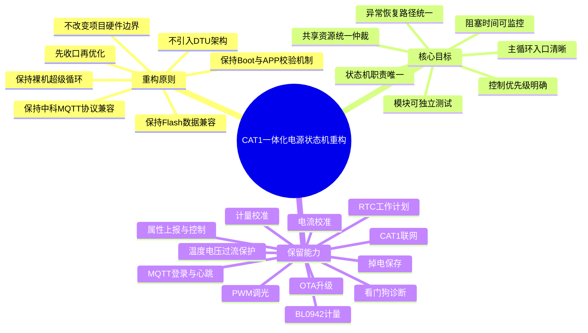

---

## 2. 目标软件分层思维导图

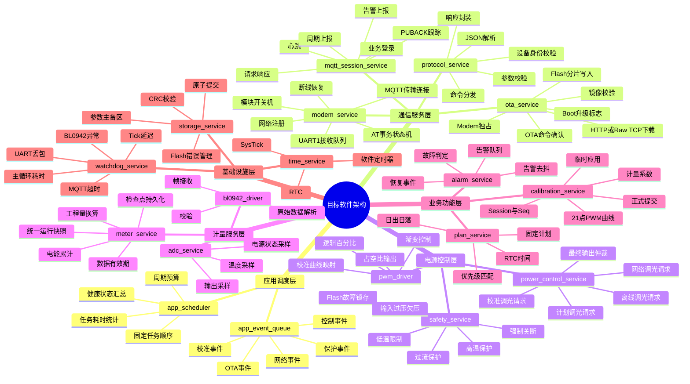

---

## 3. 状态机归属重构思维导图

当前问题不是状态机数量本身，而是同一个业务状态被多个模块重复表达。重构后每类状态只能有一个权威来源。

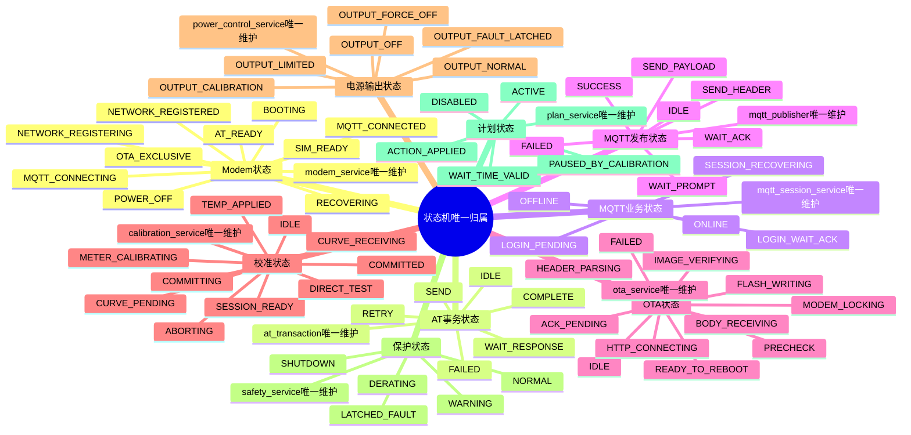

---

## 4. 主循环重构思维导图

重构后 `main.c` 只负责硬件初始化和调用统一调度器，不再直接了解每个业务状态机内部细节。

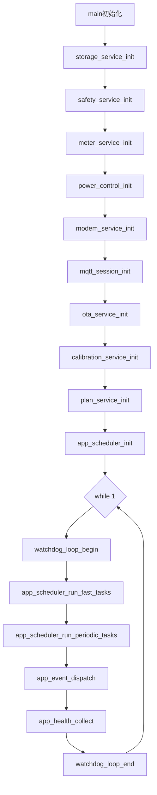

统一调度器内部：

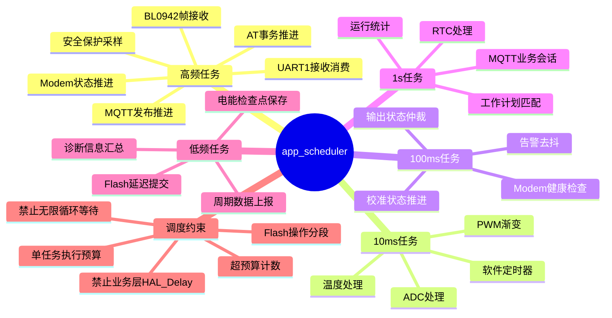

---

## 5. 通信状态机改造思维导图

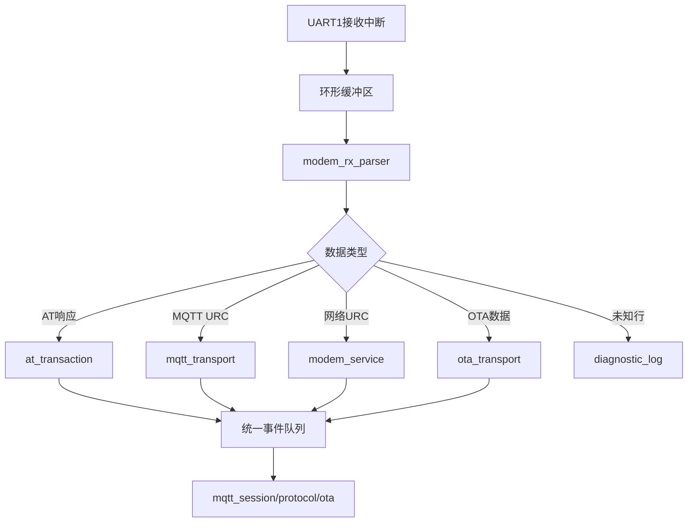

目标：

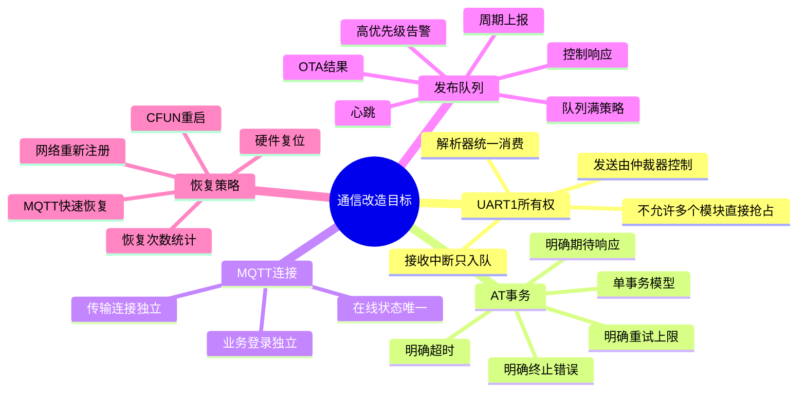

---

## 6. 电源输出与保护仲裁思维导图

所有功能只提交“期望输出”，最终 PWM 只能由 `power_control_service` 一个模块决定。

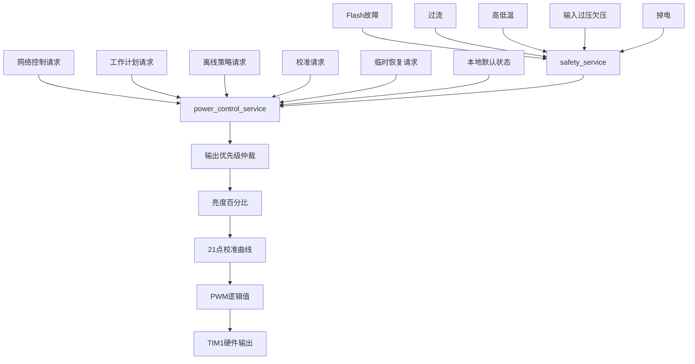

优先级：

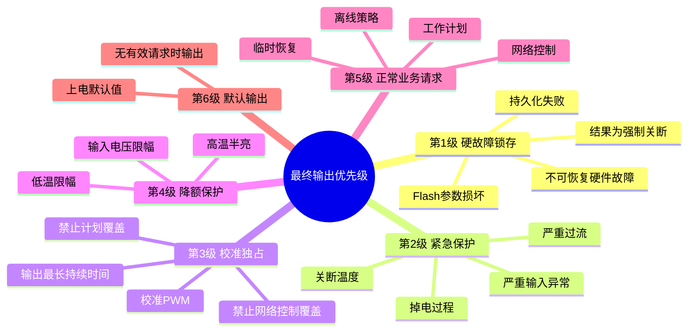

---

## 7. BL0942计量状态机改造思维导图

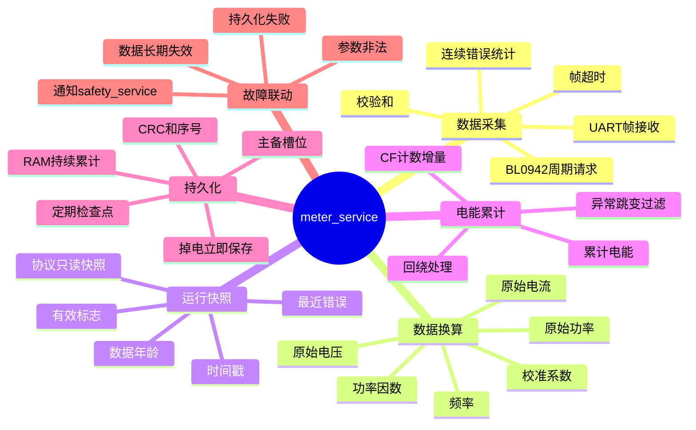

---

## 8. OTA与校准互斥思维导图

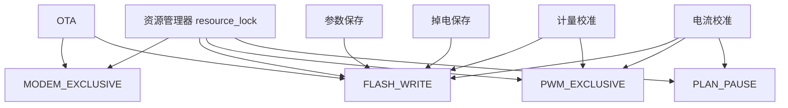

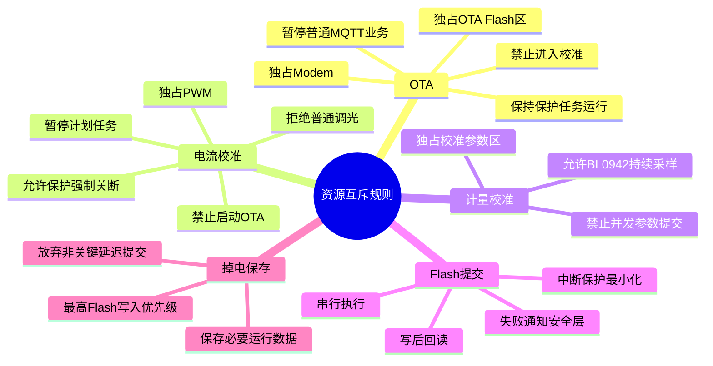

---

## 9. 事件驱动改造思维导图

模块之间不再直接跨层调用内部函数，而是通过事件和命令接口协作。

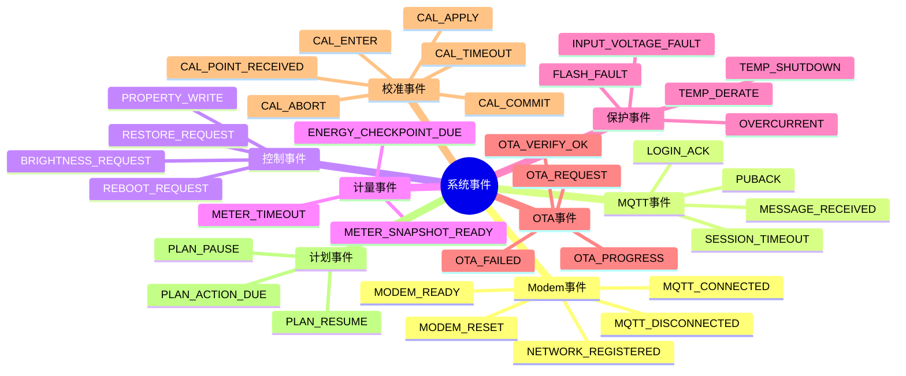

接口原则：

```text
上层向下层发命令
下层向上层发事件
同层之间不直接修改对方内部状态
全局变量逐步收口到模块Context
```

---

## 10. 文件结构改造思维导图

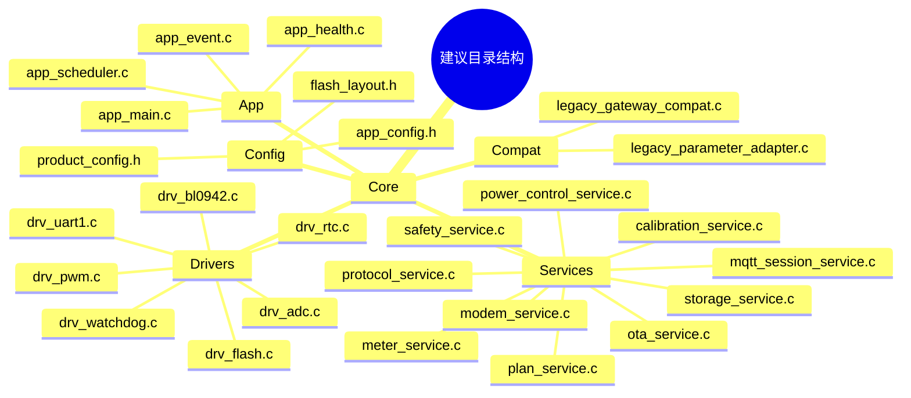

第一阶段不要求一次性移动全部文件。应先在现有目录内建立新接口，再逐步迁移实现，避免 Keil 工程文件和编译路径一次性大改。

---

## 11. 分阶段改造路线思维导图

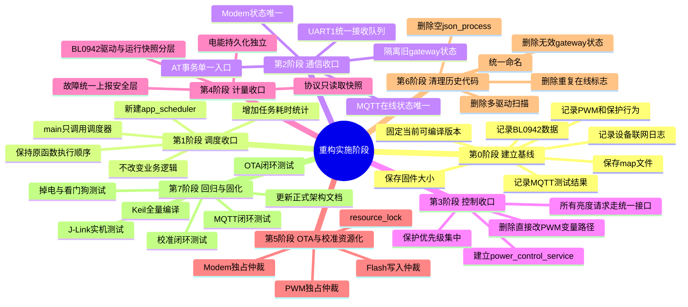

---

## 12. 重构验收思维导图

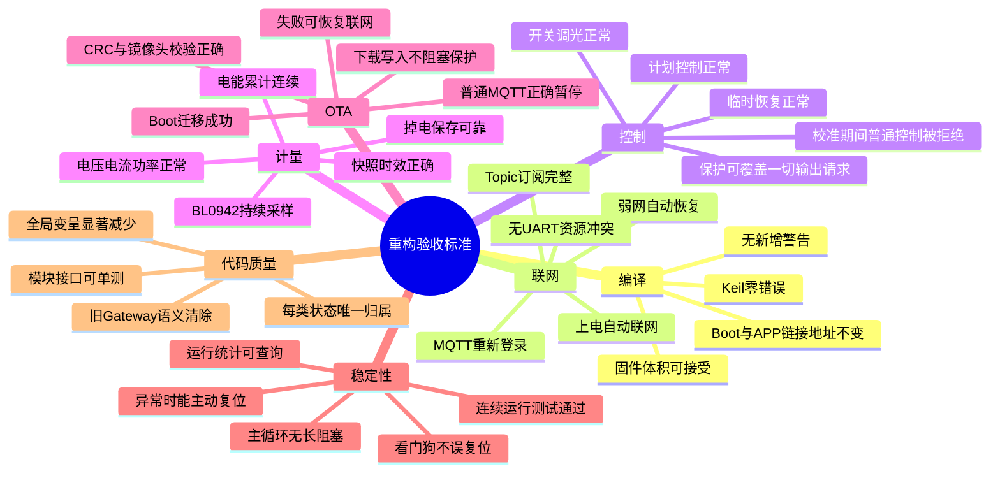

---

## 13. 第一阶段结论

本次状态机重构的核心不是增加更多状态，而是完成以下五个收口：

```text
主循环入口收口到 app_scheduler
4G状态收口到 modem_service
MQTT业务状态收口到 mqtt_session_service
所有PWM请求收口到 power_control_service
所有保护结果收口到 safety_service
```

最终目标架构：

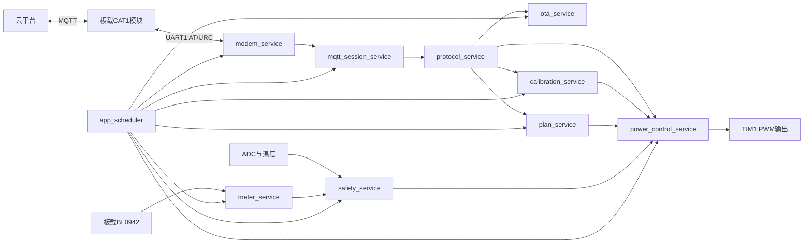

后续详细设计应在这张思维导图基础上，继续展开：

1. 每个状态机的正式状态定义与转换条件；
2. 模块Context结构体；
3. 事件类型与队列结构；
4. 各模块公开API；
5. 原文件到新模块的迁移映射；
6. 分阶段Codex执行任务；
7. 每阶段Keil编译和J-Link实机测试用例。
