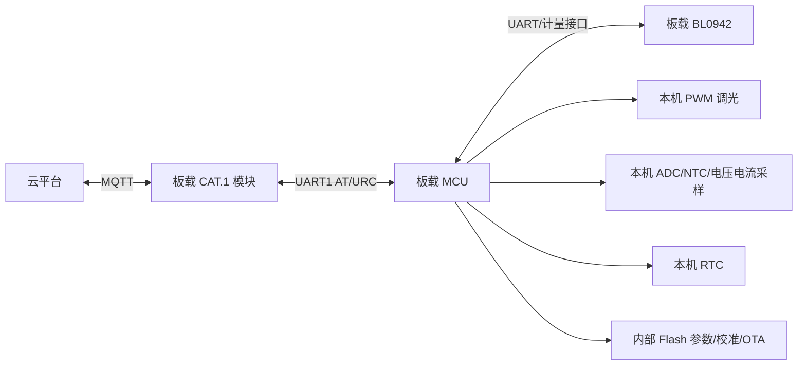
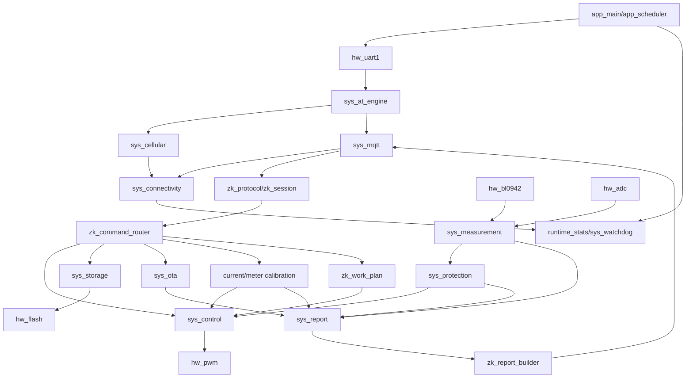

# CAT1_Keil_Project 一体化架构迁移与功能逻辑实施总文档

> 文档版本：V1.0  
> 编制日期：2026-07-30  
> 适用项目：`CAT1_Keil_Project`  
> 产品形态：MCU + 板载 CAT.1 模块 + 板载 BL0942 + 本机 PWM/ADC/NTC/RTC/Flash 的一体化电源  
> 参考项目：`DTU-CAT.1`，仅参考模块边界、请求队列、控制仲裁、状态快照和异常恢复设计，不复制 DTU、UART2 外部数字电源或单双路架构  
> 代码规范依据：`docs/嵌入式C代码编写规范.md`  
> 实施目标：彻底迁移到职责单一、资源唯一所有、状态唯一归属、异常可自动恢复的新架构，并删除全部不再使用的旧兼容代码

---

# 1. 文档目的

本文不是概念性架构说明，而是后续 Codex、Claude Code 和人工开发必须共同遵守的实施基线。本文必须回答以下问题：

1. 当前一体化项目最终保留哪些功能；
2. 每项功能由哪个模块唯一负责；
3. 每个模块允许依赖谁、禁止依赖谁；
4. 每个状态机有哪些状态、进入条件、退出条件、超时和失败处理；
5. MQTT、4G、OTA、Flash、PWM、计量等共享资源由谁独占；
6. 设备“有电、有信号但平台失联，必须重新上电”的假在线问题如何自动发现和恢复；
7. 旧文件中的有效逻辑迁移到哪里；
8. 哪些旧文件、旧状态、旧宏和 Keil Group 最终必须删除；
9. 每个迁移阶段如何编译、测试、烧录和验收；
10. 如何确保迁移过程中不破坏 Boot、APP 分区、参数区、OTA 区和现有平台协议。

本文实施完成后，`main.c`、网络、协议、计量、控制、保护、校准、存储和 OTA 之间不得再通过散乱全局变量形成隐式控制链路。

---

# 2. 项目边界与非目标

## 2.1 唯一产品边界

本项目唯一硬件和业务结构如下：



## 2.2 明确不包含

新架构不包含且不得保留以下产品语义：

- 独立 DTU；
- UART2 半双工外部数字电源；
- 多驱动扫描；
- 单路/双路数字电源切换；
- 旧 `0x50 0x50 0x50 0x50` 数据点协议；
- 旧 Gateway 登录流程；
- 平台业务层 Ping/Pong；
- 为历史版本保留的兼容分支；
- 未被正式产品使用的 DALI、485、USB、RTOS 示例、旧测试协议；
- 同一功能的新旧两套实现同时参与编译。

## 2.3 保留功能

迁移后必须完整保留并重新归属：

- MCU 初始化、时钟、中断和看门狗；
- 4G 模块上电、SIM、网络注册、信号查询、PDP 和自动恢复；
- MQTT Open、Connect、Subscribe、QoS1 Publish、PUBACK、下行接收；
- 中科 MQTT 登录、属性、控制、巡检、计划、告警、校准、OTA 和响应；
- BL0942 计量采集和统一运行快照；
- PWM 调光、渐变和校准曲线；
- 输入电压、电流、功率、频率、功率因数、能量和温度；
- 过温、过流、输入过压/欠压、输出异常、掉电和 Flash 故障保护；
- RTC、固定计划、日出日落计划和临时控制恢复；
- 电流 21 点校准、计量校准、会话与提交；
- 参数主备、CRC、序号、延迟写和掉电保存；
- OTA 流式下载、备份区写入、镜像校验、Boot 迁移和升级结果补报；
- 日志、运行统计、异常原因和 J-Link 可观察变量。

---

# 3. 代码规范适用规则

## 3.1 必须直接执行的现有规范

以下规则完全继承 `嵌入式C代码编写规范.md`：

- 三层调用方向：应用层调用系统层，系统层调用硬件层，硬件层不得反向调用；
- 一个模块对应一对 `.c` 和 `.h` 文件；
- C 文件名、H 文件名和公开函数前缀一致；
- 文件名全小写，单词使用下划线分隔；
- 枚举类型以 `_en` 结尾；
- 结构体类型以 `_st` 结尾；
- 静态变量使用 `_` 前缀；
- 宏和常量使用全大写下划线；
- 缩进统一为 4 个空格，禁止 Tab；
- 每个 C 文件必须有规范文件头；
- 每个函数必须有“功能描述、输入参数、输出返回”注释块；
- ISR 只读取寄存器、清标志和入队，不解析协议、不打印、不写 Flash；
- 复杂流程必须使用非阻塞状态机；
- 禁止函数内部死等；
- 多语句宏使用 `do { } while (0)`；
- 条件编译使用 `#if`；
- 避免魔法数字，超时、次数和容量必须使用具名宏；
- Flash 写入前先比较，关键数据使用主备和校验。

## 3.2 本次架构迁移对现有规范的补充

### 3.2.1 `common.h` 收口

`common.h` 只允许包含：

- MCU/HAL 基础头文件；
- `type.h`；
- 编译期产品常量；
- 不含业务语义的基础宏；
- 日志开关。

禁止在 `common.h` 中继续增加：

- 业务状态全局变量；
- 模块 Context 的 `extern`；
- 业务函数声明；
- 网络、计量、PWM、OTA、校准等跨模块对象。

跨模块协作必须通过模块 `.h` 中的公开 API、事件或只读快照完成。

### 3.2.2 公共全局变量限制

新模块默认不得导出可写全局变量。模块状态必须保存在本模块 `.c` 内的静态 Context：

```c
static sys_mqtt_context_st _context;
```

允许公开的内容只有：

- `const` 配置；
- 只读快照 getter；
- 事件提交接口；
- 命令接口；
- 测试构建下的受控诊断接口。

禁止：

```c
extern u8 online;
extern u8 gateway_state;
extern u8 dim_level;
extern u8 OTA_ENABLE_state;
```

### 3.2.3 看门狗规则修订

保留“整个工程只允许在主循环首部喂狗”的位置约束，但禁止无条件喂狗。新主循环第一行必须是：

```c
sys_watchdog_try_feed();
```

`sys_watchdog_try_feed()` 根据上一轮健康快照决定是否真正调用硬件喂狗。健康快照至少检查：

- 主循环是否按时完成；
- 调度器是否持续推进；
- UART 接收是否持续溢出；
- AT 引擎是否永久卡在同一事务；
- Flash 操作是否超时；
- 关键保护任务是否按周期执行。

网络离线不等于 MCU 不健康，不能仅因 MQTT 离线停止喂狗。网络恢复由连接监督模块完成。

### 3.2.4 头文件守卫

统一使用：

```c
#ifndef __SYS_MQTT_H__
#define __SYS_MQTT_H__
...
#endif
```

### 3.2.5 单文件规模限制

推荐限制：

- 普通模块 `.c` 不超过 800 行；
- 协议命令分发模块不超过 1000 行；
- 单个函数不超过 80 行；
- `switch` 状态机过大时按子状态机拆分；
- 一个模块不得同时拥有网络、Flash、PWM 和计量四类资源中的两类以上。

超过限制必须在代码审查中说明原因，不能继续形成新的 `NbDriver.c` 或 `mqtt_zk_protocol.c` 式巨型文件。

---

# 4. 架构总原则

## 4.1 四条不可破坏的边界

```text
协议层不直接操作硬件
业务模块不直接读取 UART
网络模块不直接修改产品输出
模块不得修改其他模块的内部状态
```

## 4.2 单一事实来源

每类状态只能有一个权威模块：

| 状态/资源 | 唯一所有者 |
| --- | --- |
| UART1 RX/TX | `hw_uart1` |
| AT 事务 | `sys_at_engine` |
| SIM/注册/PDP | `sys_cellular` |
| MQTT 连接/订阅/发布 | `sys_mqtt` |
| 在线状态和恢复等级 | `sys_connectivity` |
| MQTT 业务登录 | `zk_session` |
| 下行 JSON 解析 | `zk_protocol` |
| 业务命令路由 | `zk_command_router` |
| BL0942 原始帧 | `hw_bl0942` |
| 运行计量快照 | `sys_measurement` |
| PWM 硬件输出 | `hw_pwm` |
| 最终亮度仲裁 | `sys_control` |
| 保护状态 | `sys_protection` |
| 校准会话 | `current_calibration` / `meter_calibration` |
| RTC 和时间有效性 | `sys_rtc` |
| 工作计划 | `zk_work_plan` |
| 上报队列 | `sys_report` |
| 参数和记录写入 | `sys_storage` |
| OTA 总流程 | `sys_ota` |
| Flash 物理操作 | `hw_flash` |
| 看门狗健康判定 | `sys_watchdog` |
| 系统事件队列 | `sys_event` |

任何新代码如果创建第二个 `online`、第二个 MQTT 状态、第二个 PWM 当前值或第二个 OTA Busy 标志，必须拒绝合入。

## 4.3 资源所有权

硬件资源只有一个直接调用者：

```text
UART1 HAL API     -> hw_uart1
BL0942 UART HAL   -> hw_bl0942
TIM1 PWM HAL      -> hw_pwm
ADC HAL           -> hw_adc
Flash HAL         -> hw_flash
RTC HAL           -> hw_rtc
4G PWRKEY/RESET   -> hw_4g_power
IWDG HAL          -> hw_watchdog
```

系统层通过硬件层 API 使用资源，应用层不得直接调用 HAL。

---

# 5. 目标目录与 Keil Group

## 5.1 物理目录

```text
Core/
├── App/
│   ├── app_main.c/.h
│   ├── app_boot.c/.h
│   └── app_scheduler.c/.h
├── System/
│   ├── sys_event.c/.h
│   ├── sys_time.c/.h
│   ├── sys_watchdog.c/.h
│   ├── sys_at_engine.c/.h
│   ├── sys_cellular.c/.h
│   ├── sys_mqtt.c/.h
│   ├── sys_connectivity.c/.h
│   ├── sys_measurement.c/.h
│   ├── sys_control.c/.h
│   ├── sys_protection.c/.h
│   ├── sys_report.c/.h
│   ├── sys_storage.c/.h
│   ├── sys_rtc.c/.h
│   ├── sys_resource.c/.h
│   └── sys_ota.c/.h
├── Hardware/
│   ├── hw_uart1.c/.h
│   ├── hw_4g_power.c/.h
│   ├── hw_bl0942.c/.h
│   ├── hw_pwm.c/.h
│   ├── hw_adc.c/.h
│   ├── hw_flash.c/.h
│   ├── hw_rtc.c/.h
│   └── hw_watchdog.c/.h
├── Protocol/
│   ├── zk_protocol.c/.h
│   ├── zk_session.c/.h
│   ├── zk_command_router.c/.h
│   ├── zk_property.c/.h
│   ├── zk_report_builder.c/.h
│   ├── zk_work_plan.c/.h
│   └── zk_alarm.c/.h
├── Services/
│   ├── current_calibration.c/.h
│   ├── current_cal_storage.c/.h
│   ├── current_cal_curve.c/.h
│   ├── meter_calibration.c/.h
│   ├── meter_runtime.c/.h
│   └── runtime_stats.c/.h
└── Config/
    ├── product_config.h
    ├── network_config.h
    ├── flash_layout.h
    ├── protocol_config.h
    └── build_config.h
```

## 5.2 Keil Group

Keil Group 必须与物理目录和职责一致：

```text
Application
System/Kernel
System/Network
System/Power
System/Storage
System/OTA
Hardware
Protocol/ZK
Services/Calibration
Services/Runtime
Libraries
HAL
CMSIS
```

禁止再使用语义错误的 `login` Group 装入 OTA、cJSON、校准、告警、属性和计划等无关文件。

## 5.3 Target

正式只保留：

- `IntegratedPower_Debug`
- `IntegratedPower_Release`

两个 Target 的业务逻辑必须完全一致，只允许以下差异：

- 日志开关；
- 优化等级；
- 调试信息；
-断言和性能统计。

不得通过 Target 或宏保留旧业务架构。

---

# 6. 系统启动逻辑

## 6.1 `main.c` 最终形态

```c
int main(void)
{
    app_boot_init();

    while (1)
    {
        sys_watchdog_try_feed();
        app_scheduler_process();
    }
}
```

`main.c` 不允许包含：

- 4G 连接状态；
- MQTT 发布状态；
- OTA 状态；
- PWM 亮度变量；
- BL0942 数据转换；
- RTC 计划匹配；
- Flash 保存；
- JSON 解析；
- 校准流程。

## 6.2 初始化顺序

```text
1. HAL_Init
2. SystemClock_Config
3. hw_watchdog_init
4. GPIO/DMA 基础初始化
5. hw_uart1_init
6. hw_bl0942_init
7. hw_pwm_init，并保持安全输出状态
8. hw_adc_init
9. hw_flash_init
10. hw_rtc_init
11. sys_time_init
12. sys_event_init
13. sys_storage_init 并加载参数
14. 校验参数、校准曲线和计量系数
15. sys_protection_init
16. sys_measurement_init
17. sys_control_init
18. sys_rtc_init
19. zk_work_plan_init
20. sys_report_init
21. sys_at_engine_init
22. sys_cellular_init
23. sys_mqtt_init
24. sys_connectivity_init
25. sys_ota_init
26. 校准模块初始化
27. sys_watchdog_init_health
28. app_scheduler_init
29. 开中断
```

## 6.3 上电输出策略

禁止无条件上电 100% 亮度。启动输出按以下顺序决定：

1. PWM 初始化为关闭或产品定义的安全值；
2. 加载并校验参数、校准曲线和保护配置；
3. 若 Flash、校准曲线或关键配置损坏，保持关断并锁存故障；
4. 若 RTC 有效且当前计划存在，应由计划模块提交请求；
5. 若有合法的掉电前恢复策略，可由控制模块恢复；
6. 无有效请求时使用产品默认亮度，默认值必须写入 `product_config.h`；
7. 最终值经过保护限制后才允许输出。

---

# 7. 调度器与时间逻辑

## 7.1 SysTick 中断

SysTick ISR 只做：

```c
void SysTick_Handler(void)
{
    HAL_IncTick();
    sys_time_tick_isr();
}
```

禁止在 SysTick ISR 中调用 ADC、PWM、RTC、计划、4G、MQTT、Flash、告警或计量业务。

## 7.2 绝对时间调度

每个任务保存下一次到期时间，不依赖函数被调用次数：

```c
if (sys_time_is_due(now_ms, task->next_run_ms) == BOOL_TRUE)
{
    task->next_run_ms += task->period_ms;
    task->process();
}
```

若主循环延迟：

- 不得无限追赶；
- 同一任务每轮最多执行一次；
- 记录 missed_count 和 max_lag_ms；
- 关键保护任务使用当前绝对时间重新计算，不使用递减计数器补次数。

## 7.3 任务分级

### 每轮快速任务

1. `hw_uart1_process()`；
2. `sys_at_engine_process()`；
3. `sys_cellular_process()`；
4. `sys_mqtt_process()`；
5. `hw_bl0942_process()`；
6. `sys_measurement_process()`；
7. `sys_ota_process()`；
8. `sys_event_process()`。

### 10ms 任务

- PWM 渐变；
- ADC 滤波；
- UART 字节间超时；
- 协议帧超时；
- 控制执行确认。

### 100ms 任务

- 保护状态机；
- 控制仲裁；
- 连接监督；
- 上报队列；
- 校准安全超时；
- 主循环健康统计。

### 1s 任务

- RTC 更新；
- 工作计划；
- 运行时间统计；
- 信号查询调度；
- MQTT 业务登录和周期逻辑；
- 存储延迟提交；
- 诊断摘要。

### 低频任务

- 周期运行数据上报；
- 能量检查点；
- 时间同步；
- 参数一致性巡检；
- 长周期网络诊断。

---

# 8. 系统事件模型

## 8.1 事件队列原则

事件队列使用固定长度静态数组，禁止动态内存。事件内容必须是值拷贝或稳定对象 ID，不允许保存调用方临时栈指针。

```c
typedef enum
{
    SYS_EVENT_NONE = 0,
    SYS_EVENT_MODEM_READY,
    SYS_EVENT_MODEM_NO_RESPONSE,
    SYS_EVENT_NETWORK_REGISTERED,
    SYS_EVENT_NETWORK_LOST,
    SYS_EVENT_MQTT_CONNECTED,
    SYS_EVENT_MQTT_SUBSCRIBED,
    SYS_EVENT_MQTT_DISCONNECTED,
    SYS_EVENT_MQTT_PUBACK,
    SYS_EVENT_MQTT_PUBLISH_FAILED,
    SYS_EVENT_MQTT_MESSAGE,
    SYS_EVENT_MEASUREMENT_UPDATED,
    SYS_EVENT_PROTECTION_CHANGED,
    SYS_EVENT_CONTROL_APPLIED,
    SYS_EVENT_POWER_FAIL,
    SYS_EVENT_STORAGE_FAILED,
    SYS_EVENT_OTA_FINISHED,
    SYS_EVENT_CALIBRATION_CHANGED
} sys_event_type_en;
```

## 8.2 调用方向

```text
上层 -> 下层：公开命令接口
下层 -> 上层：事件或只读快照
同层之间：通过明确服务接口，不得访问内部 Context
```

## 8.3 队列满策略

事件分为：

- 不可丢事件：掉电、保护关断、MQTT 断线、存储失败、OTA 完成；
- 可合并事件：计量更新、信号更新、状态变化；
- 可丢低优先级事件：重复调试事件。

队列满时：

1. 优先删除可合并的旧事件；
2. 同类型状态事件只保留最新一条；
3. 不可丢事件仍无法入队时，锁存 `event_queue_critical_overflow`；
4. 诊断模块记录并上报；
5. 不能在 ISR 中等待队列空闲。

---

# 9. UART1 与 AT 引擎

## 9.1 `hw_uart1`

唯一职责：

- UART1 HAL 初始化；
- RX ISR 字节入环形缓冲；
- TX 非阻塞发送；
- UART ORE/FE/NE 错误恢复；
- 环形缓冲溢出计数；
- 提供字节读取和发送完成状态。

禁止：

- 解析 `OK`、`ERROR`；
- 识别 QMT URC；
- 清空队列来开始新命令；
- 处理 OTA HTTP；
- 调用协议层。

严禁新代码调用 `flushQueue()` 清空未分类的 UART 数据。

## 9.2 `sys_at_engine`

唯一职责：

- AT 请求队列；
- 单一活动事务；
- 命令发送；
- 期待响应匹配；
- Prompt 模式；
- 超时和有限重试；
- 命令响应与 URC 分流；
- 事务结果事件。

AT 请求结构：

```c
typedef struct
{
    const char *command;
    const char *expected_token;
    const char *error_token;
    u32 timeout_ms;
    u8 retry_max;
    u8 priority;
    u16 owner_id;
} sys_at_request_st;
```

事务状态：

```text
IDLE
 -> DEQUEUE
 -> SEND
 -> WAIT_RESPONSE
 -> COMPLETE
 -> IDLE

WAIT_RESPONSE --timeout--> RETRY_WAIT
RETRY_WAIT --due--> SEND
达到 retry_max -> FAILED -> IDLE
```

约束：

- 同一时间只允许一个普通 AT 事务；
- URC 不属于当前事务时必须立即送到对应模块，不能丢弃；
- MQTT 发布 Prompt/ACK 通过 AT 引擎注册专用事务，不允许另一个状态机直接抢读 UART；
- OTA 原始数据模式通过 `sys_resource` 独占 UART 解析模式；
- 每次状态变化记录时间戳，事务超时后必须释放所有权。

---

# 10. 蜂窝网络模块

## 10.1 `sys_cellular` 职责

只负责：

- 4G 模块硬件启动；
- AT 可用性；
- SIM/CPIN；
- IMEI/ICCID；
- CEREG 注册；
- PDP 激活；
- RSRP/信号；
- CFUN 恢复；
- 4G 模块硬复位。

不负责 MQTT Topic、JSON、业务登录和设备控制。

## 10.2 状态机

```text
POWER_OFF
 -> POWER_ON_START
 -> WAIT_RDY
 -> AT_PROBE
 -> SIM_CHECK
 -> NETWORK_REGISTERING
 -> PDP_ACTIVATING
 -> NETWORK_READY
```

异常路径：

```text
AT_PROBE 超时 -> MODULE_HARD_RESET
SIM 不可用 -> SIM_ERROR_WAIT
注册超时 -> CFUN_RECOVERY
CFUN 失败 -> MODULE_HARD_RESET
PDP 失效 -> PDP_RECOVERY
```

## 10.3 重试与退避

推荐初始配置：

| 参数 | 建议值 |
| --- | ---: |
| AT 探测超时 | 2s |
| AT 探测重试 | 3 次 |
| 网络注册单轮等待 | 60s |
| CFUN 恢复次数 | 2 次 |
| 模块硬复位冷却 | 30s |
| 模块硬复位上限 | 3 次/小时 |

所有值放入 `network_config.h`，实机测试后调整。

---

# 11. MQTT 传输模块

## 11.1 `sys_mqtt` 职责

只负责：

- QMTOPEN；
- QMTCONN；
- 必要 Topic 订阅；
- QoS1 发布；
- Packet ID；
- Prompt；
- PUBACK；
- `+QMTRECV`；
- `+QMTSTAT`；
- MQTT 会话关闭和重建；
- 发布队列和结果事件。

不负责中科 JSON 内容和业务在线状态。

## 11.2 MQTT 状态

```text
DISABLED
 -> WAIT_NETWORK
 -> OPENING
 -> CONNECTING
 -> SUBSCRIBING_DOWNLINK
 -> SUBSCRIBING_UPGRADE
 -> READY
 -> CLOSING
 -> RECOVERY_WAIT
```

只有全部 Topic 订阅成功才进入 `READY`。

## 11.3 发布事务

```text
IDLE
 -> PREPARE
 -> SEND_HEADER
 -> WAIT_PROMPT
 -> SEND_PAYLOAD
 -> WAIT_PUBACK
 -> SUCCESS/FAILED
 -> IDLE
```

要求：

- 默认使用 QoS1；
- Packet ID 单调递增并跳过 0；
- 必须匹配当前 Packet ID；
- 发布缓冲由 `sys_mqtt` 自己持有；
- 调用方返回后，Payload 仍然有效；
- 单次失败必须返回明确原因；
- 不允许把发布成功等同于平台业务已消费。

## 11.4 发布优先级

```text
1. 保护/故障关键事件
2. OTA 命令确认和结果
3. 控制命令响应
4. 校准命令响应
5. 连接探测/登录
6. 巡检实时上报
7. 状态变化上报
8. 周期运行数据
9. 普通诊断
```

队列满时不得丢弃 1 至 4 级消息。

---

# 12. 假在线检测与自动恢复

## 12.1 问题定义

假在线指：

- MCU 和 4G 模块仍有电；
- 模块可能仍显示有信号和已注册；
- 内部变量仍认为 MQTT 在线；
- 平台已收不到设备数据或无法下发；
- 没有收到明确断线 URC；
- 设备只有重新上电后才能恢复。

该问题不能继续依赖单一 `online` 布尔变量，也不能依赖平台回复心跳。

## 12.2 不使用平台 Ping/Pong

平台不会回复心跳，因此：

- 不发送等待业务 ACK 的心跳；
- 不使用旧 `makePingPack()`；
- 不因平台不回复心跳判定离线；
- MQTT Keepalive 仍由模块和 Broker 协议层正常启用。

## 12.3 在线证据

连接监督模块维护多个时间戳：

```c
typedef struct
{
    u32 last_at_ok_ms;
    u32 last_registered_ms;
    u32 last_mqtt_connected_ms;
    u32 last_subscribed_ms;
    u32 last_puback_ms;
    u32 last_downlink_ms;
    u32 suspect_since_ms;
    u16 session_generation;
    u8 publish_fail_streak;
} sys_connectivity_snapshot_st;
```

`ONLINE_VERIFIED` 必须同时满足：

1. 4G 模块 AT 通讯近期正常；
2. 网络注册状态有效；
3. MQTT 已连接；
4. 必要 Topic 已订阅；
5. 最近存在有效 QoS1 PUBACK；
6. PUBACK 在线租约未过期。

下行消息可以刷新接收证据，但不能代替 PUBACK 租约，因为设备可能长期没有下行。

## 12.4 在线租约

推荐初始值：

```text
无业务发布时探测间隔：60s
PUBACK 在线租约：180s
单次发布超时：按模块手册和实测确定，初始 15s
连续失败进入 SUSPECT：2 次
连续失败触发 MQTT 重建：3 次
```

正常业务消息收到 PUBACK 后直接续租。若 60 秒内没有任何业务发布，则发送最小 QoS1 链路探测消息。平台无需回复该消息，设备只检查 Broker PUBACK。

## 12.5 连接监督状态机

```text
OFFLINE
 -> WAIT_NETWORK
 -> MQTT_CONNECTING
 -> SESSION_VERIFYING
 -> ONLINE_VERIFIED
 -> SUSPECT
 -> RECOVER_MQTT
 -> RECOVER_NETWORK
 -> RESET_MODEM
```

### `ONLINE_VERIFIED -> SUSPECT`

任一条件成立：

- 连续 2 次 QoS1 发布失败；
- 距 `last_puback_ms` 超过租约；
- 收到 QMTSTAT、PDP DEACT 或 MQTT 断线 URC；
- MQTT READY 状态与模块查询结果不一致；
- AT 通讯长时间没有成功证据。

### `SUSPECT -> ONLINE_VERIFIED`

- 新的 QoS1 发布成功并收到匹配 PUBACK；
- 网络、MQTT 和订阅状态仍有效；
- 清零连续失败计数。

### `SUSPECT -> RECOVER_MQTT`

- 第三次发布失败；
- 租约超时后主动探测仍失败；
- 收到明确 MQTT 会话错误。

## 12.6 分级恢复

### Level 0：发布事务恢复

- 终止当前发布；
- 释放 Prompt/ACK 状态；
- 保留待发送业务消息；
- 延迟后重试一次；
- 不清空 UART RX。

### Level 1：MQTT 会话重建

```text
暂停新普通发布
 -> QMTDISC/QMTCLOSE
 -> QMTOPEN
 -> QMTCONN
 -> 重新订阅全部 Topic
 -> 发布上线/登录消息
 -> 收到 QoS1 PUBACK
 -> ONLINE_VERIFIED
```

### Level 2：网络恢复

```text
查询 CEREG/PDP
 -> PDP 重建
 -> 必要时 CFUN 0/1
 -> 等待重新注册
 -> MQTT 重建
```

### Level 3：4G 模块硬复位

当 AT 无响应、网络恢复失败或模块状态机长期卡死：

```text
停止 MQTT/AT 新事务
 -> 记录恢复原因
 -> hw_4g_power_reset
 -> 等待模块重新启动
 -> AT 探测
 -> SIM/注册/PDP
 -> MQTT/订阅/业务登录
```

只复位 4G 模块，不复位 MCU，不停止本地采集、调光、保护和 RTC 计划。

### Level 4：MCU 看门狗复位

仅在主循环、调度器、Flash 或核心软件无法推进时使用。网络异常本身不得直接触发 MCU 复位。

## 12.7 能力边界

QoS1 PUBACK 能证明：

- 设备至模块链路；
- 蜂窝网络；
- TCP/MQTT Broker；
- Broker 收到发布。

它不能证明平台业务程序已经消费消息。若未来需要判断平台业务服务是否正常，必须由平台增加业务 ACK；当前项目明确不做该功能。

---

# 13. 中科协议与业务会话

## 13.1 模块拆分

```text
zk_protocol          JSON 基础解析、字段读取、边界检查
zk_session           业务登录、登录状态、会话代次
zk_command_router    消息类型分发和服务调用
zk_property          属性模型与读写适配
zk_report_builder    报告 JSON 构造
zk_work_plan         计划解析、存储模型和执行匹配
zk_alarm             告警码和平台字段映射
```

## 13.2 下行链路

```text
+QMTRECV
 -> sys_mqtt 提取 topic/payload/length
 -> SYS_EVENT_MQTT_MESSAGE
 -> zk_protocol_parse
 -> 校验 JSON、设备身份、消息 ID 和长度
 -> zk_command_router
 -> 调用唯一服务接口
 -> 生成响应模型
 -> sys_report_enqueue
```

要求：

- 全链路传递显式长度；
- 禁止在未验证 `length` 的情况下直接 `strlen()`；
- 同一 MQTT 消息只允许分发一次；
- 使用消息 ID、命令类型和会话代次实现必要的重复抑制；
- 协议层不得写 Flash、改 PWM、发 AT、访问 BL0942。

## 13.3 业务登录状态

```text
OFFLINE
 -> LOGIN_PENDING
 -> LOGIN_PUBLISHING
 -> LOGIN_WAIT_RESULT
 -> ONLINE
```

当前平台若存在登录结果消息，则登录成功由该结果确认。登录状态和 MQTT 传输状态必须分开：

```text
MQTT READY != ZK SESSION ONLINE
```

MQTT 重建后必须增加 `session_generation`，清理旧请求上下文并重新登录。

---

# 14. 计量采集逻辑

## 14.1 `hw_bl0942`

只负责：

- UART/接口初始化；
- 原始字节接收；
- 帧头、长度和校验；
- 原始寄存器值；
- 通讯错误统计。

不负责工程量换算、平台上报和 Flash。

## 14.2 `sys_measurement`

负责：

- BL0942 原始值换算；
- ADC 和 NTC 数据融合；
- 输入电压、电流、功率、频率和功率因数；
- 输出电流、电压或本机采样数据；
- 能量累计；
- 样本有效性和年龄；
- 统一只读快照。

快照示例：

```c
typedef struct
{
    u32 revision;
    u32 sample_time_ms;
    u32 valid_mask;
    s32 input_voltage_mv;
    s32 input_current_ma;
    s32 input_power_mw;
    s32 output_voltage_mv;
    s32 output_current_ma;
    s32 temperature_0p1c;
    u32 energy_0p001wh;
    u16 frequency_0p01hz;
    u16 power_factor_0p001;
    u8 data_quality;
} sys_measurement_snapshot_st;
```

## 14.3 数据有效性

每个数据项必须有：

- 是否有效；
- 更新时间；
- 数据年龄；
- 连续失败计数；
- 最近错误原因。

协议巡检读取快照，不直接启动阻塞采样。若数据过期：

1. 请求高优先级刷新；
2. 在限定时间内等待状态机完成，不死等；
3. 超时后返回数据无效或最近有效值及其状态；
4. 不得将旧数据伪装为实时数据。

## 14.4 能量持久化

- RAM 中持续累计；
- 周期检查点写主备记录；
- 掉电事件触发关键保存；
- 通过序号和 CRC 选择最新有效记录；
- Flash 失败通知 `sys_protection`；
- 不允许每次采样写 Flash。

---

# 15. 控制与 PWM 逻辑

## 15.1 `sys_control` 是唯一控制仲裁者

所有亮度来源只能提交请求：

- 平台控制；
- RTC 工作计划；
- 临时控制恢复；
- 校准测试；
- 上电默认；
- 本地维修测试。

任何来源都不得直接调用 `hw_pwm_set()`。

## 15.2 三态模型

```text
requested：业务期望亮度
limited：经过保护、限幅和产品约束后的亮度
applied：实际已经输出并确认的亮度
```

控制 Context 至少包含：

```c
typedef struct
{
    u8 requested_brightness;
    u8 limited_brightness;
    u8 applied_brightness;
    u8 pending_brightness;
    u8 active_source;
    u8 protection_limit;
    u8 force_off;
    u32 transaction_id;
    u32 last_apply_ms;
} sys_control_context_st;
```

## 15.3 优先级

```text
1. Flash/关键参数损坏强制关断
2. 严重过流、关断温度、掉电等紧急保护
3. 校准独占输出
4. 降额保护
5. 平台临时控制
6. 工作计划
7. 普通平台控制
8. 上电默认
```

保护解除后，恢复 `requested` 对应值，而不是把保护期间的限制值永久覆盖用户请求。

## 15.4 PWM 映射

```text
亮度百分比
 -> 校验范围 0..100
 -> 21 点校准曲线插值
 -> PWM 最小/最大和偏移约束
 -> 渐变策略
 -> hw_pwm 输出
 -> 更新 applied
```

校准曲线无效时：

- 正式产品策略必须明确为安全关断或受限 fallback；
- 不允许静默使用未验证的随机参数；
- 诊断状态必须可查询。

## 15.5 临时控制恢复

平台命令包含持续时间时：

1. 保存当前有效业务请求，不保存保护后的输出；
2. 提交临时亮度请求；
3. 到期后恢复被覆盖的业务请求；
4. 新计划、新临时命令或校准开始时取消旧恢复任务；
5. 保护始终可以覆盖临时输出。

---

# 16. 保护逻辑

## 16.1 `sys_protection` 职责

只负责：

- 读取计量和 ADC/NTC 快照；
- 去抖、阈值、回差和状态机；
- 产生限幅、强制关断和告警状态；
- 向 `sys_control` 设置限制；
- 向 `sys_report` 提交状态变化。

不得直接操作 PWM 或 MQTT。

## 16.2 过温状态机

```text
NORMAL
 -> WARNING
 -> DERATE
 -> SHUTDOWN
 -> RECOVER_WAIT
 -> NORMAL
```

处理规则：

- 只使用新鲜、有效的温度样本；
- 连续样本达到阈值才推进普通告警；
- 严重温度可立即关断；
- 恢复必须低于 release 阈值并持续规定时间；
- 传感器失效采用产品定义的保守策略；
- 每个新样本只处理一次，不对同一时间戳重复累计。

## 16.3 输入电压/过流等保护

每项保护必须定义：

- 触发阈值；
- 恢复阈值；
- 连续样本数；
- 最大样本年龄；
- 动作：告警、降额或关断；
- 是否锁存；
- 清除方式；
- 平台告警码。

## 16.4 Flash 故障

以下情况必须进入安全状态：

- 主备参数均损坏；
- 校准记录冲突且无法选择；
- 关键配置写入后回读失败；
- 回滚失败；
- OTA 写入越界。

安全状态至少包括：

- 停止高风险输出；
- 锁存错误原因；
- 允许通信和诊断继续运行；
- 禁止继续使用不可信参数。

---

# 17. 校准逻辑

## 17.1 电流 21 点校准

保留：

- Session ID；
- 单调 `seq`；
- 命令摘要；
- 21 点位图；
- 分片写入；
- 临时应用；
- 正式提交；
- CRC；
- 主备记录；
- 超时退出；
- 最大持续输出时间；
- 校准期间计划暂停；
- OTA 与校准互斥。

## 17.2 状态机

```text
IDLE
 -> SESSION_READY
 -> DIRECT_TEST / CURVE_RECEIVING
 -> CURVE_PENDING
 -> TEMP_APPLIED
 -> COMMITTING
 -> COMMITTED
 -> IDLE
```

异常可从任意活动状态进入：

```text
ABORTING -> FORCE_PWM_OFF -> RELEASE_RESOURCE -> IDLE
```

## 17.3 校准资源

进入校准前必须申请：

- `SYS_RESOURCE_PWM_EXCLUSIVE`；
- `SYS_RESOURCE_FLASH_CALIBRATION`；
- `SYS_RESOURCE_PLAN_PAUSE`。

保护模块不受校准锁限制，仍可强制关断。

## 17.4 参数改变联动

修改硬件最大电流、采样电阻、PWM 偏移或其他影响曲线语义的 Factory 参数时：

1. 校验新参数；
2. 强制安全关闭输出；
3. 标记旧校准曲线失效；
4. 原子提交新 Factory 参数；
5. 失败时恢复旧参数和旧曲线；
6. 回滚失败则保持安全锁存；
7. 成功后重新加载控制配置；
8. 未重新校准前不得宣称曲线有效。

该事务由 `config/service + current_cal_storage + sys_storage + sys_control` 协作，协议层只接收结果。

---

# 18. RTC 与工作计划

## 18.1 `sys_rtc`

负责：

- RTC 读写；
- 时间有效性；
- 时间跳变检测；
- 服务器校时；
- 本地时间快照。

## 18.2 `zk_work_plan`

负责：

- 计划解析；
- 日期、星期、固定时间、日出日落偏移；
- 当前动作选择；
- 计划优先级；
- 已执行去重；
- 校准暂停和恢复。

计划模块只向 `sys_control` 提交亮度请求。

## 18.3 时间跳变

若校时导致时间跨越：

- 小幅前跳：重新评估当前分钟；
- 大幅前跳：不补执行所有历史动作，只执行当前应该生效的最高优先级动作；
- 后跳：使用动作 ID + 日期 + 时间窗口去重，防止重复执行；
- RTC 无效：计划保持暂停，不使用随机时间。

---

# 19. 上报服务

## 19.1 `sys_report`

负责：

- 统一上报请求队列；
- 优先级；
- 合并同类状态；
- 失败重试；
- QoS1 结果关联；
- 网络恢复后关键消息补发。

不负责 JSON 字段生成，JSON 由 `zk_report_builder` 完成。

## 19.2 报告类型

- 登录；
- 在线探测；
- 周期运行数据；
- 巡检实时数据；
- 控制响应；
- 属性响应；
- 告警触发和恢复；
- OTA 确认、进度、结果；
- 校准响应；
- 时间同步；
- 诊断摘要。

## 19.3 离线期间

- 周期普通数据只保留最新一份；
- 告警触发/恢复保留事件序列或最终状态，按平台协议能力处理；
- 控制响应若会话已失效，保留至超时或会话代次改变；
- 网络恢复后先登录，再发送高优先级积压；
- 不得无限积累导致 RAM 耗尽。

---

# 20. 存储服务

## 20.1 `sys_storage` 是唯一逻辑写入入口

其他模块不得直接调用 `hw_flash` 或 `sys_data_store()`。

存储请求包含：

- 记录类型；
- 数据版本；
- 长度；
- 优先级；
- 是否需要主备；
- 回调/事件 ID。

## 20.2 记录格式

建议统一：

```c
typedef struct
{
    u32 magic;
    u16 version;
    u16 length;
    u32 sequence;
    u32 payload_crc32;
    u32 header_crc32;
} sys_storage_record_header_st;
```

## 20.3 原子提交

```text
比较新旧数据
 -> 选择非活动槽
 -> 擦除
 -> 写 Header/Payload
 -> 写后回读
 -> CRC 校验
 -> 标记新槽有效
 -> 更新 RAM active slot
```

写入失败：

- 原活动槽仍有效时继续使用旧值；
- 新旧均不可用时通知保护模块；
- 不允许先破坏唯一有效数据再写新数据。

## 20.4 Flash 布局

Boot、APP、参数、OTA 备份区地址必须保持当前工程正式布局，不得在本次架构重构中随意改变。所有地址集中在 `flash_layout.h`，业务模块不得出现裸地址。

---

# 21. OTA 逻辑

## 21.1 模块边界

```text
sys_ota                 OTA 总状态和资源管理
sys_ota_http            HTTP 请求和响应解析
sys_ota_writer          Flash 分片写入
sys_ota_validator       镜像头、长度、CRC、设备类型、版本校验
sys_ota_result          升级结果持久化和重启补报
```

若代码规模允许，可合并为较少文件，但职责不得重新混杂到网络主状态机。

## 21.2 唯一下载链路

正式版本只保留已经实机验证的流式下载方案：

- Raw TCP / HTTP GET；
- HTTP 200 全量响应；
- 支持无 Content-Length；
- 支持从固件头获得镜像长度和校验；
- 流式写 MCU OTA 备份区；
- 不依赖 UFS 全量缓存；
- 不依赖服务器 Range/206；
- 删除 QHTTPREADFILE 和旧分片兼容分支。

## 21.3 OTA 状态机

```text
IDLE
 -> PRECHECK
 -> COMMAND_ACK_PENDING
 -> RESOURCE_ACQUIRE
 -> MQTT_PAUSE
 -> HTTP_CONNECT
 -> HEADER_PARSE
 -> BODY_STREAM
 -> FLASH_WRITE
 -> IMAGE_VERIFY
 -> MARK_READY
 -> REBOOT_PENDING
```

失败路径统一：

```text
任意失败
 -> ABORT_TRANSPORT
 -> RELEASE_FLASH_BUFFER
 -> RELEASE_MODEM_RESOURCE
 -> RESTORE_MQTT
 -> PERSIST_RESULT
 -> FAILED/IDLE
```

## 21.4 OTA 期间仍必须运行

- 主循环；
- 看门狗健康监督；
- ADC/温度/过流保护；
- PWM 安全控制；
- 掉电处理；
- 必要日志。

普通 MQTT 业务可以暂停，但本地保护不得暂停。

## 21.5 安全校验

至少保留：

- APP 起始地址和长度边界；
- 镜像头；
- 设备类型；
- 固件长度；
- CRC；
- 版本策略；
- 写入后回读。

后续建议增加签名校验和防回滚，但若本阶段 Boot 不支持，不得在未同步 Boot 的情况下只改 APP 宣称已完成安全升级。

---

# 22. 资源互斥

`sys_resource` 使用静态资源位和明确所有者：

```text
MODEM_EXCLUSIVE
FLASH_CONFIG
FLASH_CALIBRATION
FLASH_OTA
PWM_EXCLUSIVE
PLAN_PAUSE
REPORT_PAUSE
```

规则：

- OTA 独占 Modem 和 OTA Flash；
- 校准独占 PWM 和校准 Flash；
- 掉电保存拥有最高 Flash 请求优先级；
- 参数保存与校准提交串行；
- 保护强制关断不受 PWM 独占限制；
- 资源申请必须有超时和失败返回；
- 模块退出、失败或复位时必须释放资源；
- 禁止只设置一个全局 Busy 标志而无所有者和代次。

---

# 23. 诊断与看门狗

## 23.1 统一恢复原因

```c
typedef enum
{
    SYS_RECOVERY_NONE = 0,
    SYS_RECOVERY_PUBACK_TIMEOUT,
    SYS_RECOVERY_PUBLISH_ERROR,
    SYS_RECOVERY_QMTSTAT,
    SYS_RECOVERY_PDP_DEACT,
    SYS_RECOVERY_ONLINE_LEASE_EXPIRED,
    SYS_RECOVERY_AT_TIMEOUT,
    SYS_RECOVERY_MODEM_NO_RESPONSE,
    SYS_RECOVERY_NETWORK_REG_LOST,
    SYS_RECOVERY_UART_OVERFLOW,
    SYS_RECOVERY_OTA_ABORT,
    SYS_RECOVERY_STORAGE_FAILURE
} sys_recovery_reason_en;
```

## 23.2 运行统计

至少统计：

- 主循环最大耗时；
- 每个任务最大耗时和超预算次数；
- UART1 溢出和错误次数；
- AT 超时、重试和失败；
- 网络注册丢失；
- MQTT 连接次数；
- MQTT 非正常断开次数；
- PUBACK 成功、失败和超时；
- 在线租约超时；
- MQTT 快速重连；
- CFUN 恢复；
- 模块硬复位；
- 最长连续离线时间；
- BL0942 帧错误和数据过期；
- Flash 写失败和回滚失败；
- OTA 失败原因；
- 看门狗拒绝喂狗原因。

## 23.3 日志规范

```text
[NET][CELL]
[NET][MQTT]
[NET][LINK]
[AT]
[MEAS]
[CTRL]
[PROTECT]
[STORE]
[OTA]
[CAL]
[PLAN]
[WDT]
```

日志必须：

- 有状态变化，不按每轮刷屏；
- 包含时间、旧状态、新状态和原因；
- Release 可按等级关闭；
- ISR 中禁止打印；
- 不打印敏感 Token 和完整密码。

---

# 24. 掉电处理

掉电 ISR 只锁存事件和必要时间戳，不执行 Flash 写入。主循环中：

1. `sys_protection` 立即请求安全关断；
2. `sys_report` 生成掉电事件，但不保证网络有时间发出；
3. `sys_storage` 只保存关键最小数据：能量、运行时间、必要状态；
4. 放弃普通延迟参数提交；
5. Flash 写入必须有电容维持时间预算；
6. 保存结束记录结果；
7. 禁止掉电流程死等网络上报。

---

# 25. 旧文件迁移映射

## 25.1 网络和旧 Gateway

| 旧文件/职责 | 新模块 | 迁移完成后 |
| --- | --- | --- |
| `NbDriver.c/.h` UART、AT、网络、MQTT、发布、OTA锁混合 | `hw_uart1`、`sys_at_engine`、`sys_cellular`、`sys_mqtt`、`sys_connectivity` | 删除 |
| `hw_gateway.c/.h` URC处理、旧网关状态、重复分发 | `sys_mqtt`、`zk_session` | 删除 |
| `TcpClient.c/.h` 网络桥接和事件 | `sys_mqtt`、`sys_report` | 删除 |
| `Portable.c/.h` 4G电源和混合适配 | `hw_4g_power`、必要基础适配 | 删除或仅保留无业务基础函数后改名 |
| `app_active/http_active` | 对应新网络/OTA状态 | 删除 |

## 25.2 旧协议

| 旧文件 | 处理 |
| --- | --- |
| `Protocol.c/.h` | 旧数据点协议，删除 |
| `App.c/.h` | 迁移有效参数、RTC、校准、OTA接口后删除 |
| `net_dim.c/.h` | 控制迁入 `sys_control` 后删除 |
| 旧 Ping 构造和处理 | 删除 |

## 25.3 一体化功能

| 旧文件 | 新归属 |
| --- | --- |
| `sys_bl0942` | `hw_bl0942 + sys_measurement` |
| `sys_pwm` | `hw_pwm + sys_control` |
| `sys_temp_over_protect` | `sys_protection` |
| `danger_current_check` | `sys_protection` |
| `sys_pow_drop_check` | `sys_protection + sys_storage` |
| `sys_data` | `sys_storage + 各模块配置结构` |
| `data_backup` | `sys_storage` |
| 旧运行统计 | `runtime_stats/sys_watchdog` |

## 25.4 删除条件

旧文件只有在以下条件全部满足后才能删除：

1. 有效功能已迁移；
2. 新接口已有单元测试；
3. Keil Debug/Release 均编译通过；
4. 实机关键链路通过；
5. 全仓搜索无引用；
6. Keil Group 已移除；
7. Include Path 无旧目录依赖；
8. MAP 文件无旧符号；
9. 旧宏删除后仍编译通过。

最终发布版本禁止保留“默认关闭但仍存在”的旧功能源文件。

---

# 26. 迁移实施阶段

## 阶段 0：冻结基线

产物：

- 当前可编译 commit；
- Debug/Release MAP、HEX、BIN；
- 固件大小；
- 现有 MQTT 登录、发布、下行日志；
- BL0942、PWM、保护、RTC、校准和 OTA 基线；
- J-Link 烧录和回读记录。

禁止在没有基线的情况下开始大规模删除。

## 阶段 1：建立目录、规范和调度骨架

实施：

- 新建三层目录和 Keil Group；
- 新建 `app_boot`、`app_scheduler`、`sys_event`、`sys_time`；
- `main.c` 收口；
- 保持原处理顺序的临时适配调用；
- 增加任务耗时统计；
- SysTick ISR 移除业务逻辑。

验收：功能行为不变、编译零错误、无新增警告。

## 阶段 2：重写 UART1 和 AT 引擎

实施：

- UART1 唯一 RX 环形缓冲；
- 所有消费者改为 AT 引擎/URC 路由；
- 删除发送前清队列；
- 增加 ORE、溢出、事务超时诊断；
- 旧网络模块暂通过适配层调用新接口。

验收：AT、IMEI、ICCID、CEREG、信号查询稳定；高频 URC 不丢失。

## 阶段 3：拆分 Cellular、MQTT 和 Connectivity

实施：

- 建立网络注册状态机；
- 建立 MQTT 连接/订阅/发布队列；
- 建立在线租约和假在线恢复；
- 移除重复 MQTT 分发；
- 移除旧 `online/gateway_state` 权威性。

验收：阻断 Broker、丢 URC、断天线、恢复网络均可自动恢复，不重启 MCU。

## 阶段 4：协议和业务会话拆分

实施：

- 拆分 `mqtt_zk_protocol.c`；
- 长度安全解析；
- 单次分发；
- 消息去重；
- 命令只调用服务接口；
- 响应进入统一上报队列。

验收：控制、属性、巡检、计划、告警、校准和 OTA 命令不重复执行。

## 阶段 5：计量、控制和保护收口

实施：

- BL0942 驱动与工程量换算分离；
- 建立统一快照；
- 所有 PWM 请求迁入 `sys_control`；
- 保护只设置限制；
- 去除直接修改 `dim_level` 和 PWM 的旁路。

验收：平台控制、计划、临时恢复、保护和校准优先级正确。

## 阶段 6：存储和配置迁移

实施：

- 拆分巨型 `sys_data_st`；
- 记录版本化；
- 主备和 CRC；
- 延迟写和事务回滚；
- Factory 参数与校准曲线联动。

验收：断电、写失败、记录损坏和回滚场景安全。

## 阶段 7：OTA 重构

实施：

- 单一流式下载链路；
- Modem/Flash 资源独占；
- HTTP 和 Flash 写入分层；
- 失败恢复 MQTT；
- 删除 UFS、Range、旧分支。

验收：成功升级、断网失败、掉电中断、CRC 错误、服务器无 Content-Length 均有明确结果。

## 阶段 8：删除全部旧架构

实施：

- 删除旧源文件；
- 删除兼容宏；
- 删除旧 Keil Group；
- 删除注释代码和空函数；
- 清理 Include Path；
- 更新测试；
- 检查 MAP。

验收：仓库只剩一套正式业务链路。

## 阶段 9：整机回归和长稳

实施：

- Debug/Release fresh rebuild；
- APP-only 安全烧录；
- 72 小时和更长时间运行；
- 网络、OTA、校准、保护、掉电压力测试；
- 固件体积和 RAM 审计。

---

# 27. 测试矩阵

## 27.1 假在线专项

| 场景 | 预期 |
| --- | --- |
| Broker 端口阻断，信号正常 | 租约/发布失败发现，自动 MQTT 重建 |
| 丢弃 QMTSTAT URC | PUBACK 租约仍能发现 |
| 天线断开后恢复 | 自动重新注册和登录 |
| PDP 失效 | 网络恢复后 MQTT 恢复 |
| AT 完全无响应 | 自动硬复位 4G 模块 |
| 平台不回复心跳 | 不影响在线判断 |
| 业务长期无变化 | 最小 QoS1 探测维持租约 |
| 网络离线时本地调光 | 正常 |
| 网络离线时过温 | 正常降额/关断 |
| 网络恢复 | 重订阅、重登录、关键积压补发 |
| 72 小时运行 | 不需要整机重新上电 |

## 27.2 控制与保护

- 0%、1%、50%、99%、100% 调光；
- 校准曲线边界插值；
- 计划和网络控制冲突；
- 临时控制到期；
- 保护期间收到 100% 命令；
- 保护恢复后恢复 requested；
- 校准期间普通控制拒绝；
- 保护强制覆盖校准；
- 上电参数损坏保持安全关闭。

## 27.3 存储

- 主槽损坏、备槽有效；
- 备槽损坏、主槽有效；
- 两槽均损坏；
- 写入中断电；
- 写后回读失败；
- 参数不变不擦写；
- 序号回绕；
- 校准提交回滚。

## 27.4 OTA

- 正常下载；
- 无 Content-Length；
- Chunked 或连接关闭结束；
- 中途断网；
- 超时；
- CRC 错；
- 设备类型错；
- 长度越界；
- Flash 写失败；
- OTA 失败后 MQTT 自动恢复；
- Boot 迁移后结果补报。

---

# 28. 最终验收指标

## 28.1 编译和结构

- Keil Debug/Release：0 Error；
- 不新增 Warning；
- Boot/APP/参数/OTA 地址不变；
- `main.c` 只保留启动和调度；
- 单一 UART1 消费入口；
- 单一 MQTT 下行分发入口；
- 单一 PWM 输出入口；
- 单一 Flash 逻辑写入口；
- 不存在旧 Gateway、旧数据点协议和兼容宏；
- MAP 中不存在已删除旧符号。

## 28.2 网络

- 假在线发现时间目标不超过 3 分钟；
- 普通 MQTT 会话恢复目标不超过 2 分钟；
- 模块硬复位后恢复目标不超过 5 分钟；
- 网络恢复无需整机重新上电；
- 同一命令只执行一次；
- UART RX 不因发送命令被清空。

## 28.3 本地功能

- 网络异常不影响计量、PWM、保护和 RTC 计划；
- OTA 不阻塞关键保护；
- 校准不被普通计划覆盖；
- Flash 故障进入明确安全状态；
- 数据快照有有效性和年龄，不上报伪实时数据。

## 28.4 稳定性

- 至少 72 小时连续运行；
- 无主循环永久卡死；
- 无重复 MQTT 分发；
- 无未释放资源锁；
- 无持续 Flash 高频擦写；
- 无必须人工断电才能恢复的 4G/MQTT 故障。

---

# 29. Codex/Claude Code 执行约束

每个阶段执行时必须遵守：

1. 先阅读本文和 `嵌入式C代码编写规范.md`；
2. 先列出本阶段修改文件、迁移函数、删除候选和风险；
3. 不跨阶段同时重写多个核心域；
4. 不创建兼容层作为永久方案；
5. 临时适配层必须标记删除阶段和调用者；
6. 每完成一个模块立即补齐 `.h`、函数注释、状态说明和测试；
7. 禁止通过新增全局变量快速串联；
8. 禁止在 ISR、定时器或业务函数中增加死等；
9. 禁止直接改 Boot/Flash 布局；
10. 禁止删除仍有有效逻辑但未迁移的旧文件；
11. 每个阶段必须 fresh rebuild；
12. 每个阶段必须检查 MAP、固件大小、RAM 和编译警告；
13. 涉及硬件行为的阶段必须通过 J-Link/实机验证；
14. 测试失败不得通过屏蔽功能、缩短流程或关闭校验绕过；
15. 提交信息必须说明：迁移内容、删除内容、测试结果和遗留风险。

---

# 30. 代码审查检查表

## 模块边界

- [ ] 每个硬件资源只有一个所有者；
- [ ] 状态只有一个权威来源；
- [ ] 无跨层 HAL 调用；
- [ ] 无跨模块修改内部 Context；
- [ ] 无新增可写公共全局变量；
- [ ] 协议层无 Flash/PWM/AT/计量硬件操作。

## 状态机

- [ ] 每个状态有进入动作；
- [ ] 每个等待状态有超时；
- [ ] 每个失败路径释放资源；
- [ ] 重试次数有限；
- [ ] 状态变化有原因和时间戳；
- [ ] 重启后状态恢复策略明确。

## 代码规范

- [ ] 文件头完整；
- [ ] 函数注释完整；
- [ ] 文件名与函数前缀一致；
- [ ] 枚举 `_en`、结构体 `_st`；
- [ ] 静态变量 `_` 前缀；
- [ ] 4 空格、无 Tab；
- [ ] 无魔法数字；
- [ ] 无死等；
- [ ] ISR 只入队；
- [ ] 条件编译使用 `#if`；
- [ ] 无未使用函数和变量。

## 实机

- [ ] 上电安全；
- [ ] MQTT 自动恢复；
- [ ] 假在线自动发现；
- [ ] 本地控制不受网络影响；
- [ ] 保护可覆盖所有输出；
- [ ] OTA 失败恢复联网；
- [ ] 校准互斥正确；
- [ ] 掉电保存可靠；
- [ ] 72 小时长稳通过。

---

# 31. 最终架构结果

迁移完成后的系统链路必须清晰为：



最终必须实现：

```text
功能模块只负责自己的逻辑
硬件资源只有一个所有者
复杂流程全部非阻塞状态机
平台协议与产品控制解耦
网络故障不影响本地安全功能
假在线无需人工整机断电即可恢复
旧代码迁移完成后从源码和 Keil 工程彻底删除
```
