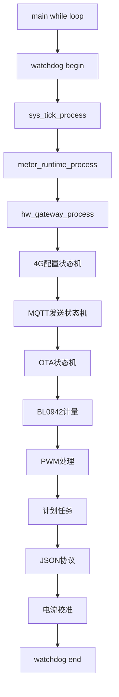
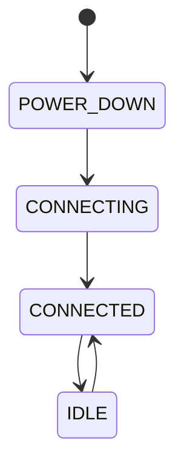
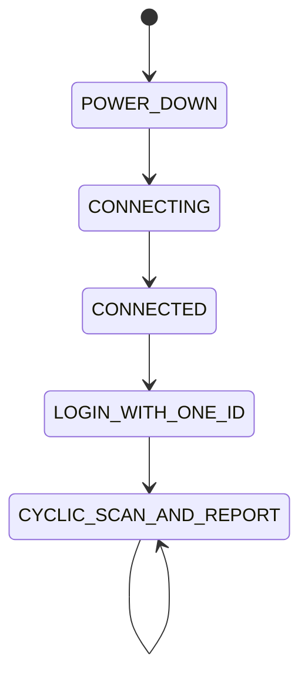

# CAT1_Keil_Project 状态机架构与系统调度梳理

> 分析版本：2026-07-28  
> 分析对象：CAT1_Keil_Project main 分支  
> 目标：梳理当前裸机系统状态机、任务调度关系、通信链路和功能耦合关系。

---

## 1. 总体架构

当前系统不是 RTOS，而是：

```
                 STM32 Main Loop
                       |
              watchdog_loop_begin/end
                       |
                 sys_tick_process
                       |
 ------------------------------------------------
 |        |          |          |              |
4G状态机 MQTT状态机 OTA状态机 PWM控制 计量状态机
 |        |          |          |              |
NB AT    ZK协议    HTTP/TCP   TIM PWM      BL0942
```

核心入口：

- `Core/Src/main.c`
- `while(1)` 中循环推进所有状态机。

---

# 2. 主循环调度关系

执行顺序：



---

# 3. 4G模块状态机

文件：

- `NbDriver.c`
- `NbDriver.h`

## 3.1 模块状态



## 3.2 AT命令状态机

```
IDLE
 |
READY
 |
TXING
 |
RXING
 |
RXING_COMPLETE
```

支持：

- 自动重发
- 超时检测
- 链路丢失恢复
- OTA锁保护

---

# 4. MQTT连接状态机

连接流程：

```
AT Ready
 |
CPIN检测
 |
CEREG注册
 |
IMEI获取
 |
MQTT配置
 |
QMTOPEN
 |
QMTCONN
 |
QMTSUB
 |
CONNECTED
```

业务在线需要额外登录：

```
MQTT Connected
       |
发布登录包
       |
等待平台ACK
       |
online=1
```

MQTT连接 ≠ 平台在线。

---

# 5. MQTT发布状态机

状态：

```
IDLE
 |
SEND_HEADER
 |
WAIT_PROMPT
 |
SEND_PAYLOAD
 |
WAIT_ACK
 |
FINISH
```

发送具有反压机制：

- AT忙禁止发送
- 发布忙禁止发送
- OTA期间禁止普通发布

---

# 6. OTA状态机

OTA为最高优先级互斥任务。

```
MQTT在线
 |
收到OTA命令
 |
nb_modem_lock_for_ota()
 |
关闭普通MQTT业务
 |
HTTP/TCP下载
 |
Flash写入
 |
校验
 |
恢复MQTT
```

互斥：

```
OTA
 |
 +-- 禁止MQTT发布
 +-- 禁止普通AT
 +-- 锁定4G UART
```

---

# 7. 网关状态机

文件：`hw_gateway.c`



当前CAT1模式主要流程：

```
4G连接
 |
MQTT登录
 |
平台ACK
 |
online=1
 |
周期上报/控制
```

---

# 8. 控制链路

```
平台MQTT
 |
Json_Protocol
 |
zk_handle_control_message()
 |
zk_apply_brightness()
 |
dim_level
 |
sys_pwm
 |
TIM PWM输出
```

PWM优先级：

```
Flash异常保护
 > 校准锁
 > 温度保护
 > 过流保护
 > 网络调光
 > 普通调光
```

---

# 9. 电流校准状态机

状态：

```
IDLE
 |
READY
 |
DIRECT_TEST
 |
CURVE_RECEIVING
 |
CURVE_PENDING
 |
COMMITTING
 |
COMMITTED
```

特点：

- session机制
- seq防重复
- CRC校验
- PWM锁定
- OTA期间禁止校准

---

# 10. 计量状态机

模块：

- BL0942
- meter_runtime
- calibration

结构：

```
BL0942采样
 |
frame解析
 |
校准转换
 |
snapshot缓存
 |
MQTT读取
```

Flash采用检查点保存，不持续写入。

---

# 11. 系统定时架构

```
SysTick IRQ
 |
10ms tick
 |
sys_tick_process()
 |
各模块timer
```

注意：

- 中断只更新时间
- 状态机全部在主循环运行
- 最大追赶周期3次

---

# 12. 当前架构风险点

## 12.1 状态机数量较多

当前存在：

- NB状态机
- AT状态机
- MQTT发布状态机
- OTA状态机
- Gateway状态机
- PWM状态机
- 校准状态机
- 计划任务状态机

后续维护建议统一生命周期管理。

---

## 12.2 旧Gateway逻辑残留

发现：

- 原网关扫描逻辑仍存在
- 单设备CAT1模式与旧多驱动网关模式混合

建议后续拆分：

```
cat1_gateway.c
legacy_gateway.c
```

---

# 13. 推荐下一阶段重构方向

```
app_scheduler
 |
 +-- comm_service
 |     +-- mqtt
 |     +-- ota
 |
 +-- power_service
 |     +-- pwm
 |     +-- protect
 |
 +-- meter_service
 |
 +-- calibration_service
```

目标：

- 降低状态机耦合
- 明确优先级
- 避免任务互相调用
- 保持裸机架构

---

# 结论

当前工程已经具备完整产品级状态机雏形，但属于持续演进后的多模块叠加架构。

优点：

- 非阻塞状态机
- OTA/MQTT互斥保护
- 看门狗健康检测
- 校准安全机制

主要问题：

- 状态机入口分散
- Gateway历史代码残留
- 通信层和业务层耦合较深

后续数字电源版本建议保留状态机思想，但重新规划模块边界。
