# CAT1_Keil_Project 状态机架构与系统调度梳理

> 分析版本：2026-07-28  
> 分析对象：CAT1_Keil_Project main 分支  
> 项目类型：CAT.1 一体化电源固件  
> 目标：梳理当前裸机系统状态机、任务调度关系、内部通信链路和功能耦合关系。

---

## 0. 项目边界声明

`CAT1_Keil_Project` 是 **一体化电源项目**，硬件主体包括：

- MCU：STM32F103/HK32F103 系列；
- 板载 CAT.1/4G 通信模块；
- 板载 BL0942 电能计量芯片；
- PWM 调光、电压电流采样、温度检测及保护电路；
- RTC、Flash、掉电检测等本机外围模块。

其实际控制结构为：

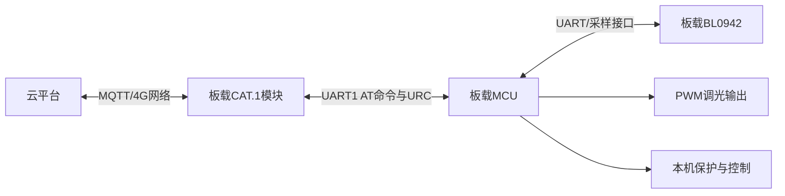

必须明确：

- 本项目没有独立 DTU 模块；
- 本项目不是“MQTT → DTU → UART2 → 数字电源”架构；
- MCU 不通过 UART2、半双工单线协议或外部通信协议去控制另一台电源；
- UART1 主要用于 MCU 与板载 4G 模块之间的 AT 命令和 URC 数据交互；
- BL0942、PWM、温度及保护逻辑均属于同一台一体化电源内部功能。

“MQTT → DTU → UART2 → 数字电源”仅属于另一个独立的 `DTU-CAT.1` 项目，不在本文分析范围内。

---

## 1. 总体架构

当前系统不是 RTOS，而是：

```text
                 MCU Main Super Loop
                         |
                watchdog_loop_begin/end
                         |
                   sys_tick_process
                         |
 ---------------------------------------------------------
 |           |            |          |         |          |
4G状态机  MQTT状态机   OTA状态机   PWM控制   计量处理   校准/计划
 |           |            |          |         |          |
AT/URC     中科协议      HTTP/TCP    TIM1      BL0942     Flash/RTC
```

核心入口：

- `Core/Src/main.c`
- `while (1)` 中循环推进各业务状态机和周期任务。

系统本质是：

```text
裸机超级循环
+
多个非阻塞状态机
+
Tick驱动的周期处理
+
少量中断收发与计时
```

---

# 2. 主循环调度关系

主循环主要执行顺序如下：

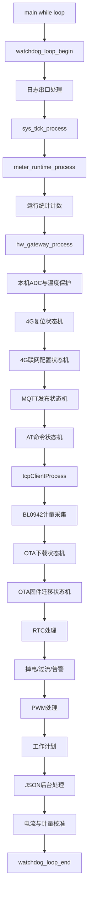

调度特点：

1. 所有模块共用同一个主循环；
2. 模块没有独立线程；
3. 任意一个处理函数长时间阻塞，都会推迟其他状态机；
4. 看门狗是否喂狗取决于整轮主循环健康状态；
5. OTA、Flash擦写等长操作需要自行分片或周期喂狗。

---

# 3. 4G模块状态机

主要文件：

- `Core/Src/LampProtocolLib/NbDriver.c`
- `Core/Src/LampProtocolLib/NbDriver.h`
- `Core/Src/LampProtocolLib/Portable.c`
- `Core/Src/hw_uart1.c`

这里的 UART 是 **MCU 与板载 CAT.1 模块之间的内部接口**，不用于连接外部数字电源。

## 3.1 模块生命周期状态

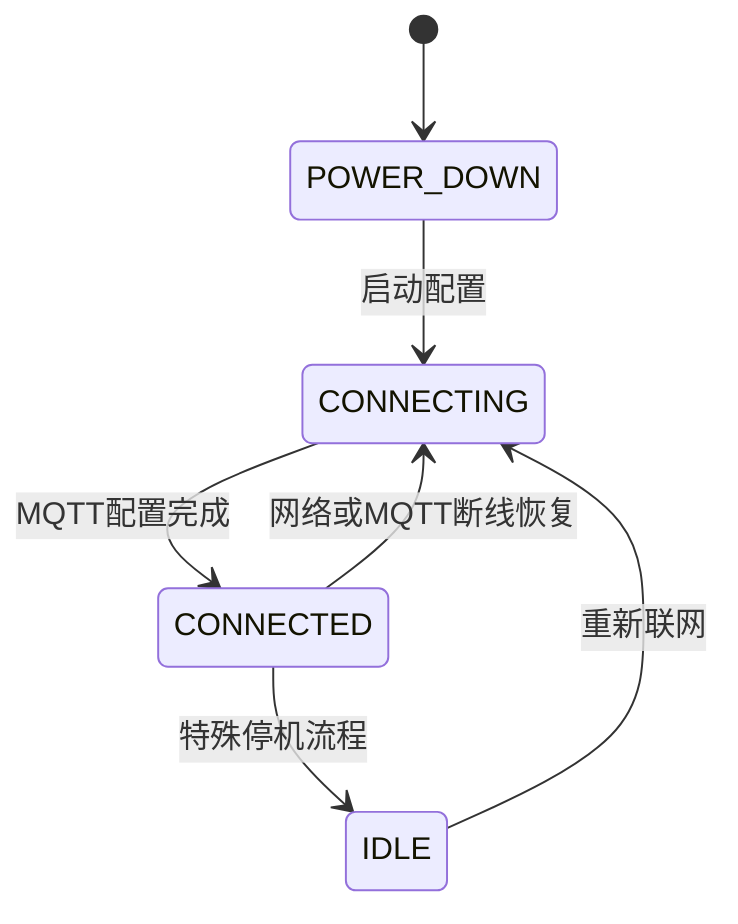

`NB_STATE` 用于表达模块的高层生命周期：

- `NB_STATE_POWER_DOWN`
- `NB_STATE_NOT_CONNECT`
- `NB_STATE_CONNECTING`
- `NB_STATE_CONNECTED`
- `NB_STATE_IDLE`

当前实际联网过程主要由更细的 `CONNECT_CONFIG_state_en` 推进。

## 3.2 4G联网配置状态机

完整配置链路包括：

```text
AT探测
  |
必要时PWRKEY启动/硬复位
  |
CPIN检查
  |
CEREG网络注册
  |
IMEI获取
  |
MQTT接收模式/版本/Keepalive/Session/Timeout配置
  |
遗嘱消息配置
  |
QMTOPEN
  |
QMTCONN
  |
QCCID
  |
订阅业务Topic
  |
订阅升级Topic
  |
CONNECTED
```

该状态机同时实现三级恢复策略：

```text
MQTT快速恢复
    ↓ 失败
网络注册恢复（CPIN/CEREG/CFUN）
    ↓ 失败
硬件复位恢复
```

## 3.3 AT命令状态机

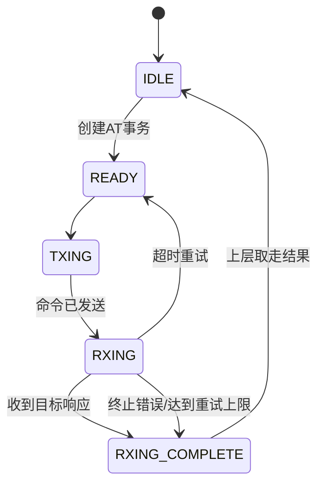

支持：

- 命令超时；
- 自动重发；
- IMEI/ICCID有效性校验；
- CEREG、QMT状态解析；
- 链路丢失检测；
- OTA独占锁保护。

## 3.4 4G硬件复位状态机

`Portable.c` 中通过 `_state_reset` 管理：

```text
IDLE
  |
PWRKEY_START
  |
PWRKEY保持550ms
  |
FINISH
```

硬复位流程为：

```text
RESET_N拉低
  |
延时20ms
  |
PWRKEY拉低
  |
RESET_N保持约320ms
  |
PWRKEY保持约550ms
  |
释放并进入FINISH
```

---

# 4. MQTT连接与业务登录状态机

4G模块完成 `QMTOPEN/QMTCONN/QMTSUB` 后，只能说明 MQTT 传输层已连接。

```text
4G网络注册成功
  |
MQTT配置完成
  |
QMTOPEN
  |
QMTCONN
  |
QMTSUB
  |
NB_EVENT_CONNECTED
```

随后还要执行中科业务登录：

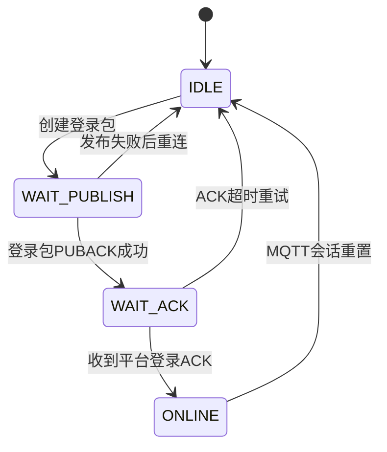

因此：

```text
MQTT连接成功 ≠ 平台业务在线
```

只有业务登录ACK成功后才会：

- 设置 `zk_login_state = ZK_LOGIN_STATE_ONLINE`；
- 设置 `online = 1`；
- 启动心跳、周期上报、校时、告警等业务定时器。

---

# 5. MQTT发布状态机

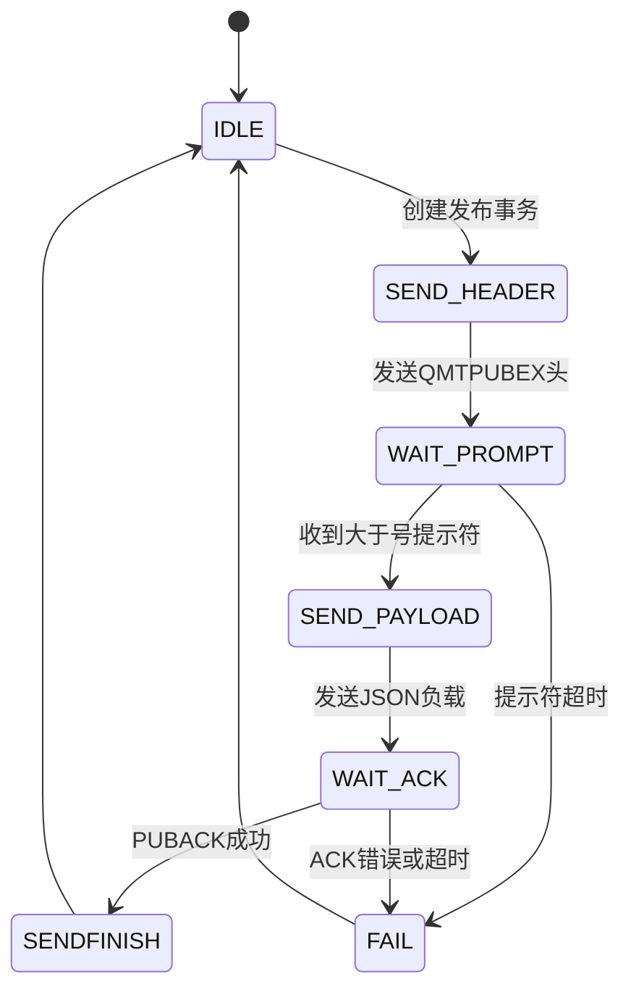

发送具有反压机制：

- AT事务忙时禁止新发布；
- MQTT发布状态机忙时禁止新发布；
- OTA期间禁止普通发布；
- 发布数据先复制到固定缓存，避免调用方缓冲区生命周期问题；
- 使用 MQTT Packet ID 匹配发布ACK。

业务会话层在发送资源空闲时，按优先级处理：

```text
心跳ACK检查
  > 信号查询
  > 告警
  > OTA确认/结果
  > OTA错误/进度
  > 请求响应队列
  > 启动校时
  > 巡检上报
  > 状态变化上报
  > 周期运行数据
  > 周期校时
  > 周期心跳
```

---

# 6. MQTT下行解析与本机控制链路

下行数据来自板载 4G 模块的 `+QMTRECV` URC：

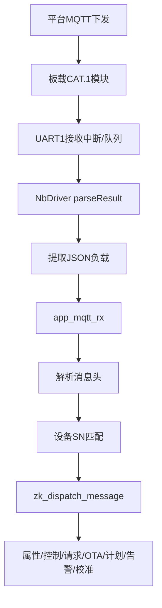

该链路完全在同一台一体化电源内部完成，不经过 DTU，也不通过 UART2 转发给另一台电源。

## 6.1 调光控制链路

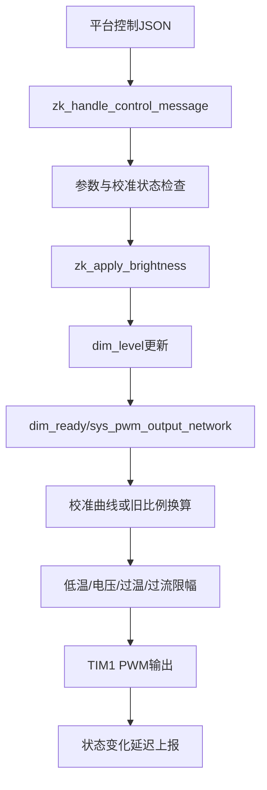

PWM控制优先级可概括为：

```text
Flash持久化故障锁存
    > 强制关断
    > 校准独占锁
    > 过流保护
    > 高低温/输入电压限幅
    > 网络/计划/离线调光请求
```

## 6.2 临时控制恢复

控制命令支持 `last` 定时恢复：

```text
记录控制前亮度
  |
执行临时亮度
  |
Timer到期
  |
恢复原亮度
```

新的计划动作会取消旧的临时恢复任务，避免计划执行后又被旧定时器覆盖。

---

# 7. `hw_gateway` 历史命名模块

文件：`Core/Src/LampProtocolLib/hw_gateway.c`

虽然模块仍命名为 `gateway`，但在当前一体化电源项目中，它不是独立 DTU 网关，也不代表存在外部数字电源。

当前真正有效的核心职责主要是：

- 调用 `nbModuleProcess()` 处理 4G模块URC；
- 保存兼容性的 `gateway_state`、`online`、登录标志；
- 兼容旧代码中的网络接收完成标志；
- 承接部分历史登录状态和日志。

文件中仍保留的以下逻辑属于历史网关代码：

- 扫描多个驱动；
- 多设备ID逐个登录；
- `LOGIN_ALL_DRIVER`；
- `SCAN_ALL_DRIVER`；
- `CYCLIC_SCAN_AND_REAPORT_DRIVER_DATA` 命名。

这些代码或被条件编译、注释，或只保留状态枚举，不应解释为当前产品真实硬件架构。

建议后续将该模块重命名或拆分为：

```text
cat1_transport_service.c
cat1_session_bridge.c
legacy_gateway_compat.c
```

其中长期目标应是删除不再使用的多驱动扫描与登录遗留代码。

---

# 8. OTA状态机

OTA是全局高优先级互斥任务。

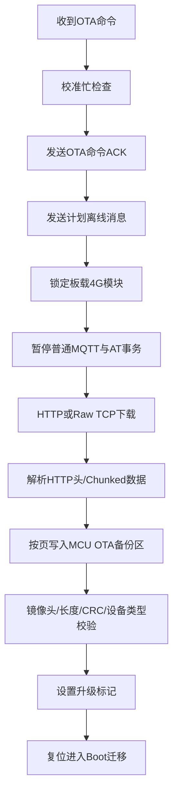

OTA互斥关系：

```text
OTA活跃
  |
  +-- 禁止普通MQTT发布
  +-- 禁止普通AT命令
  +-- 暂停tcpClientProcess
  +-- 独占MCU与板载4G模块之间的UART1
  +-- 禁止进入电流校准
```

OTA内部包含多层状态：

1. OTA协议确认状态；
2. 4G HTTP/Raw TCP下载状态；
3. HTTP头和Chunked解析状态；
4. Flash页缓存与写入状态；
5. 镜像校验状态；
6. Boot迁移状态；
7. 升级结果持久化和重启后补报状态。

---

# 9. BL0942计量与运行快照

主要模块：

- `sys_bl0942.c`
- `meter_runtime.c`
- `meter_calibration.c`
- `current_cal_storage.c`

数据链路：

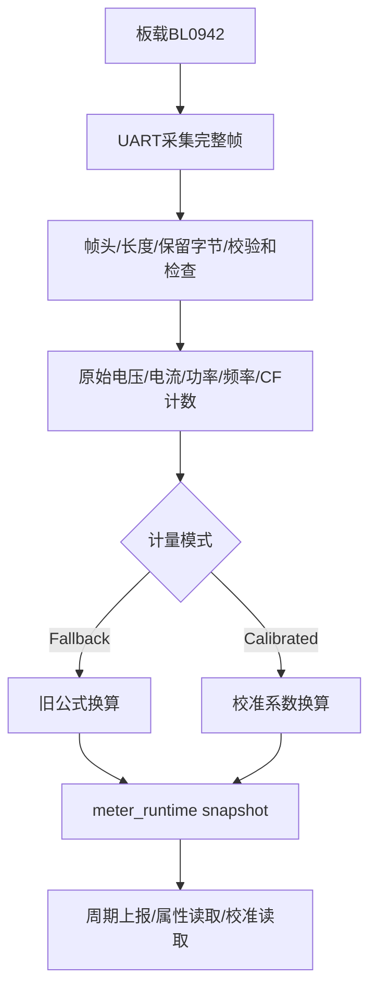

计量运行层采用：

```text
采样生产者
  |
统一运行快照
  |
协议消费者
```

协议上报不直接触发一次新的BL0942阻塞采集，而是读取最近有效快照，并检查样本年龄。

## 9.1 电能累计与持久化

```text
BL0942 CF24计数
  |
连续性与物理增量边界检查
  |
累计总电能
  |
RAM中持续更新
  |
约6小时写入一次A/B检查点
```

异常策略：

- 检查点冲突、Flash写入失败或计量系数非法时锁存持久化故障；
- 持久化故障会触发 `sys_pwm_force_off()`；
- 掉电检测可触发立即保存。

---

# 10. 电流与计量校准状态机

状态包括：

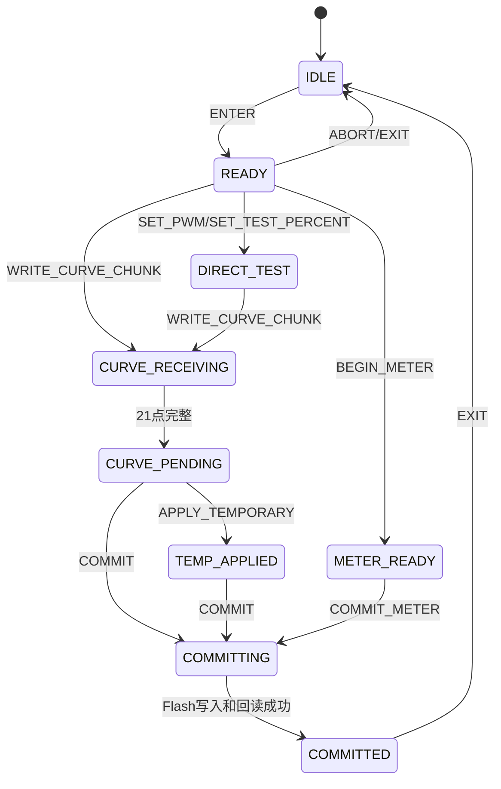

校准机制包含：

- Session ID；
- 单调递增 `seq`；
- 命令摘要防冲突；
- 21点PWM曲线位图；
- 分片写入；
- Context CRC、Curve CRC、Meter CRC；
- 临时应用与正式提交分离；
- PWM校准独占锁；
- 保护状态检查；
- 输出最长持续30秒自动关断；
- 会话超时自动退出；
- OTA期间禁止进入校准。

校准运行期间：

- 普通网络调光和计划任务不得覆盖校准PWM；
- 计划任务暂停；
- 校准结束后跳过当前相同计划动作窗口；
- 退出或异常时强制关闭PWM。

---

# 11. 工作计划调度

计划任务数据存储在主、备Flash区，并通过校验和检查完整性。

运行方式：

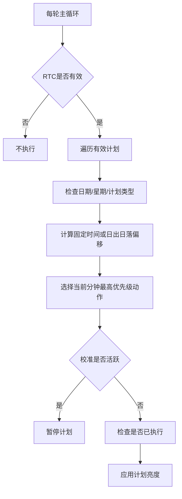

当前计划调度不是严格意义上的独立状态机，而是主循环中的周期匹配器。

---

# 12. 系统定时架构

## 12.1 SysTick中断

```text
SysTick_Handler
  |
HAL_IncTick
  |
sys_timer_1ms
```

每10ms执行：

- `main_timer()`；
- `updateTimeTick(10)`；
- 调试UART定时器。

中断只完成轻量计数，不直接运行主要业务状态机。

## 12.2 主循环Tick补偿

```text
sys_tick_process
  |
检查距离上次调度是否达到 MODULE_TIMER_INTERVAL
  |
调用 sys_tick_cycle_handle
```

`sys_tick_cycle_handle()` 驱动：

- ADC；
- PWM渐变；
- 温度保护；
- BL0942；
- RTC；
- 掉电检测；
- 过流检测；
- 网关兼容定时器；
- 离线计划等模块计时。

最多只追赶3个周期。主循环阻塞过久时：

- 多余周期不会无限补执行；
- 系统计入 `sys_tick_lag_count`；
- 最大延迟记录到 `sys_tick_max_lag_ticks`；
- 连续延迟异常会影响看门狗喂狗判定。

---

# 13. 看门狗与系统健康判定

每轮主循环执行：

```text
watchdog_loop_begin
  |
运行整轮任务
  |
watchdog_loop_end
  |
更新健康指标
  |
健康才喂狗
```

监控指标包括：

- 单轮主循环耗时；
- Tick调度丢失次数；
- MQTT发布超时次数；
- 4G UART接收队列丢字节次数；
- BL0942超时次数；
- BL0942 UART错误次数。

这意味着看门狗不是无条件周期喂狗，而是带运行质量判断的监督机制。

---

# 14. 当前架构风险点

## 14.1 状态机入口分散

当前主要并行状态包括：

- 4G生命周期状态；
- 4G配置状态；
- AT命令状态；
- MQTT发布状态；
- MQTT业务登录状态；
- OTA确认状态；
- OTA下载状态；
- OTA Flash迁移状态；
- 校准状态；
- PWM渐变和保护状态；
- 温度、掉电、过流、告警状态。

各状态机由 `main.c` 直接逐个调用，缺少统一的调度层和资源所有权表。

## 14.2 `hw_gateway` 名称与真实产品架构不一致

当前代码中的 `gateway` 是历史命名，并不代表项目存在DTU网关。

风险在于：

- 容易让维护人员误判为“网关+外部电源”架构；
- 遗留多驱动扫描状态增加理解成本；
- `online`、登录状态、MQTT会话状态存在多处表达；
- 旧状态枚举可能与新中科MQTT会话重复。

建议把当前真实职责迁移到明确的一体化电源通信模块中，再删除旧网关状态。

## 14.3 4G串口资源由多个状态机共享

UART1接收队列同时服务：

- 普通URC解析；
- AT命令响应；
- MQTT发布提示符和ACK；
- OTA HTTP/TCP数据；
- 模块身份和网络状态查询。

目前依靠状态变量和OTA锁避免竞争，但资源所有权仍分布在多个文件中，后续应建立统一 `modem_transport` 仲裁层。

## 14.4 主循环存在阻塞风险

需要重点控制：

- `delayMs()`；
- `HAL_Delay()`；
- Flash整页擦写；
- 大量日志输出；
- JSON构造与解析；
- OTA大块数据处理。

任意阻塞超过调度周期都会造成采样、保护、MQTT和计时任务延迟。

## 14.5 上电默认100%输出

当前 `main.c` 中仍存在上电后将 `dim_level` 设置为100并启动渐变到100%的逻辑。

这属于产品行为，不是状态机必需条件。应根据一体化电源的正式上电策略确认是否保留，避免上电瞬间默认满功率。

---

# 15. 推荐重构方向

推荐保持裸机架构，但按一体化电源真实硬件边界重新分层：

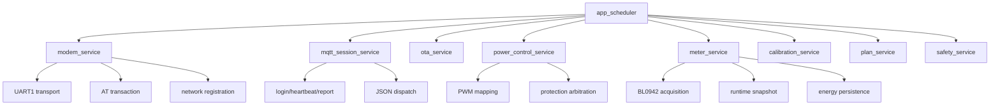

建议模块边界：

```text
app_scheduler
  |
  +-- modem_service
  |     +-- UART1接收队列
  |     +-- AT事务
  |     +-- 网络注册与MQTT连接
  |
  +-- mqtt_session_service
  |     +-- 登录/心跳/上报
  |     +-- 下行JSON分发
  |
  +-- ota_service
  |
  +-- power_control_service
  |     +-- PWM
  |     +-- 温度/电压/过流保护仲裁
  |
  +-- meter_service
  |     +-- BL0942
  |     +-- ADC输出采样
  |     +-- 统一快照
  |
  +-- calibration_service
  |
  +-- plan_service
```

重构目标：

- 以一体化电源真实硬件为边界；
- 删除DTU、多驱动扫描等错误语义；
- 统一板载4G模块UART资源所有权；
- 合并重复的MQTT在线状态；
- 明确OTA、校准、保护之间的互斥优先级；
- 限制单次主循环任务执行时间；
- 保持Boot/APP校验与现有Flash布局兼容。

---

# 16. 系统思维导图

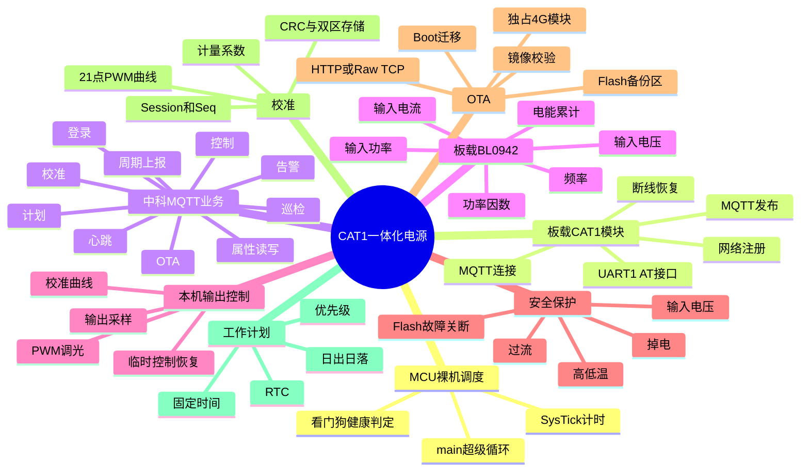

---

# 结论

`CAT1_Keil_Project` 的正确定位是：

```text
云平台
  ↕ MQTT
板载CAT.1模块
  ↕ UART1 AT/URC
板载MCU
  ↔ 板载BL0942
  → 本机PWM与保护控制
```

它不是DTU转发项目，也不存在通过UART2半双工协议控制外部数字电源的业务链路。

当前工程已经具备较完整的一体化电源产品功能：

- 4G联网和自动恢复；
- MQTT登录、心跳、上报和控制；
- BL0942计量；
- PWM调光与保护仲裁；
- OTA；
- 电流和计量校准；
- RTC工作计划；
- 看门狗和运行诊断。

当前最主要的架构问题不是缺少功能，而是：

- 历史网关命名和多驱动代码容易造成项目定位误解；
- 状态机入口与共享资源分散；
- MQTT连接、业务在线和旧Gateway状态存在重复表达；
- 主循环对阻塞操作敏感；
- 4G UART资源仲裁依赖多个隐式状态变量。

后续所有分析和重构均应以“一体化电源：MCU + 板载4G模块 + 板载BL0942 + 本机PWM控制”为唯一架构基线。