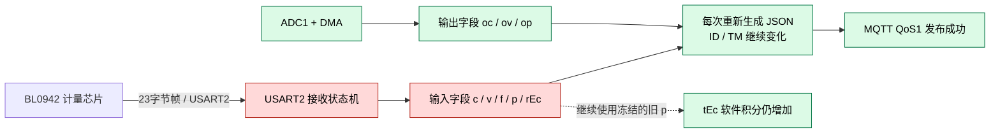
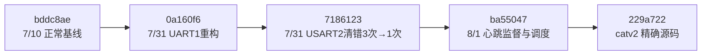
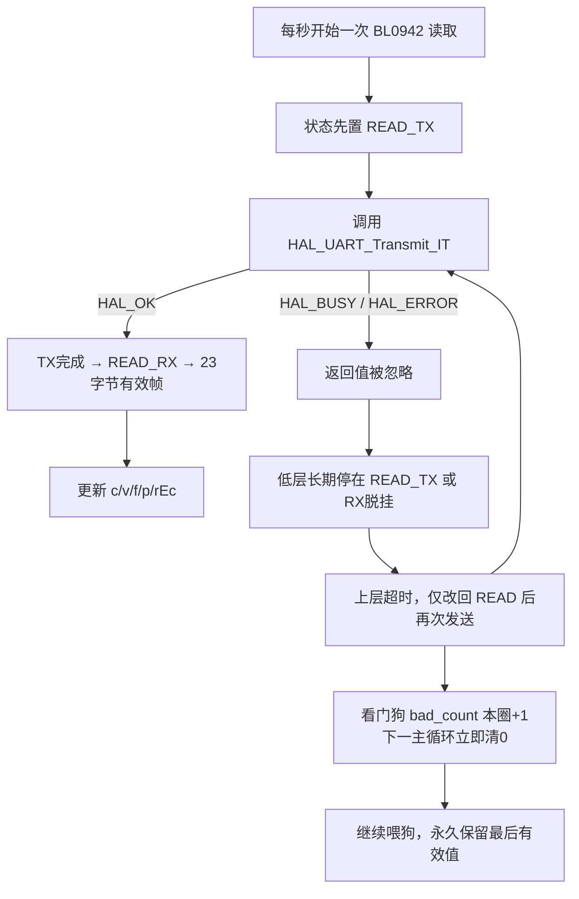

# catv2 BL0942 输入电参冻结根因报告

> 调查日期：2026-08-10　　范围：STM32F103、BL0942、USART2、J-Link、固件提交差异

## 1. 技术摘要：永久冻结来自 USART2 缺少失败闭环

**问题不是“数据新鲜度”，也不是 MQTT 把旧报文反复发送。**

| 裁决 | 结论 | 证据等级 |
|---|---|---|
| 故障位置 | `BL0942 → USART2 → c/v/f/p/rEc` 的有效采样帧停止更新 | **已确认（A级）** |
| 永久不恢复的根因 | USART2 状态机忽略 HAL 发送结果；超时只重试、不重建 USART2；看门狗异常计数下一主循环即清零 | **已确认（A级）** |
| 自然首发形态 | 偶发 USART2/BL0942 事务异常击中上述潜伏缺陷，随后被永久化 | **高概率（B级）；异常的第一来源未定** |
| MQTT/主循环 | 故障期间仍生成新 `ID/TM`，输出侧 `oc/ov/op` 和 MQTT PUBACK 仍推进 | **已排除（A级）** |
| 4G 模块复位 | 约 100 台冻结中只有约 3 台发生复位登录，不能解释共同故障 | **排除为共同触发（现场统计）** |
| 最近提交中的首次触发点 | 现有 A/B 未找到能稳定首次触发冻结的单一提交 | **尚未证实** |

因此，本次能下定论的“关键”是：

> **一次偶发的 USART2/BL0942 事务异常，被缺少返回值检查、局部重试和失效看门狗放大为永久冻结；整机断电重建 USART2/HAL 状态后才恢复。**

同一台设备只恢复 USART2 软件状态、不复位 MCU 和 4G，即可重新取得有效帧，未发现硬件电路损坏证据。

## 2. 字段组合把故障锁定在 BL0942/USART2



| 现场现象 | 代码含义 |
|---|---|
| `c/v/f/p/rEc` 同时固定 | 没有新的 BL0942 有效测量帧进入全局量 |
| `ID/TM` 递增 | 主循环和报文生成仍在运行，不是旧整包回放 |
| `oc/ov/op` 变化 | ADC/DMA 输出采样链仍在运行 |
| `tEc` 继续增加 | 定时器继续用冻结的 `p≈30.3 W` 积分，不能证明 BL0942 有新帧 |

`catv2` 每次周期上报都重新创建 JSON，并直接读取上述全局量；发布参数为 QoS1、`retain=0`。所以平台看到的旧输入值，是**新报文携带未刷新的输入全局量**，不是 MQTT 缓存重放。

## 3. 最近提交尚未通过首次触发的因果门槛

| 固件 | 长度 | SHA-256 | 确定性重建结果 |
|---|---:|---|---|
| 正常版 `cat1v23.bin` | 71,648 B | `BF6AAD5B20D597243A7907B36AD0581872CADED64073F59FDDB1CFC41E468FFB` | `bddc8ae / Release-MinSize`，逐字节一致 |
| 故障版 `catv2.bin` | 73,068 B | `84374CC09B19C416F2485D16BF28D69FB10923359B216E96036594BAF921A96D` | `229a722 / Release-MinSize`，逐字节一致 |

两版均由 ARMCC 5.06u6 build 750 重建，0 error；`catv2.bin` 文件时间为 2026-08-03 08:23:41。



提交级核对结果：

| 边界/候选 | 静态证据 | 实机裁决 |
|---|---|---|
| `0a160f6 → 7186123` | 唯一直接改 USART2：错误回调的 SR/DR 清错由 3 次改为 1 次 | 两版各注入 100 次真实 ORE，均恢复；**标准 ORE 不是该边界的触发根因** |
| `7186123 → ba55047` | 新增 60 s 心跳监督，并改变心跳/周期上报占用发布器的顺序 | 碰撞可复现，但 20 次碰撞及“高频上报+100次 ORE”均未冻结；**碰撞存在但不是充分条件** |
| QENG 提交 | 代码已编入 | `catv2` 正常登录后 AT 状态停在 7，QENG 只接受状态 0，运行期实际不可达；排除共同触发 |
| 4G 恢复提交 | 只在心跳连续失败/断链时执行 | 仅约 3/100 台触发，排除百台共同触发 |
| 6 h/12 h Flash 保存 | 新旧版路径和周期相同 | 不是新增回归；因按要求立即交付，未执行实机 100 次组合压力，保留为未验证限制 |
| `restore=5` | 仅收到平台清零命令时执行四页写入 | 未提供全量下行历史，当前不能判断 |

此外，`main.c`、`watchdog.c`、`sys_tick.c`、`dma.c` 在正常版和 `catv2` 之间逐文件相同；没有发现新增的 24/48 小时定时触发器，RAM 占用也未增加到临界点。

忽略 USART2 HAL 返回值、超时不重建和看门狗计数缺陷在正常基线中已经存在，属于**潜伏的永久化缺陷**；最近提交即使改变了异常出现概率，也不能在没有 A/B 闭环时直接写成根因。

## 4. 一次事务异常为何会永久化



`catv2` 的关键缺口：

1. `hw_bl0942_uart_read()` 调用 `HAL_UART_Transmit_IT()`，不检查返回值。
2. TX 续发和 RX 续挂也不检查 HAL 返回值。
3. BL 超时只把上层状态改回 `READ`，不执行 `AbortTransmit`、USART2 外设复位或重新初始化。
4. `bl0942data_ready` 成功一次后长期为 1，不能用作活性标志。
5. 看门狗要求连续 5 次异常，但超时约每秒变化一次；其间数千次主循环都会把计数清零，阈值实际无法达到。

## 5. J-Link 复现、A/B 与自愈验收

### 5.1 在原始 catv2 上复现同型终态

只把 `huart2.gState` 置为 `BUSY_TX(0x21)`，不复位 MCU/4G：

| 观测项 | 正常 | 冻结 26 s 后 | 说明 |
|---|---:|---:|---|
| BL 低层状态 | `READY(4)` | `READ_TX(2)` | 发布启动后永远等不到回调 |
| `c/v/f/p` 对应 RAM | 变化 | 完全不变 | 输入采样停止刷新 |
| `rEc` | `0x4E09` | `0x4E09` | 没有新有效计量帧 |
| BL 超时计数 | `7` | `0x1A(26)` | 每秒重试仍无法恢复 |
| MQTT PUBACK 成功计数 | `0x16F` | `0x172` | MQTT 和主循环仍正常 |
| 4G 恢复启动计数 | `0` | `0` | 与 4G 复位无关 |

随后只把 USART2 HAL 状态恢复为 `READY`，4 秒内 BL 状态回到 `READY`，`rEc 0x4E09→0x4E3A`，没有复位 MCU 或 4G。

原始日志：

- `tools/ota_test/logs/catv2_bl0942_snapshot_20260810_135115.log`
- `tools/ota_test/logs/catv2_bl0942_stuck_confirm_20260810_135233.log`
- `tools/ota_test/logs/catv2_bl0942_release_busy_20260810_135233.log`

### 5.2 提交 A/B 和时序压力结果

| 镜像/实验 | 次数 | 结果 |
|---|---:|---|
| `0a160f6`，23 字节回复期间真实 ORE（USART2 SR=`0xF8`） | 100 | 100 次均恢复，有效帧继续 |
| `7186123`，相同 ORE | 100 | 100 次均恢复，有效帧继续 |
| 原始 `catv2`，相同 ORE | 100 | 100 次均恢复，有效帧继续 |
| `ba55047`，心跳与周期上报同轮到期 | 20 | 发生 Busy→5 s 重试，但 BL 帧继续 |
| `ba55047`，高频周期上报叠加真实 ORE | 100 | 无永久冻结，`rEc` 继续增加 |

结论：这些测试排除了几个最直观的“最近提交/时序”解释，但**没有达到把某一提交定为首次触发根因的四项因果门槛**，因此报告不作过度归因。

### 5.3 USART2 完整自愈验收

诊断固件只存在于临时构建目录，未合入生产代码。它在每个有效帧后自动制造一次 `BUSY_TX + 中断脱挂`，并在主循环内完整重建 USART2。

| 指标 | 实测 |
|---|---:|
| 自动注入 | 100 |
| 成功恢复 | 100 |
| 最大超时采样周期 | 0 |
| 有效帧计数（3 s） | `185 → 188` |
| `rEc`（3 s） | `0x6DDD → 0x6DE2` |
| MCU/4G 复位 | 0 |

原始日志：`tools/ota_test/logs/bl0942_auto_recovery_100_rerun.log`。

## 6. 百台冻结分布仍缺原始 Broker 导出

当前可用的现场数量信息为：

| 设备现象 | 数量级 | 对比 |
|---|---:|---|
| 输入电参冻结 | 约 100 台 | `██████████████████████████████` |
| 发生 4G 复位登录 | 约 3 台 | `█` |

两项可能有交集，但数量级已足以排除“4G 复位是百台共同触发”。

工作区内没有这约 100 台设备的 Broker 全量导出，只有 7 月单机台架 JSONL，因此不能生成真实的“百台冻结起点按天/小时分布”，也不能判断冻结点是否对齐 `restore=5` 或某次统一配置下发。为避免伪造数据，本报告不补画虚假分布。

已提供离线分析工具：

```powershell
python tools/analyze_catv2_fleet_history.py <Broker导出.csv或.jsonl> `
  --out-dir tools/ota_test/logs/fleet_analysis
```

工具严格按本计划的定义识别冻结点：连续至少 6 包、跨度至少 30 分钟，`c/v/f/p/rEc` 完全相同，同时 `ID/TM` 推进且 `oc/ov/op` 至少一项变化；并输出附近事件、`hPeriod`、ID 跳号、5 秒间隔、区段最大包间隔及距固件上线后 6/12 小时边界的距离。无时区时间默认按 `Asia/Shanghai` 解释，明细同时保留 UTC 与本地时间。结果文件为 `freeze_points.csv` 和时间分布 Markdown。工具只读取本地文件，不连接网络；7 组冻结/非冻结、时区、普通文本事件和端到端输出测试均通过。

## 7. USART2 完整自愈已通过注入，长稳按要求提前结束

建议把修复放在 BL0942/USART2 链，而不是 MQTT 字段或“新鲜度”层：

1. 所有 `HAL_UART_Transmit_IT/Receive_IT` 必须检查返回值；失败时不得继续推进状态。
2. 连续 2～3 个采样周期无有效帧，在主循环执行原子恢复：`HAL_UART_Abort` → 关闭中断 → RCC 复位 USART2 → 清 HAL/低层状态 → `hw_uart2_init()` → 重新挂接收。
3. 增加 `last_valid_frame_tick`，替代粘滞的 `bl0942data_ready` 判断活性。
4. 看门狗按“连续超时采样周期”累计，不要在每个无新增超时的主循环清零。
5. 恢复只作用于 USART2/BL0942，不需要复位 MCU 或 4G。

| 验收项 | 当前状态 |
|---|---|
| 根因终态注入至少 100 次 | **完成：100/100** |
| 修正后 3 个采样周期内恢复 | **完成：100/100，最大 0 个超时周期** |
| 100次注入后恢复 `catv2.bin` | **完成：APP SHA-256 与原文件一致** |
| Boot/参数区保持不变 | **完成：100次注入前后整片 256 KiB 差异 0 字节** |
| 修正候选 48 h 正常负载 | **未完成：按要求提前结束；已连续运行 1.1312 h、取得 4,072 个有效帧** |
| 百台 Broker 冻结时间分布 | **待提供全量历史导出后执行** |
| 首次自然触发提交闭环 | **尚未证实；不得写成已找到** |

100 次注入实验后的恢复核验：

- APP：`84374CC09B19C416F2485D16BF28D69FB10923359B216E96036594BAF921A96D`
- 诊断前/后 256 KiB Flash：`965C2B994826E28387D7CF1D0E8F074BEF76867B4D29374861188B81281C8B6B`
- 前后逐字节差异：`0`

为立即交付报告，48 h 长稳于 2026-08-10 16:42:21（+08:00）提前结束。候选从基线 Tick `14,380` 运行至 `4,086,660`，净运行 `4,072,280 ms（1.1312 h）`；有效帧 `4→4,076`、`rEc 0x729D→0x8C0E`，超时、校验错误、UART 错误和自愈次数均为 0，BL 低层状态为 `READY(4)`，HAL `Lock/gState/RxState=00/20/20`。这只证明约 1.13 h 内无回归，**不能写成 48 h 验收通过**。

提前收尾后，已通过受控 APP 区写入恢复原始 `catv2.bin`。该动作造成一次预期的 MCU 重启；读回 APP SHA-256 为 `84374CC09B19C416F2485D16BF28D69FB10923359B216E96036594BAF921A96D`，恢复后整片 256 KiB Flash SHA-256 为 `965C2B994826E28387D7CF1D0E8F074BEF76867B4D29374861188B81281C8B6B`，与测试前整片镜像完全一致。恢复后 BL0942 和 USART2 均处于正常就绪态。

本报告的剩余限制只有两项：未完成 48 h 长稳；未取得约 100 台设备的 Broker 原始历史，因此首次自然触发提交、冻结时间分布和 `restore=5` 对齐关系仍未验证。这些限制不影响“故障域”和“永久化缺陷”的 A 级结论，但限制了对第一次异常来源的归因。

报告数字可由 `tools/validate_catv2_report_evidence.ps1` 本地重算；当前验证结果为 `REPORT_EVIDENCE_VALIDATION=PASS`。
