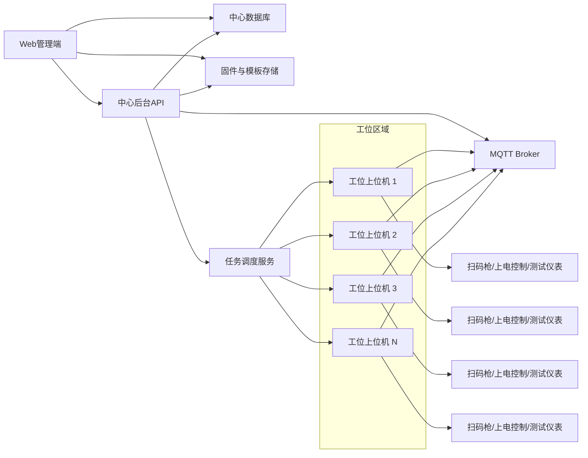
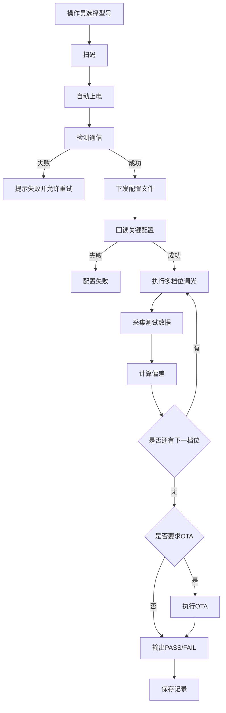
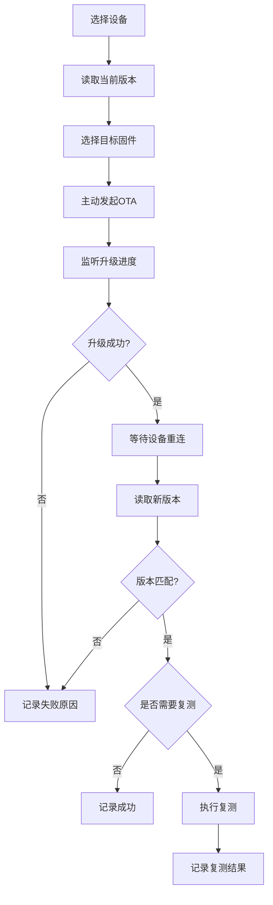
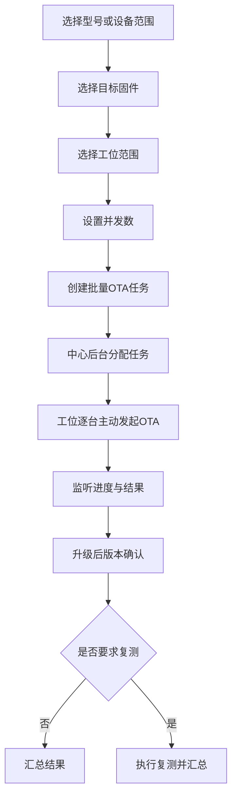

# 多工位产线测试与 OTA 工具设计方案

版本：v1.0  
日期：2026-05-30  
适用范围：CAT1 设备产线测试、配置下发、主动 OTA 升级、多工位协同管理

## 1. 文档目标

本文档用于明确一套可落地的多工位产线测试与 OTA 工具方案，重点解决以下问题：

- 产线工位如何统一执行自动化测试
- 配置文件如何按型号管理并统一下发
- OTA 固件如何统一管理并按任务主动下发
- 单台升级与批量升级的流程如何规定
- 系统整体技术选型如何统一，避免后续实现阶段反复摇摆

本文档是方案约束文档，目标是把系统形态、技术选型、流程边界和职责分工明确下来，作为后续产品原型、系统开发和项目评审的基础。

## 2. 设计原则

本方案遵循以下原则：

- 以产线稳定性优先，不追求过度复杂的平台能力
- 以本地工位自动执行为主，中心系统负责统一管理
- 操作员界面极简，只保留必要操作
- 型号配置、测试阈值、OTA 固件必须版本化管理
- OTA 只能主动下发，不允许设备自主检查更新或自行决定升级
- 工位执行必须可恢复、可追溯、可统计

## 3. 需求边界

### 3.1 需要支持的能力

- 多工位同时运行
- 操作员选择设备型号
- 操作员扫码开始测试
- 工位自动控制设备上电
- 工位自动检测设备通信是否正常
- 工位下发对应型号的配置文件
- 工位自动执行多个亮度档位测试
- 工位采集电压、电流、功率、能效等数据
- 工位根据阈值自动判定 PASS/FAIL
- 支持单台 OTA
- 支持批量 OTA
- 支持升级后版本确认和可选复测
- 支持测试记录、升级记录留档

### 3.2 当前不纳入范围

- J-Link 烧录
- 串口调试控制台
- 设备自主升级策略
- 设备自动检查更新
- 复杂 MES 深度集成
- 多工厂云端部署

## 4. 最终系统形态

本项目采用混合架构：

- 本地上位机负责测试执行和 OTA 执行
- 中心后台负责配置模板管理、固件管理、任务管理、记录管理
- Web 管理端负责查看和维护管理内容

换句话说：

- 本地上位机负责“干活”
- 中心后台负责“统一管理”
- Web 管理端负责“维护与查看”

## 5. 总体架构

## 6. 技术选型

本方案的正式技术选型如下。

### 6.1 工位执行端

- 语言：`C#`
- 框架：`.NET 8`
- UI：`WPF`
- 架构模式：`MVVM`
- MQTT 客户端：`MQTTnet`
- 本地缓存数据库：`SQLite`
- 日志：`Serilog`
- 状态机：`Stateless`
- 配置文件格式：`YAML` 或 `JSON`

选择原因：

- 工位电脑通常是 Windows 环境，WPF 最适合做稳定的本地工业桌面程序
- 本地硬件接入方便，适合扫码枪、继电器、电参数仪等设备
- 本地状态机和自动化流程控制稳定性高
- 相比纯 Web、Electron、Python GUI，更适合长期产线使用

### 6.2 中心后台

- 框架：`ASP.NET Core 8 Web API`
- ORM：`EF Core`
- 数据库：`PostgreSQL`
- 缓存：`Redis`
- 任务调度：`Hangfire`
- 实时通信：`SignalR`
- 文件对象存储：`MinIO`
- 日志：`Serilog`
- 接口文档：`Swagger/OpenAPI`

选择原因：

- 与工位端统一使用 C# 技术栈，降低团队学习成本
- 适合做模板管理、固件管理、任务管理、统计查询
- 便于支持批量 OTA 任务和多工位状态汇聚

### 6.3 Web 管理端

- 框架：`Vue 3`
- 语言：`TypeScript`
- 构建工具：`Vite`
- UI 组件库：`Element Plus`
- 状态管理：`Pinia`
- 路由：`Vue Router`
- 图表：`ECharts`

选择原因：

- 适合做配置模板、固件版本、工位监控、报表查询等后台页面
- 内部系统开发效率高，维护成本低

### 6.4 基础设施

- MQTT Broker：`EMQX`
- 反向代理：`Nginx`
- 部署方式：`Docker`

MVP 阶段可选简化方案：

- MQTT Broker 可先使用 `Mosquitto`
- 文件存储可先使用共享目录或 NAS

## 7. 职责分工

### 7.1 本地上位机职责

- 工位扫码
- 控制设备上电/断电
- 等待设备通信上线
- 拉取或读取型号对应的配置模板
- 向设备下发配置
- 回读关键参数确认
- 自动切换亮度档位并执行测试
- 采集数据并计算偏差
- 输出 PASS/FAIL
- 主动发起单台 OTA 或接收批量 OTA 任务并执行
- 升级后确认版本并执行可选复测
- 上传测试结果和 OTA 结果

### 7.2 中心后台职责

- 管理型号模板
- 管理配置文件版本
- 管理 OTA 固件包
- 管理工位信息
- 管理单台和批量 OTA 任务
- 汇总测试记录和升级记录
- 提供工位状态总览和报表

### 7.3 设备职责

- 按协议响应配置读取和配置下发
- 接收调光控制指令
- 上报运行参数
- 接收 OTA 指令并执行升级
- 上报 OTA 进度和错误

## 8. 配置文件管理方案

配置文件必须按“型号模板”管理，而不是按工位手工维护。

### 8.1 配置模板包含内容

- 型号标识
- 配置模板版本号
- 设备属性配置内容
- 调光测试档位
- 各档位目标值
- 各档位允许偏差
- 是否需要 OTA
- 目标 OTA 版本
- OTA 后是否需要复测

### 8.2 配置模板状态

- 编辑中
- 测试中
- 已发布
- 已停用

### 8.3 配置模板规则

- 工位只能使用“已发布”模板
- 每次参数修改必须产生新版本
- 不允许直接覆盖旧模板
- 每台设备测试记录必须记录所用模板版本

### 8.4 配置模板同步策略

- 工位上位机启动时同步已发布模板
- 工位本地保留缓存
- 后台不可用时可使用最近一次已缓存模板

## 9. OTA 管理方案

### 9.1 OTA 基本原则

OTA 只能主动下发：

- 只能由上位机或中心系统发起
- 设备不做自动检查更新
- 设备不做自主升级判断
- 设备只负责接收 OTA 指令并执行升级

### 9.2 OTA 固件管理要求

每个固件包必须记录：

- 固件名称
- 固件版本
- 适用型号
- 文件校验值
- 上传时间
- 发布状态
- 备注说明

### 9.3 OTA 固件状态

- 草稿
- 测试中
- 已发布
- 已停用

### 9.4 OTA 适配规则

- 每个固件必须绑定适用型号
- 工位执行 OTA 前必须校验设备型号与固件适配关系
- 不允许误下发到不兼容型号

## 10. 工位测试主流程

### 10.1 工位状态机

工位状态统一规定如下：

- 空闲
- 等待扫码
- 上电中
- 通信检测中
- 配置下发中
- 功能测试中
- OTA 升级中
- OTA 后复测中
- 完成
- 异常

### 10.2 工位异常处理

建议统一错误码类别：

- `E01` 上电失败
- `E02` 通信超时
- `E03` 配置下发失败
- `E04` 配置回读失败
- `E05` 测试数据超差
- `E06` OTA 超时
- `E07` OTA 后版本不匹配
- `E08` OTA 后复测失败

## 11. 单台 OTA 流程

单台 OTA 适用于试产验证、返修、问题机升级。

单台 OTA 记录必须包含：

- 设备标识
- 升级前版本
- 目标版本
- 升级开始时间
- 升级完成时间
- 升级结果
- 错误原因
- 是否复测及复测结果

## 12. 批量 OTA 流程

批量 OTA 适用于型号批次切换、量产版本切换。

批量 OTA 规则：

- 批量 OTA 依然是逐台主动下发
- 不允许设备上线后自动升级
- 必须支持并发数限制
- 必须支持失败重试
- 必须支持暂停和恢复任务

## 13. 多工位交互设计

### 13.1 操作员视角

操作员页面必须极简，只保留：

- 型号选择
- 扫码输入
- 开始测试
- 当前步骤
- 实时数据
- 最终结果

### 13.2 工程师/管理员视角

管理页面包含：

- 工位监控
- 配置模板管理
- OTA 固件管理
- 单台 OTA 页面
- 批量 OTA 页面
- 测试记录查询
- OTA 记录查询
- 报表统计

## 14. 数据存储要求

### 14.1 中心数据库保存

- 工位信息
- 设备档案
- 型号模板
- 配置模板版本
- OTA 固件版本
- 测试记录
- OTA 记录
- 工位状态

### 14.2 工位本地缓存保存

- 当前已发布模板缓存
- 当前已发布固件索引缓存
- 本地待上传测试记录
- 本地待上传 OTA 记录
- 最近任务状态

## 15. 页面建议

### 15.1 首页

- 今日测试数量
- 今日通过率
- 当前在线工位数
- 当前 OTA 任务数
- 当前异常设备数

### 15.2 工位监控页

- 每个工位一个卡片
- 显示型号、SN、当前步骤、实时状态、最终结果

### 15.3 单台 OTA 页

- 选择设备
- 查看当前版本
- 选择目标版本
- 执行升级
- 查看进度和结果

### 15.4 批量 OTA 页

- 选择型号或设备范围
- 选择目标固件
- 设置工位范围和并发数
- 查看任务执行统计

### 15.5 模板管理页

- 配置模板列表
- 模板版本记录
- 发布/停用操作

## 16. 开发阶段建议

### 阶段一：MVP

目标：先跑通单工位和基本 OTA

- 工位上位机
- 本地模板缓存
- 型号选择
- 扫码测试
- 配置下发
- 多档位调光测试
- 单台 OTA
- SQLite 本地记录

### 阶段二：正式版

目标：扩展多工位与中心化管理

- 中心后台 API
- 中心数据库
- Web 管理端
- 多工位监控
- 配置模板集中管理
- OTA 固件集中管理
- 批量 OTA

### 阶段三：增强版

目标：加强统计、恢复和协同

- 异常任务重试
- 任务暂停与恢复
- 报表统计
- 失败原因分析
- 工位健康检查

## 17. 最终定版结论

本项目最终技术路线明确如下：

- 执行端采用 Windows 本地上位机
- 工位执行技术选型为 `C# + .NET 8 + WPF`
- 管理端采用 `Vue 3 + TypeScript`
- 中心后台采用 `ASP.NET Core 8`
- 中心数据库采用 `PostgreSQL`
- MQTT Broker 采用 `EMQX`
- 文件与固件存储采用 `MinIO`
- OTA 只允许主动下发
- 配置模板和 OTA 固件必须版本化管理

本方案后续不再建议切换为“纯 Web 工位执行”路线，除非产线硬件接入模式发生根本变化。
