# MDK-ARM-8008000 数据采集与上报分析报告

> **项目名称**：CAT.1 智慧电源（中科协议版）
> **芯片型号**：HK32F103CCT6A / STM32F103CBT6
> **协议版本**：中科 MQTT JSON 协议 V1
> **分析日期**：2026-05-18

---

## 目录

1. [系统总体架构](#一系统总体架构)
2. [硬件采集链路](#二硬件采集链路)
3. [数据采集详解](#三数据采集详解)
4. [数据处理与计算](#四数据处理与计算)
5. [上报数据类型与组成](#五上报数据类型与组成)
6. [告警系统详解](#六告警系统详解)
7. [上报时序与优先级](#七上报时序与优先级)
8. [发现的问题与风险点](#八发现的问题与风险点)

---

## 一、系统总体架构

### 1.1 数据流全景图

```mermaid
flowchart TB
    subgraph Hardware["🔌 硬件层"]
        BL0942["BL0942 电能计量芯片<br/>（UART2）"]
        ADC["STM32 片上 ADC<br/>（12bit）"]
        NTC["NTC 热敏电阻<br/>（100K/B3950）"]
        RTC["DS1302 RTC<br/>（I2C）"]
        MODEM["Cat.1 模组<br/>（UART3）"]
        DALI["DALI 调光接口<br/>（UART1）"]
    end

    subgraph Driver["⚙️ 驱动采集层"]
        SYS_BL["sys_bl0942.c<br/>电能参数采集"]
        SYS_ADC["sys_Vo_Io.c<br/>输出参数采集"]
        SYS_NTC["ntc.c<br/>温度采集"]
        SYS_POW["sys_pow_drop_check.c<br/>掉电检测"]
        SYS_LEAK["danger_current_check.c<br/>漏电检测"]
        SYS_TEMP["sys_temp_over_protect.c<br/>过温保护"]
    end

    subgraph Data["📊 数据处理层"]
        CALC_I["容性无功电流校正<br/>get_xcap_current_creent()"]
        CALC_PF["功率因数计算<br/>ac_pf"]
        CALC_EN["电能累计<br/>ac_EnergyP"]
        CALC_TEMP["NTC温度查表插值<br/>二分法+线性插值"]
    end

    subgraph Report["📡 上报层 (mqtt_zk_protocol.c)"]
        CYCLIC["巡检上报 CT=C<br/>每300秒"]
        CHANGE["变化上报 CT=B<br/>状态变化触发"]
        ALARM["告警上报 CT=A<br/>告警状态变化"]
        HEART["心跳上报 CT=H<br/>每60秒"]
        LOGIN["登录上报 CT=L<br/>连接建立"]
    end

    subgraph Cloud["☁️ 云平台"]
        MQTT["中科 MQTT Broker<br/>47.120.15.220:1883"]
    end

    Hardware --> Driver
    Driver --> Data
    Data --> Report
    Report -->|"4G/Cat.1"| MQTT

    style Hardware fill:#1a1a2e,color:#e0e0e0
    style Driver fill:#16213e,color:#e0e0e0
    style Data fill:#0f3460,color:#e0e0e0
    style Report fill:#533483,color:#e0e0e0
    style Cloud fill:#e94560,color:#fff
```

### 1.2 模块交互时序

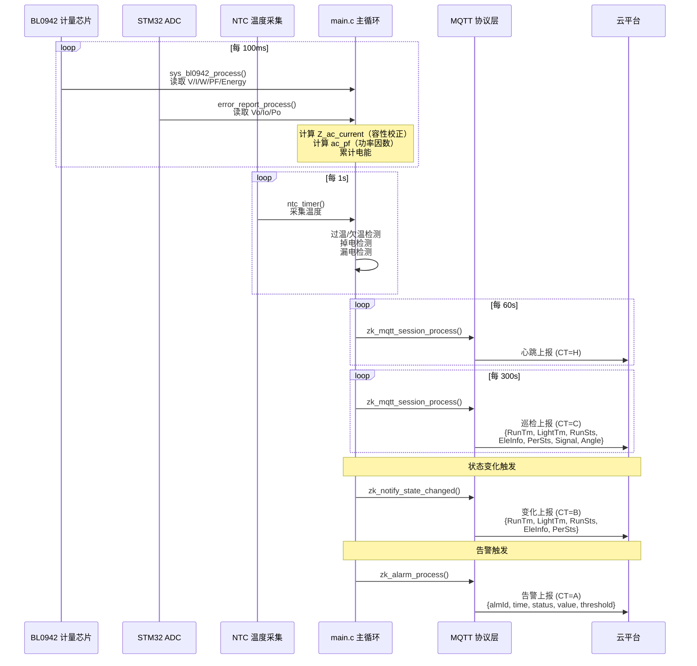

---

## 二、硬件采集链路

### 2.1 BL0942 电能计量芯片采集链路

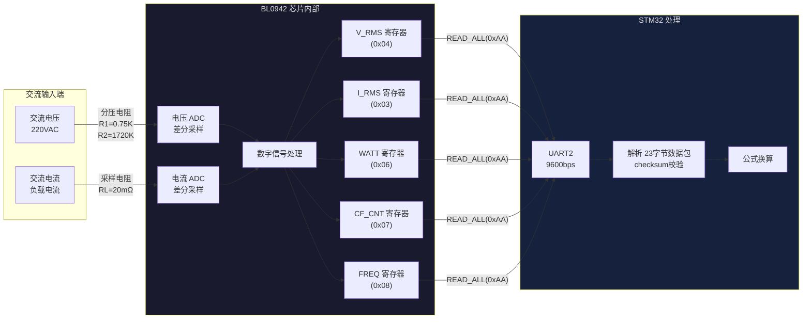

**通信协议说明**：
- 读取命令：`0x58 0xAA`（READ_HEADER + READ_ALL_HEAD）
- 返回数据：23 字节（header 0x55 + 数据 + 校验）
- 读取周期：约 100ms（由 `_timer_for_read = 100` 控制）

**BL0942 返回数据帧结构**：

| 字节偏移 | 内容 | 说明 |
|----------|------|------|
| 0 | 0x55 | 返回头 |
| 1-3 | I_RMS | 电流有效值（24bit） |
| 4-6 | V_RMS | 电压有效值（24bit） |
| 7-9 | I_FAST_RMS | 电流快速有效值（未使用） |
| 10-12 | WATT | 有功功率（24bit） |
| 13-15 | CF_CNT | 有功电能脉冲计数（24bit） |
| 16-17 | FREQ | 频率（16bit） |
| 18-21 | STATUS/VERSION | 状态和版本 |
| 22 | checksum | 校验和（~sum） |

### 2.2 ADC 采样链路

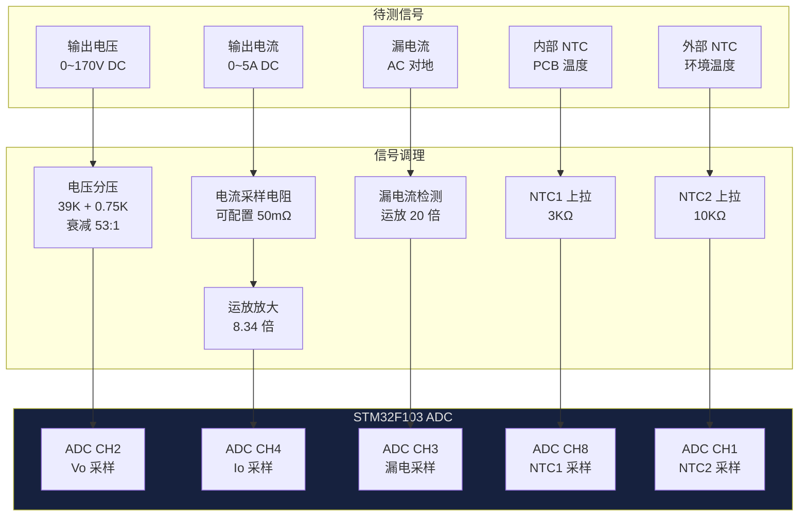

### 2.3 NTC 温度采集链路

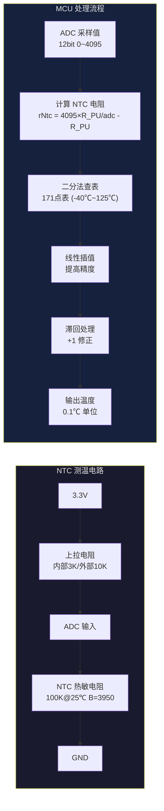

**NTC 温度对照表（部分）**：

| 温度 (℃) | 电阻值 (Ω) | 温度 (℃) | 电阻值 (Ω) |
|-----------|-----------|-----------|-----------|
| -40 | 322,555 | 25 | 10,000 |
| -20 | 95,319 | 50 | 3,588 |
| 0 | 32,490 | 75 | 1,733 |
| 10 | 19,869 | 100 | 660 |
| 20 | 12,491 | 125 | 326 |

**查表算法说明**：
- 使用二分查找法（171 个点的有序表），时间复杂度 O(log₂171) ≈ 8 次比较
- 找到区间后进行线性插值：`result = index*10 + (R_table[index]-R_actual)*10 / (R_table[index]-R_table[index+1])`
- 对上升趋势做 +1 滞回修正以平滑跳变

---

## 三、数据采集详解

### 3.1 采集参数总表

#### 3.1.1 交流侧参数（BL0942 采集）

| 参数名 | 变量 | 寄存器 | 采集周期 | 单位 | 精度说明 |
|--------|------|--------|----------|------|----------|
| 交流电压 | `ac_voltage_8209` | V_RMS(0x04) | ~100ms | 0.1V | 经分压公式换算 |
| 交流电流(原始) | `ac_current` | I_RMS(0x03) | ~100ms | mA | 未经容性校正 |
| 交流电流(校正) | `Z_ac_current` | — | ~100ms | mA | 经 X 电容容性无功补偿 |
| 有功功率 | `ac_powerpa` | WATT(0x06) | ~100ms | 0.01W | 经功率公式换算 |
| 视在功率 | `ac_power_S` | — | ~100ms | 0.1VA | `current × voltage / 100` |
| 功率因数 | `ac_pf` | — | ~100ms | 0~99 | `(P_active×100)/P_apparent` |
| 本次电能 | `energy_this_time` | CF_CNT(0x07) | ~100ms | 0.01Wh | 含脉冲溢出累计 |
| 累计电能 | `sys_data.ac_EnergyP` | — | 每小时 | 0.01Wh | Flash 持久化存储 |
| 频率 | `ac_freq` | FREQ(0x08) | ~100ms | 0.01Hz | — |

#### 3.1.2 直流输出侧参数（STM32 ADC 采集）

| 参数名 | 变量 | ADC 通道 | 采集周期 | 单位 | 换算公式 |
|--------|------|----------|----------|------|----------|
| 输出电压 | `Vo_value` | ADC CH2 | ~1ms | 0.1V | `ADC_Value2 × 39.75 / 0.75 / 100` |
| 输出电流 | `Io_value` | ADC CH4 | ~1ms | mA | `ADC_Value4 / R_sense / 8.34 × 1000` |
| 输出功率 | `Po_value` | — | ~1ms | 0.1W | `Vo_value × Io_value / 1000` |

> **注意**：Vo_value、Io_value、Po_value 仅用于本地故障判断和过温降功率保护，**不会上报到云平台**。

#### 3.1.3 温度参数

| 参数名 | 变量 | 传感器 | 采集周期 | 单位 | 用途 |
|--------|------|--------|----------|------|------|
| 驱动器温度 | `Ntctemp.Ntctemp` | 内部 NTC (100K) | ~1s | 0.1℃ | 上报、过温保护、设备故障告警 |
| 环境温度 | `Ntctemp2.Ntctemp` | 外部 NTC (10K) | ~1s | 0.1℃ | 采集但未上报 |

#### 3.1.4 漏电参数

| 参数名 | 变量 | ADC 通道 | 采集周期 | 单位 | 阈值 |
|--------|------|----------|----------|------|------|
| 漏电电流 | `dangeo_out` | ADC CH3 | ~1s | mA | 报警阈值 30mA |
| 漏电告警 | `danger_current_warn` | — | ~1s | 0/1 | dangeo_out > 30 |

#### 3.1.5 设备状态参数

| 参数名 | 变量 | 来源 | 说明 |
|--------|------|------|------|
| 调光亮度 | `dim_level` | DALI/协议/离线调光 | 0~100%，影响 RunSts、LightTm、过温降功率 |
| 4G 信号等级 | `getSignal()` | Cat.1 模组 AT 查询 | 0~31，映射为 Signal.rsrp |
| 4G 注册状态 | `online` | Cat.1 模组 | 影响 Signal.reg 和漏电检测使能 |
| RTC 时间 | `apprtc_RtcTime` | DS1302 + 服务器授时 | 用于报文时间戳和告警时间 |

#### 3.1.6 故障标志位参数

| 参数名 | 变量 | 触发条件 | 动作 |
|--------|------|----------|------|
| 闪灯故障 | `Error_0_linght` | Vo < 历史均值 × 80%（持续 >300ms） | alarmId=10004 |
| 输出过载 | `Error_1_OL` | Po_value > 180 (18W) | alarmId=10002 |
| 输出低压 | `Error_Out_LV` | Vo_value < 200 (20V) | alarmId=10003 |
| 输入过压 | `Error_3_OV` | ac_voltage_8209 > 3200 (320V) | 调灭保护 + alarmId=10000 |
| 输入欠压 | `Error_4_LV` | ac_voltage_8209 < 800 (80V) | 调灭保护 + alarmId=10001 |
| 驱动过温 | `driver_temperarure_warn` | NTC 温度 ≥ 工厂设定阈值 | 降功率保护 + alarmId=10008 |
| 漏电告警 | `danger_current_warn` | dangeo_out > 30mA | alarmId=10007 |
| 掉电标记 | `power_down_flag` | 交流电压 < 7V 持续 100ms | 写 Flash + alarmId=10009 |
| 综合故障字节 | `error_flag_byte` | 以上各标志的位或 | Bit0~Bit4 分别对应 |

---

## 四、数据处理与计算

### 4.1 关键计算公式

#### 4.1.1 交流电压换算

```
U_ac = V_RMS / K_volt

其中：K_volt = (73989 × R1 × 100) / (Vref × (R1 + R2))
             = (73989 × 0.75 × 10) / (1.218 × (0.75 + 1720))
             = 554917.5 / 2096.7535
             ≈ 264.6

结果单位：0.1V
```

#### 4.1.2 交流电流换算（含容性无功补偿）

```
原始电流：I_raw = I_RMS / K_curr

其中：K_curr = (305978 × RL) / (Vref × 1000)
             = (305978 × 20) / (1.218 × 1000)
             = 6119560 / 1218
             ≈ 5024

结果单位：mA

━━━━━━━━━━━━━━━━━━━━━━━━━━━━━━━━━

校正后电流：Z_ac_current = get_xcap_current_creent(I_raw, PF, U_ac, f, C_X)

原理公式（向量法）：
    电阻性电流分量：I_R = I_raw × PF
    容性无功分量：  I_C = 2π × f × C_X × U_ac
    感性无功分量：  I_L = I_raw × √(1 - PF²)

    合成电流：I_total = √(I_R² + (I_C + I_L)²)

    其中：
      I_raw  = 原始电流 (A)
      PF     = 功率因数 (0~1)
      U_ac   = 交流电压 (V)
      f      = 电网频率 (50Hz)
      C_X    = X电容值 (F)，取自 factory_user_buff[0x1e]，单位 0.01μF
```

**容性校正的背景**：电路中 X 电容（CX）对地产生容性无功电流，导致 BL0942 测得的电流偏大。需要通过算法减去这部分无功电流以获得真实的负载电流。

**为什么有两个版本的补偿算法**：
```c
#if 0   // 版本1：手动定点运算 — 占用 0.5KB ROM，耗时 53μs
        // 使用整数 sqrt_16() 开方，避免浮点运算
#else   // 版本2：标准库浮点运算 — 占用 2.5KB ROM，耗时 222μs
        // 使用 math.h sqrtf()/powf()，精度更高
```

当前使用版本 2（标准库浮点），因为精度优先。

**MID 型号功率补偿**：
```c
// 100W 型号 (MID==3)
ac_powerpa = ac_powerpa × (1.0 - 0.03);   // 功率下调 3%
Z_ac_current -= 7;                          // 电流再减 7mA

// 75W 型号 (MID==2)
ac_powerpa = ac_powerpa × (1.0 - 0.03);   // 功率下调 3%
Z_ac_current -= 7;                          // 电流再减 7mA
```

#### 4.1.3 有功功率换算

```
P_active = WATT / K_power

其中：K_power = (3537 × RL × R1 × 10) / (Vref² × (R1 + R2))
              = (3537 × 20 × 0.75 × 10) / (1.218² × 0.75 + 1720)
              = 530550 / 2552.5
              ≈ 207.9

结果单位：0.01W
```

#### 4.1.4 电能计算

```
E_session = CF_CNT / K_energy

其中：K_energy = (3600000 × 3537 × RL × R1) / (1638.4 × 256 × Vref² × (R1 + R2))

当 CF_CNT ≤ 42949 时（小值高精度）：
    E = CF_CNT × 100000 / (3600000×3537×20×0.75×1000 / (1638.4×256×1.218²×1960.51))
      ≈ CF_CNT × 100000 / 106467

当 CF_CNT > 42949 时（防止溢出）：
    E = CF_CNT × 100 / (3600000×3537×20×0.75 / (1638.4×256×1.218²×1960.51))
      ≈ CF_CNT × 100 / 106

结果单位：0.01Wh
```

**CF_CNT 溢出处理**：
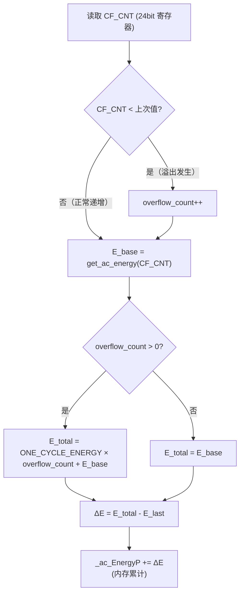

其中 `ONE_CYCLE_ENERGY` 是 CF_CNT 寄存器计满一圈（0xFFFFFF 个脉冲）对应的能量值。

#### 4.1.5 电能累计存储策略

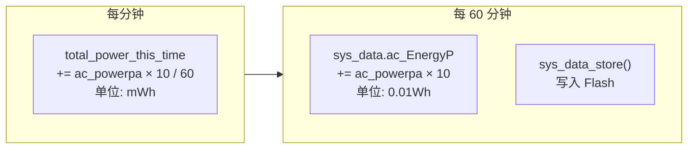

#### 4.1.6 直流输出参数换算

```
Vo_value = ADC_Value2 × 39.75 / 0.75 / 100

说明：分压比 = (39K + 0.75K) / 0.75K = 53:1
      参考电压 = 3.3V
      Vo = ADC × 3.3V / 4096 × 53
         ≈ ADC × 39.75 / 0.75 / 1000
      放大 10 倍（0.1V 单位）：×10
      → ADC_Value2 × 39.75 / 0.75 / 100

━━━━━━━━━━━━━━━━━━━━━━━━━━━━━━━━━━━━━━━━━━━━━━

Io_value = ADC_Value4 / OUTPUT_CUR_SENSOR / 8.34 × 1000

说明：采样电阻 = OUTPUT_CUR_SENSOR (mΩ，工厂配置)
      运放倍数 = 8.34
      Io(mA) = ADC/4096 × 3.3V / (R_sense × 8.34) × 1000

━━━━━━━━━━━━━━━━━━━━━━━━━━━━━━━━━━━━━━━━━━━━━━

Po_value = Vo_value × Io_value / 1000

说明：单位换算 0.1V × mA / 1000 = 0.1W
```

#### 4.1.7 温度计算

```
步骤1：读取 ADC 值，计算 NTC 电阻
    rNtc = ADC_MAX × R_PART / adc - R_PART
    
    其中 R_PART = 300 (内部NTC，3K÷10) 或 1000 (外部NTC，10K÷10)

步骤2：二分法查表，找到区间 [index, index+1]
    表长：171 点，范围 -40℃ ~ 125℃

步骤3：线性插值
    if (精确匹配):
        temp = index × 10 + (-400)     // 0.1℃ 单位
    else:
        temp = index × 10 + (R_table[index] - rNtc) × 10 / (R_table[index] - R_table[index+1]) + (-400)
        再对上升趋势做 +1 滞回

步骤4：范围保护
    if (rNtc > 表最大值): temp = -400   (-40℃)
    if (rNtc < 表最小值): temp = 1250   (125℃)
```

#### 4.1.8 温度告警阈值转换

```
告警上报 temperature:
    value = (Ntctemp.Ntctemp + 5) / 10    // 0.1℃ → ℃，四舍五入
    threshold = INNRE_TEMP_PRO            // 工厂配置的过温保护值（℃）

电流告警阈值:
    over_current_threshold = SET_OUTCUR × 150 / 100    // 150% 额定
    under_current_threshold = SET_OUTCUR × 80 / 100    // 80% 额定
```

#### 4.1.9 信号强度映射

```c
if (getSignal() >= 2)      rsrp = -700;   // 信号良好 (≥ -70 dBm)
else if (getSignal() == 1) rsrp = -900;   // 信号一般 (≥ -90 dBm)
else                       rsrp = -1100;  // 信号差   (≥ -110 dBm)
```

### 4.2 上报数据与原始采集数据对照

| 上报字段 (JSON) | 原始采集变量 | 是否计算 | 计算内容 |
|-----------------|-------------|----------|----------|
| `EleInfo.c[0]` | `Z_ac_current` | ✅ | 电容容性补偿 + 型号偏移补偿 |
| `EleInfo.v[0]` | `ac_voltage_8209` | ✅ | 分压公式换算 |
| `EleInfo.p[0]` | `ac_powerpa` | ✅ | 功率公式换算 + 单位转换 + 四舍五入 |
| `EleInfo.f[0]` | `ac_pf` | ✅ | `(P_active × 100) / P_apparent` |
| `EleInfo.rEc[0]` | `energy_this_time` | ✅ | 脉冲→电能 + 溢出累计 |
| `EleInfo.tEc[0]` | `sys_data.ac_EnergyP` | ✅ | 每小时功率累加 |
| `EleInfo.pwr` | `power_down_flag` | ✅ | 软件滤波（10cycles） |
| `EleInfo.lc` | `danger_current_warn` | ✅ | 20次峰值检测 + 30mA阈值 |
| `PerSts.temp` | `Ntctemp.Ntctemp` | ✅ | 二分查表 + 线性插值 + 滞回 |
| `RunSts.sts[0]` | `dim_level` | ✅ | `dim_level > 0 ? 31 : 32` |
| `RunSts.bri[0]` | `dim_level` | ❌ | 直接取值，钳位到 100 |
| `RunTm.tTime` | 系统 tick | ✅ | tick → 分钟转换 |
| `LightTm.tLtTime[0]` | 系统 tick | ✅ | 仅 dim_level>0 时累计分钟 |
| `Signal.rsrp` | `getSignal()` | ✅ | 等级 → dBm 映射 |

---

## 五、上报数据类型与组成

### 5.1 MQTT 报文通用结构

```json
{
    "SN": "设备序列号(IMEI)",
    "TM": "2026-05-18 14:30:25",
    "SV": "rept | prop | ctrl | rqst | ota | plan",
    "ID": "000001",
    "CT": "L | H | C | B | A | W | R | P | E",
    "DT": { ... }
}
```

### 5.2 上报类型的报文头字段对照

| 上报类型 | SV | CT | 触发条件 | 默认间隔 |
|----------|-----|-----|----------|----------|
| 登录上报 | rept | L | 模组上线建立连接 | — |
| 心跳上报 | rept | H | 周期性 | 60s (hPeriod) |
| **巡检上报（主动上报）** | rept | **C** | 周期性 | **300s** (uPeriod) |
| **变化上报** | rept | **B** | 状态变化触发 | 消抖 3s |
| **告警上报** | rept | **A** | 告警状态变化 | 实时 |
| 属性读响应 | prop | R | 平台下发读命令 | — |
| 属性写响应 | prop | W | 平台下发写命令 | — |
| OTA 进度 | ota | P | OTA 升级过程中 | — |
| OTA 错误 | ota | E | OTA 升级失败 | — |
| 时间请求 | rqst | R | 周期性 | 3600s (tPeriod) |

### 5.3 巡检上报 (CT=C) 完整 JSON 结构

```json
{
    "SN": "865432109876543",
    "TM": "2026-05-18 14:30:25",
    "SV": "rept",
    "ID": "000042",
    "CT": "C",
    "DT": {
        "RunTm": {
            "tTime": 1440,
            "rTime": 1440
        },
        "LightTm": {
            "tLtTime": [720],
            "rLtTime": [720]
        },
        "RunSts": {
            "sts": [31],
            "bri": [85]
        },
        "EleInfo": {
            "e": [0],
            "c": [350],
            "v": [2200],
            "f": [95],
            "p": [770],
            "rEc": [120],
            "tEc": [15230],
            "pwr": 0,
            "lc": 0
        },
        "PerSts": {
            "lux": 0,
            "temp": 450
        },
        "Signal": {
            "rsrp": -700,
            "cellid": 0,
            "pci": 0,
            "snr": 0,
            "reg": 1
        },
        "Angle": {
            "x": 0,
            "y": 0,
            "z": 0
        }
    }
}
```

**各字段含义速查表**：

| 字段路径 | 中文名称 | 单位 | 示例值解释 |
|----------|----------|------|-----------|
| `RunTm.tTime` | 累计运行时间 | 分钟 | 已运行 1440 分钟 (24h) |
| `RunTm.rTime` | 剩余运行时间 | 分钟 | 同上（暂未区分） |
| `LightTm.tLtTime[0]` | 累计亮灯时间 | 分钟 | 已亮灯 720 分钟 (12h) |
| `LightTm.rLtTime[0]` | 剩余亮灯时间 | 分钟 | 同上（暂未区分） |
| `RunSts.sts[0]` | 运行状态 | — | 31=亮灯, 32=灭灯 |
| `RunSts.bri[0]` | 当前亮度 | % | 亮度 85% |
| `EleInfo.e[0]` | 电能（备用） | — | 固定为 0 |
| `EleInfo.c[0]` | 交流电流 | mA | 电流 350mA |
| `EleInfo.v[0]` | 交流电压 | 0.1V | 电压 220.0V |
| `EleInfo.f[0]` | 功率因数 | 0.01 | PF=0.95 |
| `EleInfo.p[0]` | 有功功率 | 0.1W | 功率 77.0W |
| `EleInfo.rEc[0]` | 本次上电电能 | 0.01Wh | 本次耗电 1.20Wh |
| `EleInfo.tEc[0]` | 累计总电能 | 0.01Wh | 累计耗电 152.30Wh |
| `EleInfo.pwr` | 掉电状态 | 0/1 | 0=正常, 1=掉电中 |
| `EleInfo.lc` | 漏电流 | mA | 0=无漏电, 30=漏电 |
| `PerSts.lux` | 光照度 | lux | 0（未实现） |
| `PerSts.temp` | 驱动器温度 | 0.1℃ | 温度 45.0℃ |
| `Signal.rsrp` | 信号强度 | 0.1dBm | -70dBm（良好） |
| `Signal.reg` | 网络注册 | 0/1 | 1=已注册 |
| `Angle.x/y/z` | 灯杆倾角 | — | 0（未实现） |

### 5.4 变化上报 (CT=B) 与巡检上报的差异

变化上报的 DT 结构与巡检上报完全相同，但**不包含以下数据组**：

| 数据组 | 巡检上报(CT=C) | 变化上报(CT=B) | 原因 |
|--------|:---:|:---:|------|
| RunTm | ✅ | ✅ | 运行时间在任何上报中都有意义 |
| LightTm | ✅ | ✅ | 亮灯时间在任何上报中都有意义 |
| RunSts | ✅ | ✅ | 状态变化本身就需要上报 |
| EleInfo | ✅ | ✅ | 电气参数是核心变化数据 |
| PerSts | ✅ | ✅ | 温度可能变化 |
| **Signal** | ✅ | ❌ | 信号强度属于非紧急辅助信息 |
| **Angle** | ✅ | ❌ | 角度属于非紧急辅助信息 |

变化上报触发后有 **3 秒消抖时间** (`ZK_CHANGE_REPORT_SETTLE_MS = 3000ms`)，在此期间内的多次状态变化会合并为一次上报。

### 5.5 告警上报 (CT=A) 完整 JSON 结构

```json
{
    "SN": "865432109876543",
    "TM": "2026-05-18 14:30:25",
    "SV": "rept",
    "ID": "000043",
    "CT": "A",
    "DT": {
        "alm": {
            "almId": 10000,
            "time": "2026-05-18 14:30:25",
            "status": 1,
            "cns": 1,
            "value": 3280,
            "threshold": 3200
        }
    }
}
```

---

## 六、告警系统详解

### 6.1 告警状态机

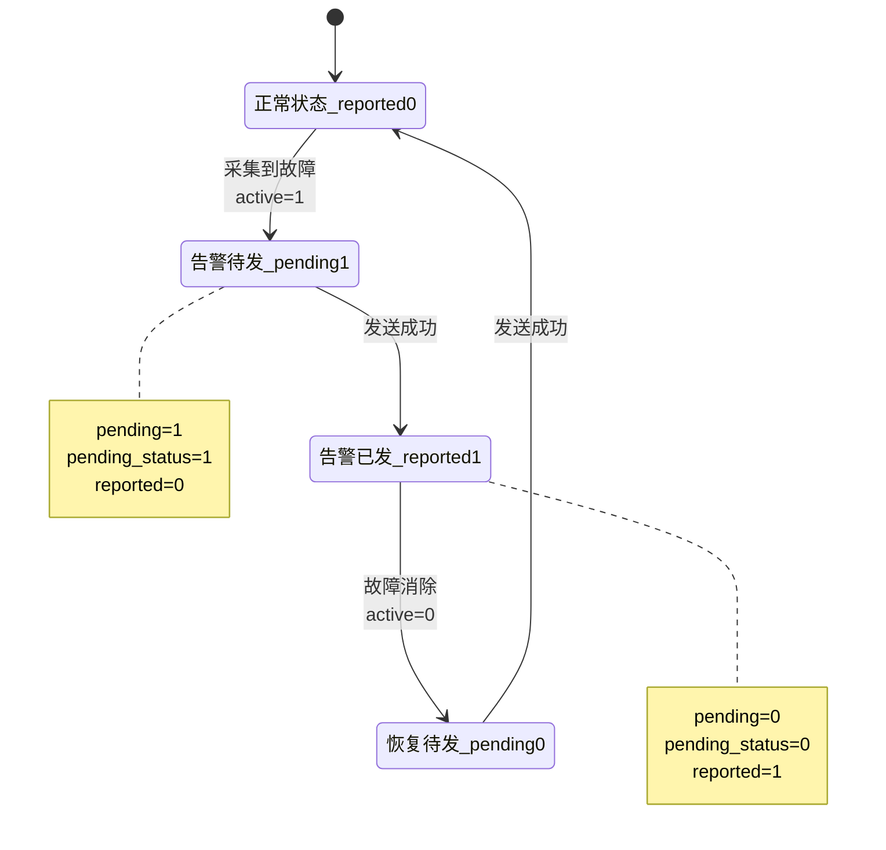

**设计要点**：
- 采用**边缘触发**模式，只在告警状态变化时上报（产生→消除各报一次）
- 掉电告警 (`ZK_ALARM_POWER_DOWN`) 是唯一设为 `one_shot=1` 的告警，上报告警后不清除 `reported` 状态，允许再次触发
- 通过 `pending`/`reported` 双标志位实现去重，避免连续的重复上报

### 6.2 告警类型完整列表

| 索引 | almId | 告警名称 | 触发源变量 | 阈值来源 | 阈值默认值 |
|------|-------|----------|-----------|----------|-----------|
| 0 | 10000 | 输入过压 | `Error_3_OV` | 硬编码 | 3200 (320V) |
| 1 | 10001 | 输入欠压 | `Error_4_LV` | 硬编码 | 800 (80V) |
| 2 | 10002 | 输出过流 | `Error_1_OL` | `SET_OUTCUR × 150%` | 动态 |
| 3 | 10003 | 输出欠流 | `Error_Out_LV` | `SET_OUTCUR × 80%` | 动态 |
| 4 | 10004 | 亮灯失败 | `Error_0_linght` | 硬编码 | 0 |
| 5 | 10007 | 漏电告警 | `danger_current_warn` | 硬编码 | 30mA |
| 6 | 10008 | 设备故障(过温) | `driver_temperarure_warn` | `INNRE_TEMP_PRO` | 工厂配置 |
| 7 | 10009 | 掉电告警 | `power_down_flag` | 硬编码 | 70 (7V) |

> **注意**：almId 10005 (灭灯失败) 和 10006 (灯杆倾斜) 在协议头文件中已定义但 **未实现检测逻辑**。

### 6.3 告警检测与上报流程

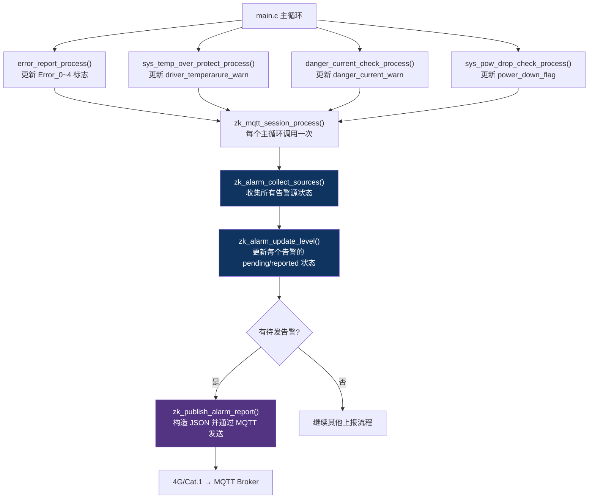

### 6.4 过温分级保护策略

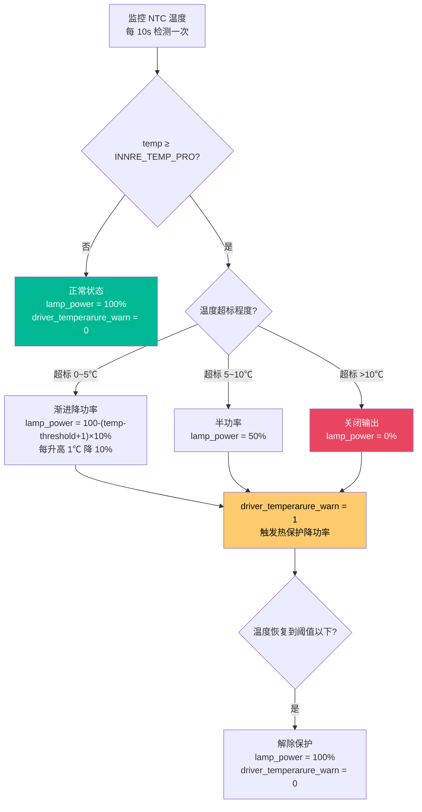

---

## 七、上报时序与优先级

### 7.1 上报优先级队列

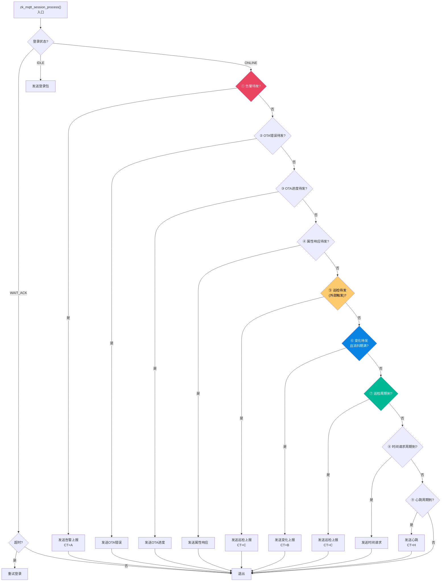

### 7.2 上报时序图

```mermaid
gantt
    title 设备上报时序示意（默认配置）
    dateFormat HH:mm
    axisFormat %H:%M

    section 登录
    登录请求             :milestone, 00:00, 0m
    登录ACK              :milestone, 00:01, 0m

    section 心跳 (60s)
    心跳1                :milestone, 01:00, 0m
    心跳2                :milestone, 02:00, 0m
    心跳3                :milestone, 03:00, 0m
    心跳4                :milestone, 04:00, 0m
    心跳5                :milestone, 05:00, 0m

    section 巡检 (300s)
    巡检1 {RunTm,EleInfo,Signal,Angle} :milestone, 05:00, 0m
    巡检2 {RunTm,EleInfo,Signal,Angle} :milestone, 10:00, 0m

    section 变化上报
    状态变化触发             :crit, milestone, 02:30, 0m
    3s消抖                   :crit, 02:30, 3m
    变化上报 {RunTm,EleInfo}  :crit, milestone, 02:33, 0m

    section 告警
    过压发生                  :milestone, 03:15, 0m
    过压告警 {almId:10000}    :crit, milestone, 03:15, 0m
    过压恢复                  :milestone, 03:45, 0m
    过压恢复告警              :crit, milestone, 03:45, 0m

    section 时间校准 (3600s)
    时间请求                :milestone, 60:00, 0m
```

### 7.3 各上报触发条件总结

| 序号 | 上报类型 | 触发方式 | 间隔/延迟 | 配置项 |
|------|----------|----------|-----------|--------|
| 1 | 告警上报 | **事件驱动** | 实时（循环检测） | — |
| 2 | OTA 相关 | **事件驱动** | 实时 | — |
| 3 | 属性响应 | **事件驱动** | 实时 | — |
| 4 | 巡检上报(外部触发) | **事件驱动** | 实时 | — |
| 5 | 变化上报 | **事件驱动** | 3s 消抖 | — |
| 6 | 巡检上报(周期) | **定时触发** | 300s 默认 | `uPeriod` |
| 7 | 时间请求 | **定时触发** | 3600s 默认 | `tPeriod` |
| 8 | 心跳上报 | **定时触发** | 60s 默认 | `hPeriod` |

---

## 八、发现的问题与风险点

### 8.1 数据采集层面

#### 问题一：头文件与源文件注释不一致（sys_bl0942）

| 文件 | 变量 | 注释单位 |
|------|------|----------|
| `sys_bl0942.h:17` | `ac_powerpa` | `有功功率0.1W` |
| `sys_bl0942.c:90` | `ac_powerpa` | `有功功率 单位：0.01W` |

以 `.c` 文件中的计算公式为准，实际为 **0.01W**。但这个不一致可能引起维护人员误判。

#### 问题二：亮灯时间统计无法持久化

`LightTm.tLtTime` 是在 `zk_add_runtime_time_groups()` 中实时计算的：
```c
light_minutes = (dim_level > 0U) ? total_minutes : 0UL;
```
- `total_minutes` 基于本次上电后的系统 tick
- 掉电后不保存，重新上电从 0 开始
- 实际语义是"本次上电后的亮灯时长"而非"设备寿命周期累计亮灯时长"

#### 问题三：漏电检测仅在联网时工作

`danger_current_check.c:27`：
```c
if(online) { ... }
```
离线模式下不检测漏电，如果设备处于离线状态但仍在供电，存在漏电风险无法检测的盲区。

#### 问题四：直流侧数据采集了但不上报

`Vo_value`（输出电压）、`Io_value`（输出电流）、`Po_value`（输出功率）这三个直流侧参数虽然通过 ADC 采集并用于故障判断，但**不在任何上报报文中出现**。云平台无法获取直流的输出状态。

### 8.2 数据处理层面

#### 问题五：总运行时间 tTime 与 rTime 始终相同

```c
cJSON_AddNumberToObject(run_tm, "tTime", (double)total_minutes);
cJSON_AddNumberToObject(run_tm, "rTime", (double)total_minutes);
```

两个字段填入相同的值（系统启动以来的总分钟数），当前没有区分"总运行时间"和"剩余运行时间"。

#### 问题六：容性校正算法占用 ROM 较大

当前使用的浮点版本（`#else` 分支）：
- 链接了 `sqrtf()`、`powf()` 等标准库函数
- 占用约 **2.5KB ROM**，耗时约 **222μs**
- 备选定点版本占用仅 **0.5KB ROM**，耗时 **53μs**

对于资源受限的 STM32F103（128KB Flash），当前选择是高精度优先，但在后续功能增加时需注意 ROM 余量。

#### 问题七：功率上报存在单位转换取整

```c
cJSON_AddItemToArray(p, cJSON_CreateNumber((double)((ac_powerpa + 5U) / 10U)));
```
- 从 0.01W 转为 0.1W 时做了加 5 的四舍五入
- 但这是**整数除法**，丢失了 0.01W 精度
- 如果需要精确功率，后台应该直接解析 `rEc`（电能增量）来反推功率

### 8.3 上报层面

#### 问题八：多个字段未实现，固定为 0

| 上报字段 | 固定值 | 说明 |
|----------|--------|------|
| `EleInfo.e[0]` | 0 | 电能备用字段 |
| `PerSts.lux` | 0 | 未接光照度传感器 |
| `Angle.x/y/z` | 0 | 未接倾角传感器 |
| `Signal.cellid` | 0 | 未从模组获取 |
| `Signal.pci` | 0 | 未从模组获取 |
| `Signal.snr` | 0 | 未从模组获取 |

这些字段占用了报文空间但对业务无贡献，如果确定不需要可以考虑精简报文或明确告知平台。

#### 问题九：变化上报缺少去重机制

`zk_notify_state_changed()` 只设置 `zk_change_report_pending = BOOL_TRUE`，若变化上报发送失败（`pubsend_state_idle() == BOOL_FALSE`）不会重试，会直接清除 pending 标志：
```c
if (zk_publish_runtime_report(ZK_CT_CHANGE) == 0)
{
    zk_change_report_pending = BOOL_FALSE;
}
```
这意味着如果当时 TCP 发送繁忙，变化上报就丢失了。

#### 问题十：告警阈值的过流/欠流依赖工厂配置正确性

```c
zk_alarm_current_threshold(150) → SET_OUTCUR × 150 / 100
zk_alarm_current_threshold(80)  → SET_OUTCUR × 80 / 100
```

如果 `SET_OUTCUR`（额定电流）的工厂配置值不正确（如为 0 或 0xFFFF），告警阈值计算会异常，导致误报或漏报。

---

## 附录 A：关键源文件索引

| 文件路径 | 功能 | 关键函数/变量 |
|----------|------|-------------|
| `Core/Src/sys_bl0942.c` | BL0942 电能计量芯片驱动 | `sys_bl0942_process()`, `Z_ac_current`, `ac_voltage_8209` |
| `Core/Src/sys_bl0942.h` | BL0942 外部接口 | 全局变量声明 |
| `Core/Src/sys_Vo_Io.c` | 输出参数采集与故障判断 | `error_report_process()`, `Vo_value`, `Io_value` |
| `Core/Src/sys_Vo_Io.h` | 输出参数接口 | `Error_0~4` 标志声明 |
| `Core/Src/ntc.c` | NTC 温度传感器采集 | `NtcTempCalc1()`, `Ntctemp` |
| `Core/Src/sys_temp_over_protect.c` | 过温分级保护 | `sys_temp_over_protect_process()` |
| `Core/Src/sys_pow_drop_check.c` | 掉电检测 | `sys_pow_drop_check_process()`, `power_down_flag` |
| `Core/Src/danger_current_check.c` | 漏电检测 | `danger_current_check_process()`, `dangeo_out` |
| `Core/Src/sys_data.c` | 系统数据 Flash 存储 | `sys_data_store()`, `sys_data.ac_EnergyP` |
| `Core/Src/factory_user_data.h` | 工厂配置参数宏定义 | `SET_OUTCUR`, `MID`, `INNRE_TEMP_PRO`, `CX` |
| `Core/Src/LampProtocolLib/mqtt_zk_protocol.c` | 中科 MQTT 协议核心 | `zk_publish_runtime_report()`, `zk_alarm_collect_sources()` |
| `Core/Src/LampProtocolLib/mqtt_zk_protocol.h` | 协议常量与类型定义 | `zk_device_config_t`, 告警 ID 定义 |
| `Core/Src/gateway/net_dim.c` | 网络调光 | `dim_level` 全局变量 |
| `Core/Src/main.c` | 主循环 | 所有模块的调度入口 |

---

## 附录 B：数据采集与上报全量关系图

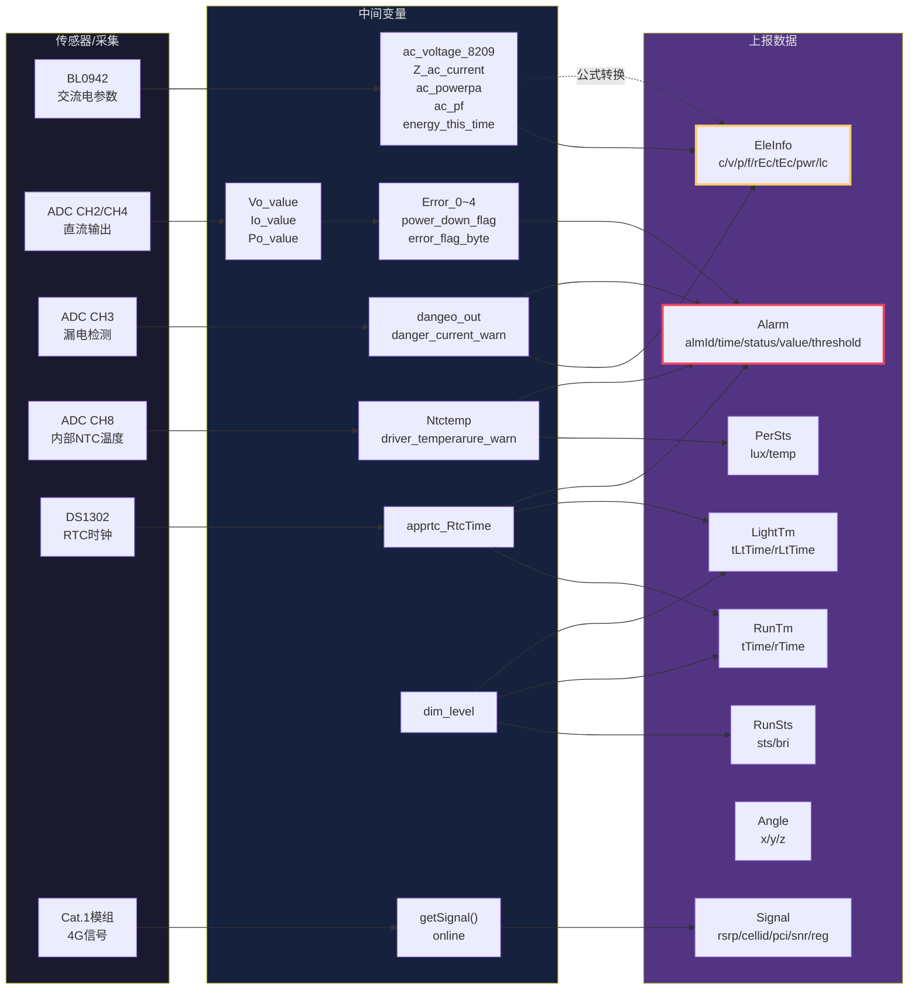

> **图例说明**：
> - 实线箭头 = 直接取值或简单映射
> - 虚线箭头 = 需要经过公式/算法转换
> - 黄色边框 = 巡检上报和变化上报共用
> - 红色边框 = 告警上报专用

---

## 附录 C：缩写与术语表

| 缩写/术语 | 全称 | 说明 |
|-----------|------|------|
| BL0942 | 贝岭 BL0942 | 电能计量芯片，通过 UART 通信 |
| ADC | Analog-to-Digital Converter | 模数转换器，12bit 分辨率 |
| NTC | Negative Temperature Coefficient | 负温度系数热敏电阻 |
| RTC | Real-Time Clock | 实时时钟 (DS1302) |
| Cat.1 | LTE Category 1 | 4G 通信标准，适用于物联网 |
| PF | Power Factor | 功率因数，cos(φ) |
| RMS | Root Mean Square | 有效值（均方根） |
| RSRP | Reference Signal Received Power | 参考信号接收功率 (dBm) |
| CX | X 电容 | 安规电容，用于 EMI 滤波 |
| MID | Model ID | 产品型号：1=60W, 2=75W, 3=100W, 4=150W, 5=200W, 6=240W |
| OTA | Over-The-Air | 空中固件升级 |
| dal | DALI | Digital Addressable Lighting Interface |
| FSM | Finite State Machine | 有限状态机 |
| SN | Serial Number | 设备序列号 (IMEI) |
| DT | Data | MQTT 报文的数据体 |
| CT | Content Type | MQTT 报文的内容类型 |
| SV | Service | MQTT 报文的服务类型 |
